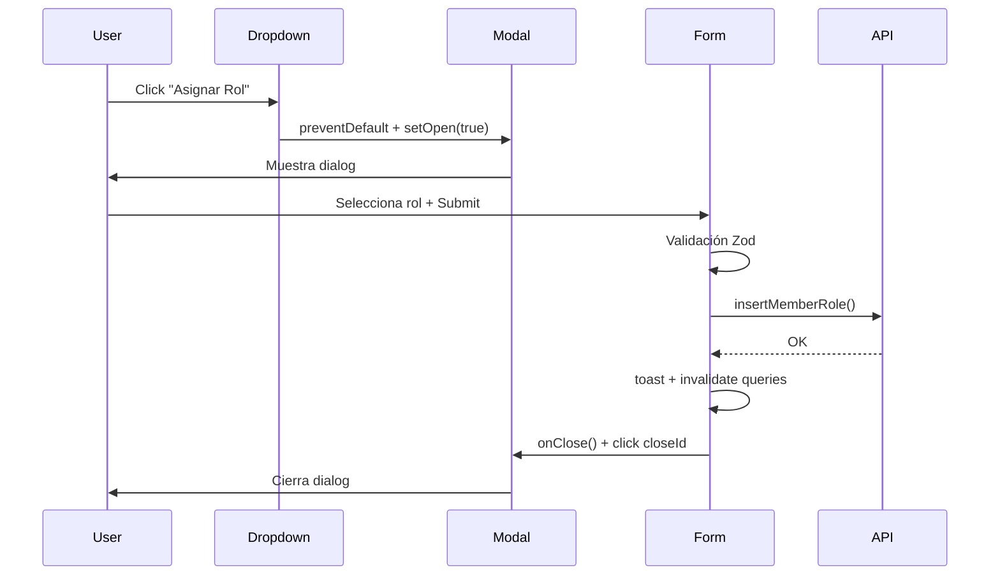

# Guía: patrón de Modal — `AssignRoleModal`

Guía portable para implementar modales de formulario en un proyecto externo. Patrón de referencia: `AssignRoleModal` y su formulario hijo `AssignRoleForm`.

Pensada para copiar en otro proyecto o pasarla como contexto a un agente de IA en Cursor.

---

## Referencia en este repositorio

| Archivo | Descripción |
|---------|-------------|
| `src/components/pages/admin/users/AssignRoleModal/AssignRoleModal.tsx` | Shell del modal (trigger, estado, footer) |
| `src/components/pages/admin/users/AssignRoleModal/AssignRoleModal.types.ts` | Props del modal |
| `src/components/pages/admin/users/AssignRoleModal/AssignRoleForm/AssignRoleForm.tsx` | Formulario + submit + mutación |
| `src/components/pages/admin/users/AssignRoleModal/AssignRoleForm/AssignRoleForm.types.ts` | Props y tipo inferido del form |
| `src/components/pages/admin/users/AssignRoleModal/AssignRoleForm/AssignRoleForm.helpers.ts` | Schema Zod y `defaultValues` |
| `src/components/widgets/DialogContent/DialogContent.tsx` | Wrapper custom sobre Radix Dialog |
| `src/components/ui/dialog.tsx` | Primitivos shadcn/ui (`Dialog`, `DialogHeader`, etc.) |
| `src/components/Tables/MembersTable/MembersTable.helpers.tsx` | Uso del modal dentro de acciones de tabla |

Modales hermanos que siguen el **mismo patrón**: `AddPaymentModal`, `CalendarEventModal`.

---

## 1. Idea general del patrón

El modal se divide en **dos responsabilidades**:

| Capa | Responsabilidad |
|------|-----------------|
| **Modal shell** (`AssignRoleModal.tsx`) | Abrir/cerrar, trigger, título, descripción, botones del footer |
| **Formulario hijo** (`AssignRoleForm.tsx`) | Campos, validación, mutación API, toast, invalidación de cache |

Esto permite reutilizar el formulario en otro contexto (p. ej. otra página) sin duplicar la lógica de negocio.

```
┌─────────────────────────────────────────────────┐
│  DropdownMenuItem  ──onSelect──►  setOpen(true) │
└─────────────────────────────────────────────────┘
                        │
                        ▼
┌─────────────────────────────────────────────────┐
│  Dialog (open / onOpenChange)                   │
│  ┌───────────────────────────────────────────┐  │
│  │  DialogContent (closeId)                  │  │
│  │    DialogHeader (title + description)     │  │
│  │    AssignRoleForm  ← id="form-{formName}" │  │
│  │    DialogFooter                           │  │
│  │      [Cancelar]  [Submit form="form-..."]  │  │
│  └───────────────────────────────────────────┘  │
└─────────────────────────────────────────────────┘
```

---

## 2. Stack tecnológico

| Librería | Uso en el modal |
|----------|-----------------|
| **Radix UI Dialog** (`@radix-ui/react-dialog`) | Accesibilidad, focus trap, overlay, escape |
| **shadcn/ui** (`Dialog`, `Button`, `DropdownMenuItem`) | Componentes base estilizados |
| **react-hook-form** + **Zod** | Formulario y validación |
| **TanStack Query** (`useIsMutating`) | Deshabilitar submit mientras hay mutaciones activas |
| **tRPC** (opcional) | Mutaciones e invalidación de cache |
| **tailwind-merge** | Combinar clases CSS del modal |

En un proyecto externo puedes sustituir tRPC por `fetch`, React Query `useMutation`, o cualquier cliente HTTP.

---

## 3. Estructura de archivos recomendada

```
AssignRoleModal/
├── AssignRoleModal.tsx          # Shell del modal
├── AssignRoleModal.types.ts     # Props del modal
└── AssignRoleForm/
    ├── AssignRoleForm.tsx       # Lógica del formulario
    ├── AssignRoleForm.types.ts  # Props del form + tipo Zod
    └── AssignRoleForm.helpers.ts # schema + defaultValues
```

---

## 4. Modal shell — `AssignRoleModal.tsx`

### 4.1 Estado de apertura

```tsx
const [open, setOpen] = useState(false);

const handleClose = () => {
  setOpen(false);
};
```

El `Dialog` es **controlado**: `open={open}` y `onOpenChange={setOpen}`.

### 4.2 Trigger desde un Dropdown (acciones de fila)

Cuando el modal vive dentro de un `DropdownMenu`, el trigger **no** usa `DialogTrigger`. En su lugar, un `DropdownMenuItem` abre el modal manualmente:

```tsx
<DropdownMenuItem
  disabled={!canEditClub}
  onSelect={(e) => {
    e.preventDefault(); // Evita que el dropdown se cierre antes de abrir el dialog
    setOpen(true);
  }}
  className="cursor-pointer"
>
  <UserCog className="h-4 w-4" />
  Asignar Rol
</DropdownMenuItem>
```

> **Importante:** `e.preventDefault()` en `onSelect` es obligatorio cuando el trigger está dentro de un dropdown. Sin esto, Radix cierra el menú y puede interferir con la apertura del dialog.

### 4.3 Convención `formName`

```tsx
const formName = "assign-role";
```

Se usa para generar el `id` del `<form>` y enlazarlo con el botón submit del footer:

- Formulario: `id={`form-${formName}`}` → `form-assign-role`
- Botón submit: `form={`form-${formName}`}` → apunta al formulario aunque esté fuera del `<form>`

Esto permite poner los botones en `DialogFooter` (fuera del `<form>`) manteniendo semántica HTML correcta.

### 4.4 Deshabilitar submit durante mutaciones

```tsx
const mutating = useIsMutating();

<Button
  type="submit"
  form={`form-${formName}`}
  disabled={!!mutating}
>
  Asignar Rol
</Button>
```

`useIsMutating()` cuenta **todas** las mutaciones activas de React Query. Si tienes varios modales/formularios, considera filtrar por `mutationKey` en proyectos más grandes.

### 4.5 JSX completo del shell

```tsx
return (
  <>
    <DropdownMenuItem /* ... trigger ... */ />

    <Dialog open={open} onOpenChange={setOpen}>
      <DialogContent
        className={twMerge("AssignRoleModal sm:max-w-[500px]", className)}
        closeId="close-assign-role-dialog"
      >
        <DialogHeader>
          <DialogTitle>Asignar Rol a Miembro</DialogTitle>
          <DialogDescription>
            Selecciona el rol que deseas asignar a {getMemberName()}
          </DialogDescription>
        </DialogHeader>

        <AssignRoleForm
          formName={formName}
          member={member}
          onClose={handleClose}
        />

        <DialogFooter>
          <Button type="button" variant="outline" onClick={handleClose}>
            Cancelar
          </Button>
          <Button
            type="submit"
            form={`form-${formName}`}
            disabled={!!mutating}
          >
            Asignar Rol
          </Button>
        </DialogFooter>
      </DialogContent>
    </Dialog>
  </>
);
```

---

## 5. `DialogContent` custom (no confundir con shadcn)

Este proyecto usa **dos** componentes llamados `DialogContent`:

| Componente | Import | Uso |
|------------|--------|-----|
| shadcn default | `@/components/ui/dialog` | Modales simples con trigger integrado |
| **Custom wrapper** | `@/components/widgets/DialogContent/DialogContent` | Modales con formularios (este patrón) |

El wrapper custom añade:

- `closeId` — ID del botón X para cerrar programáticamente tras submit exitoso
- `onClose` — callback al pulsar Escape
- `hideCloseButton` — ocultar la X si hace falta

```tsx
// DialogContent.tsx (simplificado)
<DialogPortal>
  <DialogOverlay />
  <Content onEscapeKeyDown={onClose} /* ... */>
    {children}
    <Close id={closeId ?? "close-dialog"} onClick={onCloseClick ?? onClose}>
      <X />
    </Close>
  </Content>
</DialogPortal>
```

### Por qué `closeId`

Tras un submit exitoso, el formulario cierra el modal de **dos formas**:

```tsx
onClose?.(); // 1. Actualiza el estado React (setOpen false)
document.getElementById("close-assign-role-dialog")?.click(); // 2. Dispara el Close de Radix
```

La segunda línea garantiza que las animaciones y el estado interno de Radix Dialog se sincronicen correctamente.

---

## 6. Formulario hijo — `AssignRoleForm.tsx`

### 6.1 Props

```ts
export interface AssignRoleFormProps {
  formName: string;       // Enlaza con el botón submit del footer
  member: MemberWithProfile;
  onClose?: () => void;   // Callback para cerrar el modal
}
```

### 6.2 Setup del formulario

```tsx
const form = useForm<AssignRoleForm>({
  resolver: zodResolver(schema),
  defaultValues
});

useScrollToError(form.formState.errors);
```

### 6.3 Submit handler — flujo completo

```tsx
const submitHandler: SubmitHandler<AssignRoleForm> = async (values) => {
  // 1. Validaciones de negocio (duplicados, contexto)
  const existingRoles = await utils.members_roles.select.fetch({ ... });
  if (existingRoles?.length > 0) return;

  if (!club_id) return;

  // 2. Mutación
  await insertMemberRole({ member_id, role_id, club_id });

  // 3. Feedback al usuario
  toast({ title: "Rol asignado", variant: "success" });

  // 4. Refrescar datos
  await utils.members.invalidate();
  await utils.members_roles.invalidate();

  // 5. Cerrar modal
  onClose?.();
  document.getElementById("close-assign-role-dialog")?.click();
};
```

### 6.4 JSX del formulario

El `<form>` **no incluye** los botones de acción. Solo campos:

```tsx
<Form {...form}>
  <form
    noValidate
    id={`form-${formName}`}
    className="space-y-4"
    onSubmit={form.handleSubmit(submitHandler)}
  >
    <FormRolesSelect name="role_id" label="Rol" control={form.control} />
  </form>
</Form>
```

---

## 7. Validación — `AssignRoleForm.helpers.ts`

```ts
export const schema = vRole.assignRoleForm();
// Equivalente portable:
// z.object({ role_id: z.string().uuid() })

export const defaultValues = {
  role_id: ""
};
```

Regla del proyecto: schema y `defaultValues` viven en `.helpers.ts`, no dentro del componente.

---

## 8. Tipos — `AssignRoleModal.types.ts`

```ts
export interface AssignRoleModalProps {
  className?: string;
  member: MemberWithProfile;
}

export interface AssignRoleFormData {
  role_id: string;
}
```

El modal recibe la **entidad sobre la que actúa** (`member`) como prop. No busca datos por sí mismo.

---

## 9. Integración en la UI (consumo)

Ejemplo real en acciones de tabla:

```tsx
<Table.RowActions>
  <Table.RowActions.CopyId entity={entity} id={id} />
  <AssignRoleModal member={member} />
  <Table.RowActions.Delete /* ... */ />
</Table.RowActions>
```

El modal se renderiza como un ítem más del menú de acciones. No necesita props de apertura externa: gestiona su propio estado `open`.

---

## 10. Variantes del mismo patrón

| Modal | Trigger | Diferencia |
|-------|---------|------------|
| `AssignRoleModal` | Solo `DropdownMenuItem` | Siempre desde menú contextual |
| `AddPaymentModal` | `DropdownMenuItem` (editar) **o** `DialogTrigger` (crear) | Modo crear vs editar |
| `CalendarEventModal` | Similar | Formulario más extenso |

Patrón común a todos:

1. `useState(false)` para `open`
2. `formName` único por modal
3. `DialogContent` custom con `closeId` único
4. Botón submit en `DialogFooter` con `form={...}` y `disabled={!!mutating}`
5. Formulario hijo con `onClose` + click en `closeId` al terminar

---

## 11. Checklist para implementar en proyecto externo

### Dependencias mínimas

- [ ] `@radix-ui/react-dialog`
- [ ] Componentes UI: `Dialog`, `Button`, `DropdownMenuItem` (shadcn o equivalente)
- [ ] `react-hook-form` + `@hookform/resolvers/zod` + `zod`
- [ ] `@tanstack/react-query` (para `useIsMutating`, opcional pero recomendado)

### Archivos a crear

- [ ] `XxxModal.tsx` — shell con estado, trigger, header, footer
- [ ] `XxxModal.types.ts` — props
- [ ] `XxxForm.tsx` — campos + submit
- [ ] `XxxForm.helpers.ts` — schema + defaultValues
- [ ] `DialogContent` wrapper (copiar de `src/components/widgets/DialogContent/`)

### Convenciones obligatorias

- [ ] `formName` string único → `id="form-{formName}"` en el `<form>`
- [ ] Botón submit en footer: `type="submit"` + `form="form-{formName}"`
- [ ] `closeId` único por modal → `"close-{nombre}-dialog"`
- [ ] Tras submit OK: `onClose()` + `document.getElementById(closeId)?.click()`
- [ ] Trigger en dropdown: `e.preventDefault()` en `onSelect`
- [ ] `disabled={!!mutating}` en botón submit

### Permisos (opcional)

```tsx
const { canEditClub } = useClub();

<DropdownMenuItem disabled={!canEditClub} /* ... */ />
```

Adapta el hook de permisos a tu sistema de auth.

---

## 12. Plantilla mínima portable

```tsx
"use client";

import { useState } from "react";
import { useIsMutating } from "@tanstack/react-query";
import DialogContent from "@/components/widgets/DialogContent/DialogContent";
import { Button } from "@/components/ui/button";
import {
  Dialog,
  DialogDescription,
  DialogFooter,
  DialogHeader,
  DialogTitle,
} from "@/components/ui/dialog";
import { DropdownMenuItem } from "@/components/ui/dropdown-menu";
import MyForm from "./MyForm/MyForm";

const MyModal = ({ entity }: { entity: MyEntity }) => {
  const [open, setOpen] = useState(false);
  const formName = "my-action";
  const mutating = useIsMutating();
  const closeId = "close-my-action-dialog";

  const handleClose = () => setOpen(false);

  return (
    <>
      <DropdownMenuItem
        onSelect={(e) => {
          e.preventDefault();
          setOpen(true);
        }}
      >
        Acción
      </DropdownMenuItem>

      <Dialog open={open} onOpenChange={setOpen}>
        <DialogContent className="sm:max-w-[500px]" closeId={closeId}>
          <DialogHeader>
            <DialogTitle>Título</DialogTitle>
            <DialogDescription>Descripción contextual</DialogDescription>
          </DialogHeader>

          <MyForm formName={formName} entity={entity} onClose={handleClose} closeId={closeId} />

          <DialogFooter>
            <Button type="button" variant="outline" onClick={handleClose}>
              Cancelar
            </Button>
            <Button type="submit" form={`form-${formName}`} disabled={!!mutating}>
              Guardar
            </Button>
          </DialogFooter>
        </DialogContent>
      </Dialog>
    </>
  );
};

export default MyModal;
```

```tsx
// MyForm.tsx
const MyForm = ({ formName, entity, onClose, closeId }) => {
  const form = useForm({ resolver: zodResolver(schema), defaultValues });

  const onSubmit = async (values) => {
    await saveEntity(values);
    onClose?.();
    document.getElementById(closeId)?.click();
  };

  return (
    <Form {...form}>
      <form id={`form-${formName}`} onSubmit={form.handleSubmit(onSubmit)}>
        {/* campos */}
      </form>
    </Form>
  );
};
```

---

## 13. Errores comunes

| Problema | Causa | Solución |
|----------|-------|----------|
| El modal no abre desde dropdown | Falta `e.preventDefault()` | Añadir en `onSelect` del `DropdownMenuItem` |
| Submit no hace nada | `form` del botón no coincide con `id` del `<form>` | Verificar `formName` en ambos lados |
| Modal queda “fantasma” tras submit | Solo se llama `setOpen(false)` | También hacer click en el `Close` con `closeId` |
| Botón submit siempre disabled | `useIsMutating()` detecta otras mutaciones | Filtrar por `mutationKey` o usar estado local `isPending` de la mutación específica |
| Import wrong DialogContent | Se importa el de shadcn en lugar del custom | Importar desde `@/components/widgets/DialogContent/DialogContent` |

---

## 14. Diagrama de flujo completo


