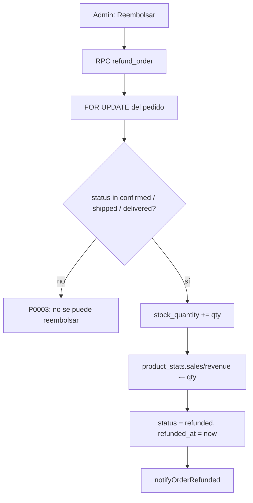
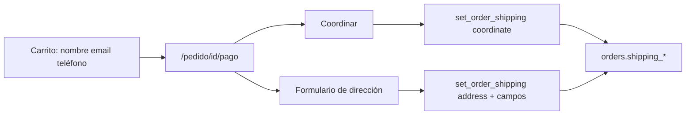

# (2) Qué le hace falta a mi ecommerce en cuanto a features para que sea operable?
_Exported on 15/9/2026 at 21:58:24 GMT-4 from Cursor (3.17.8)_

---

**User**

@src/components/Tables/ProductsTable/ProductsTable.helpers.tsx añade un link a la colomna "Nombre" que al hacer click te redirija a editar el producto, pero si al hacer click se tiene la tecla "shift" pulsada, te redirijirá al link del producto mismo en la tienda

---

**Cursor**

I'll check how product edit and store URLs are built in this table, then wire the Nombre column with normal → edit and Shift+click → store.

I'll add a small name-cell component so normal click goes to edit and Shift+click opens the storefront product page.

Listo. En la columna **Nombre**:

- **Clic** → `/admin/products/update/[id]`
- **Shift + clic** → `/productos/[slug]` (tienda)

El tooltip del link lo indica. Si el producto no tiene slug, Shift+clic se comporta como un clic normal (editar).

---

**User**

Ok perfecto, pero podemos hacer un cambio. Que sea al pulsar la tecla "Control" 

---

**Cursor**

Hecho. Ahora **Ctrl + clic** abre el producto en la tienda; el clic normal sigue yendo a editar.

---

**User**

Bueno, hagamos algo... Deja el link solo como a ir a editar, en la "Imagen" coloca el link al producto y en actions coloca un botón que copie al portapapeles el link del producto

---

**Cursor**

Voy a simplificar el nombre a solo editar, enlazar la imagen a la tienda y añadir en actions un botón para copiar el link del producto.

Quedó así:

- **Nombre** → solo edita el producto
- **Imagen** → abre el producto en la tienda (nueva pestaña)
- **Acciones** → “Copiar enlace” copia la URL completa al portapapeles

---

**User**

Necesito que @src/components/pages/categorias/CategoriesGrid/CategoriesGrid.tsx sea un carrousel de este estilo visual, para ellos deberás cambiar los estilos de @src/components/shared/CategoryCard/CategoryCard.tsx.

La cantidad de items mostrados al mismo tiempo en el carousel debe ser en base a el width del mismo. 

Esto no se puede solucionar implementando el carousel de shadcn?

---

**Cursor**

Sí, el carousel de shadcn (basado en Embla) encaja perfecto aquí. Voy a instalarlo y luego adaptar `CategoriesGrid` y `CategoryCard` al estilo de la imagen (foto cuadrada + nombre debajo, con flechas de navegación y varios items visibles según el ancho).

embla-carousel-react está instalado. Ahora creo el componente `ui/carousel.tsx` (estándar shadcn, adaptado al `button.tsx` del proyecto).

Ahora actualizo `CategoryCard` al estilo visual de la imagen (foto cuadrada + nombre debajo, sin overlay).

Ahora convierto `CategoriesGrid` en un carousel usando container queries de Tailwind v4 (`@container`), para que la cantidad de items visibles dependa del ancho del propio carousel y no del viewport.

Solo se usa dentro de `CategoriesGrid`, así que no rompe otros lugares. Ahora levanto el dev server para verificar visualmente el carousel.

Dev server ya está corriendo. Voy a tomar una captura de `/categorias` para validar el carousel visualmente.

/categorias compiló y respondió 200 sin errores. Resumen de los cambios:

- **`src/components/ui/carousel.tsx`** (nuevo, vía shadcn/Embla): primitivo genérico de carousel, con botones prev/next posicionados en los bordes.
- **`src/components/shared/CategoryCard/CategoryCard.tsx`**: rediseñado al estilo de la imagen — imagen cuadrada limpia (sin overlay ni degradado) y el nombre de la categoría debajo, centrado.
- **`src/components/pages/categorias/CategoriesGrid/CategoriesGrid.tsx`**: ahora renderiza un `Carousel` en vez de un grid estático.

Sobre tu pregunta: sí, el carousel de shadcn (que usa Embla por debajo) resuelve esto perfectamente. Para el requisito de "cantidad de items según el width del propio carousel" usé **container queries de Tailwind v4** (`@container` en el contenedor + `@sm:`, `@lg:`, `@2xl:`, `@4xl:` en cada item), en lugar de los breakpoints normales (`sm:`, `lg:`, etc.) que responden al viewport. Así, la cantidad de tarjetas visibles se ajusta al ancho real del carousel donde se use (por ejemplo, si en el futuro lo colocas en una columna angosta de un sidebar, se adapta a ese ancho y no al del viewport completo).

Los breakpoints configurados (editable vía la constante `ITEM_BASIS`):
- Por defecto: 2 items
- `@sm` (≥384px): 3 items
- `@lg` (≥512px): 4 items
- `@2xl` (≥672px): 5 items
- `@4xl` (≥896px): 6 items

También actualicé el skeleton de carga para reflejar el nuevo layout tipo fila. `FeaturedCategories` y la página `/categorias` siguen usando `CategoriesGrid` sin cambios en su API, así que no requirieron ajustes adicionales.

---

**User**

Ok, está excelente pero podemos mejorarlo... Cuando no haya suficientes elementos en el carousel como para mostrar mas, dicho botones no solo deben deshabilitarse, sino tambien ocultarse con display none.

El carousel cuando llegue al final de los elementos debe dar la vuelta para mostrar los del inicio.

Se puede hacer este comportamiento junto con el mismo componente?

---

**Cursor**

Sí, se puede con el mismo componente: Embla soporta `loop`, y ocultamos las flechas cuando no hay scroll. Voy a aplicarlo.

Sí, todo queda en el mismo componente de shadcn/Embla:

1. **Botones ocultos** — en `CarouselPrevious` / `CarouselNext`, si no se puede scrollear (`!canScrollPrev` / `!canScrollNext`) se aplica `hidden` (`display: none`).
2. **Loop** — en `CategoriesGrid` activé `loop: true`. Al llegar al final vuelve al inicio (y al revés).

Con loop, si hay overflow los botones quedan siempre visibles; si todos los items caben, Embla marca que no se puede scrollear y ambos se ocultan.

---

**User**

Elimina el límite de @src/components/pages/home/FeaturedCategories/FeaturedCategories.tsx "FEATURED_CATEGORIES_LIMIT", que la peticion tragia todas las categorias 

---

**Cursor**

Listo. Quité `FEATURED_CATEGORIES_LIMIT` y ahora `CategoriesGrid` carga todas las categorías activas.

---

**User**

Quisiera que el carousel al presionar los botones next y previous, el carousel muestre items nuevos, en el sentido de que si se estan mostrando 6, al dar a los botones de scroll se muestren los siguentes 6 o los 6 previos, todo depende la cantidad que este mostrando el carousel al mismo tiempo

---

**Cursor**

Embla tiene exactamente eso: `slidesToScroll: 'auto'` hace que next/prev avancen por el número de slides que caben visibles. Lo aplico.

Listo. Con `slidesToScroll: "auto"`, next/prev avanzan tantas tarjetas como quepan visibles (si se ven 6, salta de 6 en 6). También quité `dragFree` para que el snap quede alineado con ese mismo paso.

---

**User**

Cómo funciona exactame la funcion "formatPrice"?

---

**Cursor**

`formatPrice` del contexto es un wrapper fino sobre `formatStorePrice`.

**En el contexto** (`CurrencyContext.tsx`):

```44:47:src/contexts/CurrencyContext/CurrencyContext.tsx
  const formatPrice = useCallback(
    (amount: number) => formatStorePrice(amount, currency),
    [currency],
  );
```

Recibe un `amount` (número) y lo formatea con la moneda de la tienda (`USD` o `EUR`), leída de `storeSettings`. Si la setting no es `EUR`, usa `USD`.

**Qué hace por debajo** (`formatStorePrice` → `formatCurrency`):

1. Normaliza el código de moneda a mayúsculas.
2. Si fuera `VES`, devolvería algo como `Bs. 1.234,56`.
3. Para `USD`/`EUR`, usa `Intl.NumberFormat` con locale `es-ES` y `style: "currency"`:
   - Ejemplo USD: `1.234,56 US$` (o el formato que dé el runtime)
   - Ejemplo EUR: `1.234,56 €`
4. Si el código de moneda no es válido para `Intl`, cae al fallback: `USD 1.234,56` / `EUR 1.234,56`.

**Importante:** no convierte el monto. El precio se asume ya en la moneda de catálogo; solo le pone formato y símbolo. La conversión a bolívares es otra función: `formatBsPrice(amount)` = `amount * exchangeRate`, formateado como `Bs. …`.

---

**User**

Necesito que la currency o moneda, aparezca del lado izquierdo

---

**Cursor**

Voy a revisar cómo se formatea hoy el precio y ajustar para que el símbolo/moneda quede siempre a la izquierda.

`Intl` con `es-ES` pone la moneda a la derecha. Voy a unificar `formatCurrency` para que use el símbolo a la izquierda, como ya hace `formatCurrencyWithSymbol`.

Listo. `formatCurrency` (y por tanto `formatPrice`) ahora muestra siempre el símbolo a la izquierda, por ejemplo `$ 1.234,56`, `€ 1.234,56` o `Bs. 1.234,56`.

---

**User**

Ok, ahora necesito hacer lo siguiente, necesito que retorno del formateado sea de esta manera:
<span>
  <span>
    <span>US$</span>
  </span>
  <span>569</span>
  <span>,</span>
  <span>99</span>
</span> 

Creo que la forma más sencilla para lograr esto sea creando un componente que se encargue de esta tarea

---

**Cursor**

Voy a crear un componente que descomponga el precio en spans (moneda, enteros, coma, decimales) y usarlo donde hace falta.

Listo. Creé `FormattedPrice` y lo usé en `ProductCard`.

**Uso:**
```tsx
<FormattedPrice amount={product.price} />
```

**Render:**
```html
<span>
  <span><span>US$</span></span>
  <span>569</span>
  <span>,</span>
  <span>99</span>
</span>
```

**Props útiles:**
- `inBs` — muestra el equivalente en bolívares
- `currencyClassName` / `integerClassName` / `separatorClassName` / `fractionClassName` — para estilar cada parte (por ejemplo, decimales más chicos)

También cambié el símbolo de USD de `$` a `US$` en el formatter. Si quieres, lo aplico en el resto de sitios que aún usan `formatPrice`.

---

**User**

Los filtros del @src/components/pages/productos/ProductCatalog/ProductCatalog.tsx funcionan pero unicamente cuando presiono los botones de las categorias, si recargo la pagina y en la url están los parametros correctos para filtrar, como "?categoria=pelotas&page=1" o "?categoria=pelotas" me aparecen todos los productos sin filtrar por categorias

---

**Cursor**

Voy a revisar cómo el catálogo lee `categoria` de la URL al cargar y por qué el filtro no se aplica en el refresh.

El problema: la URL usa el slug (`categoria=pelotas`) pero el estado solo guarda el `categoryId` y al cargar no se sincroniza con la URL. Voy a enlazar ambos.

El fallo era que la URL usa el **slug** (`?categoria=pelotas`) pero el catálogo solo filtraba por `categoryId` en estado local, y al recargar no leía ese param.

Ahora:
1. Al cargar, resuelve `categoria` → id de categoría y aplica el filtro
2. Espera a tener las categorías antes de pedir productos (evita mostrar todo un momento)
3. Al hacer clic en una categoría, también actualiza `?categoria=` en la URL

Con `?categoria=pelotas` o `?categoria=pelotas&page=1` debería filtrar correctamente tras recargar.

---

**User**

/commit 

---

**Cursor**

No hay cambios en staging (`git diff --staged` está vacío). Todos los cambios del working tree están sin stagear.

Para generar el mensaje, primero añade lo que quieras incluir, por ejemplo:

```bash
git add <archivos>
```

o:

```bash
git add -p
```

Cuando haya algo en staging, vuelve a lanzar `/commit` y te doy las opciones de mensaje.

---

**User**

/commit 

---

**Cursor**

Hay **26 archivos staged**. El commit mezcla varias mejoras de tienda/admin:

- Carrusel de categorías (Embla) + rediseño de `CategoryCard`
- Sync del filtro `?categoria=` al recargar el catálogo
- `FormattedPrice` + moneda `US$` a la izquierda
- Links/acciones en la tabla de productos del admin
- Plantillas SEO con tokens (`%{sitename}%`, etc.)
- Ajustes de UI/CSS y comando `/commit`

---

### Opción 1 (recomendada — amplia pero clara)
```
feat: carrusel de categorías, precios formateados y sync de filtros por URL
```
**Por qué:** Cubre lo más visible en storefront. `feat` encaja porque añade capacidades nuevas (carrusel, FormattedPrice, SEO templates), no solo un bugfix.

---

### Opción 2 (más específica en catálogo)
```
feat: mejorar catálogo con carrusel de categorías y filtro por URL
```
**Por qué:** Enfoca el valor de producto en categorías + catálogo. Deja FormattedPrice/SEO/admin como parte implícita del mismo avance.

---

### Opción 3 (énfasis en UX de precios + admin)
```
feat: FormattedPrice, carrusel de categorías y shortcuts en productos admin
```
**Por qué:** Destaca tres frentes distintos del diff: UI de precio, home/categorías, y productividad en la tabla admin.

---

### Opción 4 (si prefieres un tono más “avance general”)
```
feat: avances en storefront, SEO templates y tabla de productos
```
**Por qué:** Encaja con el estilo de commits recientes (`Avances`), pero con conventional commits.

---

**Nota:** Incluye `.cursor/commands/commit.md`. Si no quieres versionar comandos de Cursor, sácalo del stage antes de commitear.

Dime cuál opción quieres (o una variante) y la uso al crear el commit.

---

**User**

/commit 

---

**Cursor**

Staged diff covers several storefront/admin improvements: category carousel (Embla), catalog `?categoria=` URL sync, `FormattedPrice` + currency display, admin product table shortcuts, SEO template tokens, plus small UI/CSS tweaks.

### Option 1 (recommended)
```
feat: add category carousel, structured prices, and catalog URL filters
```
**Why:** Best overall summary. New capabilities (`feat`) across categories, pricing UI, and catalog deep-linking.

---

### Option 2
```
feat: improve storefront categories, pricing display, and SEO templates
```
**Why:** Emphasizes customer-facing storefront + SEO admin work; admin product table helpers stay implied.

---

### Option 3
```
feat: sync category filters from URL and add FormattedPrice component
```
**Why:** Focuses on the two highest-impact behavioral changes (URL filter bugfix + new price component), framed as `feat` because FormattedPrice is new.

---

### Option 4
```
feat: enhance catalog UX with carousel, price parts, and product admin links
```
**Why:** Calls out carousel, price rendering, and admin table shortcuts in one line.

---

Note: `.cursor/commands/commit.md` is staged (`AM`). Unstage it if you don’t want Cursor tooling in the repo.

Pick an option (or a tweak) and I can create the commit.

---

**User**

Analiza todos los estilos en formato de clase de tailwind que tiene @src/components/ui/table.tsx y creame un scss utilizando BLOCK ELEMENT MODIFIER aplicando los estilos que se aplican con las clases de tailwind pero con clases nativas

---

**Cursor**

Voy a revisar `table.tsx` y las variables CSS del tema para traducir las clases Tailwind a SCSS con BEM.

## Análisis de clases Tailwind → CSS

| Componente | Clases Tailwind | Equivalente CSS |
|---|---|---|
| **Container** | `relative w-full overflow-x-auto` | `position: relative; width: 100%; overflow-x: auto;` |
| **Table** | `w-full caption-bottom text-sm` | `width: 100%; caption-side: bottom; font-size: 0.875rem; line-height: 1.25rem;` |
| **Header** | `[&_tr]:border-b` | filas hijas: `border-bottom: 1px solid var(--border);` |
| **Body** | `[&_tr:last-child]:border-0` | última fila: `border-bottom: 0;` |
| **Footer** | `bg-muted/50 border-t font-medium [&>tr]:last:border-b-0` | fondo muted 50%, borde top, `font-weight: 500`, última fila sin borde bottom |
| **Row** | `hover:bg-muted/50 data-[state=selected]:bg-muted border-b transition-colors` | hover muted 50%, selected muted, borde bottom, transición de color |
| **Head** | `text-foreground h-10 px-2 text-left align-middle font-medium whitespace-nowrap` + checkbox tweaks | color foreground, altura 2.5rem, padding-x 0.5rem, left, middle, medium, nowrap |
| **Cell** | `p-2 align-middle whitespace-nowrap` + checkbox tweaks | padding 0.5rem, middle, nowrap |
| **Caption** | `text-muted-foreground mt-4 text-sm` | color muted-foreground, margin-top 1rem, text-sm |

---

## SCSS BEM propuesto

```scss
// Table.scss — BEM mirror of src/components/ui/table.tsx

.Table {
  position: relative;
  width: 100%;
  overflow-x: auto;

  // ——— Element: <table> ———
  &__table {
    width: 100%;
    caption-side: bottom;
    font-size: 0.875rem; // text-sm
    line-height: 1.25rem;
  }

  // ——— Element: <thead> ———
  &__header {
    .Table__row {
      border-bottom: 1px solid var(--border); // [&_tr]:border-b
    }
  }

  // ——— Element: <tbody> ———
  &__body {
    .Table__row:last-child {
      border-bottom-width: 0; // [&_tr:last-child]:border-0
    }
  }

  // ——— Element: <tfoot> ———
  &__footer {
    background-color: color-mix(in oklab, var(--muted) 50%, transparent); // bg-muted/50
    border-top: 1px solid var(--border); // border-t
    font-weight: 500; // font-medium

    > .Table__row:last-child {
      border-bottom-width: 0; // [&>tr]:last:border-b-0
    }
  }

  // ——— Element: <tr> ———
  &__row {
    border-bottom: 1px solid var(--border); // border-b
    transition-property: color, background-color, border-color;
    transition-timing-function: cubic-bezier(0.4, 0, 0.2, 1);
    transition-duration: 150ms; // transition-colors

    &:hover {
      background-color: color-mix(in oklab, var(--muted) 50%, transparent); // hover:bg-muted/50
    }

    // Modifier: selected (data-state="selected")
    &--selected,
    &[data-state="selected"] {
      background-color: var(--muted); // data-[state=selected]:bg-muted
    }
  }

  // ——— Element: <th> ———
  &__head {
    color: var(--foreground); // text-foreground
    height: 2.5rem; // h-10
    padding-inline: 0.5rem; // px-2
    text-align: left;
    vertical-align: middle;
    font-weight: 500; // font-medium
    white-space: nowrap;

    // [&:has([role=checkbox])]:pr-0
    &:has([role="checkbox"]) {
      padding-right: 0;
    }

    // [&>[role=checkbox]]:translate-y-[2px]
    > [role="checkbox"] {
      transform: translateY(2px);
    }
  }

  // ——— Element: <td> ———
  &__cell {
    padding: 0.5rem; // p-2
    vertical-align: middle;
    white-space: nowrap;

    &:has([role="checkbox"]) {
      padding-right: 0;
    }

    > [role="checkbox"] {
      transform: translateY(2px);
    }
  }

  // ——— Element: <caption> ———
  &__caption {
    color: var(--muted-foreground); // text-muted-foreground
    margin-top: 1rem; // mt-4
    font-size: 0.875rem; // text-sm
    line-height: 1.25rem;
  }
}
```

---

## Uso equivalente en JSX (referencia)

```tsx
<div className="Table">
  <table className="Table__table">
    <thead className="Table__header">...</thead>
    <tbody className="Table__body">
      <tr className="Table__row" data-state="selected"> {/* o Table__row--selected */}
        <th className="Table__head">...</th>
        <td className="Table__cell">...</td>
      </tr>
    </tbody>
    <tfoot className="Table__footer">...</tfoot>
    <caption className="Table__caption">...</caption>
  </table>
</div>
```

**Notas:**
- `bg-muted/50` se traduce con `color-mix` para respetar tus variables `oklch` de `globals.css`.
- El borde usa `var(--border)`, igual que `border-border` de Tailwind en tu tema.
- El modifier BEM puro sería `Table__row--selected`; también dejé el selector `[data-state="selected"]` para no romper el API actual de shadcn.

Estoy en **Ask mode**, así que no puedo crear el archivo en el repo. Si quieres que lo deje aplicado en el proyecto, cambia a **Agent mode**.

---

**User**

Creame una pagina test/page.tsx la cual renderice @src/components/global/EntitySummary/EntitySummary.tsx con datos aleatorios de prueba

---

**Cursor**

Creo la página de prueba en `/test` con datos mock que cubren todos los tipos de item que soporta `EntitySummary`.

Listo. La página está en `/test`.

Renderiza `EntitySummary` con datos aleatorios que cubren:
- IDs (copiables)
- Links
- Status (badge)
- Números
- Fechas con y sin hora
- Valores `null` → `N/A`
- Items `null` filtrados

También hay un botón **Regenerar datos** para probar otras combinaciones. Ábrela en [http://localhost:3000/test](http://localhost:3000/test) (no pasa por el middleware de admin).

---

**User**

Necesito adaptar este componente @src/components/global/EntitySummary a vue.js, ya que planeo utilizarlo en otro proyecto, elimina el uso de "useToast" en el componente, usa alert en reemplazo, y en cuanto al uso de dayjs, pasa a date-fns. Los estilos serán creados mediante sass, adapta los estilos de tailwind a sass, utilizando la convencion BEM para las clases, el BLOCK será el mismo nombre del componente "EntitySummary".

---

**Cursor**

Voy a adaptar `EntitySummary` a Vue: sin `useToast` (usaré `alert`), `date-fns` en lugar de dayjs, y estilos SASS con BEM.

Crearé una versión portable en Vue dentro de `EntitySummary/vue`, lista para copiar al otro proyecto.

Listo. Dejé una versión portable en:

`src/components/global/EntitySummary/vue/`

```
vue/
├── EntitySummary.vue      # componente Vue 3 (script setup)
├── EntitySummary.scss     # estilos BEM
├── types.ts
├── helpers.ts             # getStatusVariant
└── index.ts
```

**Cambios clave vs React:**
- Sin `useToast` → `alert(...)` al copiar IDs
- `dayjs` → `date-fns` (`format`, `getHours`, `getMinutes`, `getSeconds`)
- Sin Next `Link` / shadcn `Badge` → `<a>` + badge BEM
- Estilos Tailwind → SASS BEM (`EntitySummary`, `EntitySummary__item`, `EntitySummary__badge--active`, etc.)

**Uso en el otro proyecto:**
```vue
<script setup lang="ts">
import { EntitySummary } from "@/components/global/EntitySummary/vue";
</script>

<template>
  <EntitySummary :items="items" />
</template>
```

**Dependencias:** `vue`, `date-fns`, soporte SASS (`sass`).

**CSS vars esperadas** (con fallbacks): `--input`, `--foreground`, `--muted-foreground`, `--primary`, `--destructive`, `--border`, `--radius`, etc.

Puedes copiar la carpeta `vue/` completa al otro repo. Si quieres, también puedo dejar un ejemplo de página Vue de prueba.

---

**User**

Necesito crear una tabla para marcas, cómo me recomiendas que esté defina?

---

**Cursor**

Reviso cómo están definidas tablas similares (categorías, productos) para recomendarte un esquema de marcas alineado al proyecto.

Hoy `products.brand` es texto libre; la definición recomendable es una tabla al estilo de `categories` y enlazar productos con FK.

---

**User**

Ok, todo el plan me parece bien, pero no crees estos campos: slug, description, website_url.

---

**Cursor**

Implementaré `brands` sin `slug`, `description` ni `website_url`, y migraré `products.brand` a `brand_id`.

Sigo con SQL, migración a `brand_id` y actualización de tipos/form/búsqueda. El CRUD admin completo de marcas lo dejo fuera por ahora; el form de producto podrá elegir marcas vía un router.

Creo el SQL y actualizo productos, tipos y formulario.

Actualizo los scripts SQL de init/reset que aún usan `brand` como texto.

Añado `brands` a los manifests de build y regenero los SQL.

Listo. `brands` quedó sin `slug`, `description` ni `website_url`.

**SQL**
- [`supabase/tables/brands.sql`](supabase/tables/brands.sql) — `id`, `name`, `image_url`, `display_order`, `is_active`, timestamps + RLS
- [`supabase/scripts/migrate_brands.sql`](supabase/scripts/migrate_brands.sql) — crea la tabla, migra `products.brand` → `brand_id` y elimina el texto libre
- `products.sql` ahora usa `brand_id` FK
- Regenerados `init_database.sql` y `reset_and_rebuild_catalog.sql`

**App**
- Tipos, validaciones y router `trpc.brands`
- Formulario de producto: select de marca (en lugar de input de texto)
- Detalle de producto: carga el nombre de la marca por `brand_id`

**Pendiente en tu BD:** ejecuta `migrate_brands.sql` en el SQL Editor de Supabase.

No hay páginas admin CRUD de marcas todavía; el API sí (`brands.insert/update/delete/select`). Por ahora puedes crear marcas por SQL o con el router. Si quieres el CRUD tipo categorías, lo armamos después.

---

**User**

Ok, ahora debemos crear el crud completo para @supabase/tables/brands.sql, debes seguir las mismas convenciones que ya maneja el proyecto, analiza paginas y componentes como @src/app/admin/products/page.tsx, @src/app/admin/products/create/page.tsx @src/app/admin/products/update/[id]/page.tsx, @src/components/pages/admin/products/ProductsForm/ProductVariantsSection.tsx, @src/components/Tables/ProductsTable/ para replicarlo. 

---

**Cursor**

Analizo el CRUD de productos/categorías y lo que ya existe de brands para armar un plan alineado a las convenciones del proyecto.

---

**User**

CRUD admin de marcas

Implement the plan as specified, it is attached for your reference. Do NOT edit the plan file itself.

To-do's from the plan have already been created. Do not create them again. Mark them as in_progress as you work, starting with the first one. Don't stop until you have completed all the to-dos.

---

**Cursor**

Implementaré el CRUD de marcas siguiendo el plan, empezando por el bucket de storage y las plantillas de categorías.

Creo el bucket y los componentes del CRUD en paralelo.

CRUD de marcas listo, siguiendo el patrón de categorías.

**Storage**
- Bucket [`brands_images.sql`](supabase/storage/buckets/brands_images.sql) + incluido en el reset catalog

**Tabla**
- [`BrandsTable`](src/components/Tables/BrandsTable/) — imagen, nombre (link a editar), orden, estado, fecha, acciones

**Formulario**
- [`BrandsForm`](src/components/pages/admin/brands/BrandsForm/) — nombre, orden, activo, imagen

**Páginas**
- `/admin/brands`, `/admin/brands/create`, `/admin/brands/update/[id]`

**Nav**
- “Marcas” en el sidebar (icono `FiTag`)

Si la BD ya existe, ejecuta también el SQL del bucket `brands_images` en Supabase (además de `migrate_brands.sql` si aún no lo corriste).

---

**User**

Implement the plan as specified, it is attached for your reference. Do NOT edit the plan file itself.

To-do's from the plan have already been created. Do not create them again. Mark them as in_progress as you work, starting with the first one. Don't stop until you have completed all the to-dos.

Qué le hace falta a mi ecommerce en cuanto a features para que sea operable?

---

**Cursor**

Voy a revisar qué tiene ya el proyecto (tienda, checkout, pagos, admin, auth) para decirte qué falta para que sea operable.

Ya puedes operar un flujo real **con usuario logueado + pago manual**, pero no está listo para “cualquiera compra sin fricción”. Esto es lo que más te falta, priorizado:

### Bloqueantes / casi bloqueantes para operar
1. **Emails transaccionales** — No hay avisos de pedido creado, pago recibido, confirmado, cancelado o enviado. Hoy dependes de WhatsApp/admin a mano.
2. **Contacto real** — `/contacto` es stub (`alert`/`console.log`). Sin inbox no atiendes dudas de compra.
3. **Cron de pedidos pendientes** — La reserva de stock (48h) existe en SQL, pero necesita `pg_cron` (o equivalente) desplegado; si no, quedan reservas colgadas.
4. **Bucket/migración de marcas en producción** — Si aún no corriste `migrate_brands.sql` + `brands_images`, el CRUD de marcas/productos puede fallar en prod.

### Importantes para vender más fluido
5. **Checkout de invitado** — El carrito guest existe, pero confirmar pedido exige login.
6. **Envío calculado** — Ahora es “a coordinar”; no hay zonas/tarifas/costo automático.
7. **Pasarela de pago** — Solo reportes manuales (Pago Móvil, Zelle, etc.). Operable, pero no captura automática (Stripe/MP/etc.).
8. **Clientes en admin** — Hay listado; falta ficha/detalle y operaciones (ver pedidos, editar, etc.).

### Útiles, no bloquean el día 1
9. Cupones/descuentos con código  
10. Moderación de reseñas (tabla existe, sin UI/router)  
11. Alertas de stock bajo en admin  
12. Reembolsos (solo status `refunded`, sin flujo)  
13. Filtro/páginas de marcas en tienda  
14. Sitemap/robots/JSON-LD  
15. Analytics más allá del dashboard básico  

### Lo que ya te alcanza para operar “MVP serio”
- Catálogo (productos, variantes, stock, categorías, marcas admin)  
- Carrito + pedido + reserva de stock  
- Direcciones + envío manual  
- Métodos de pago manual + confirmación admin  
- Historial `/mis-compras`  
- Auth (login/registro/reset)  
- Settings de tienda/SEO/branding  

**Resumen:** para abrir con pagos por transferencia/Pago Móvil, prioriza **emails + contacto funcional + cron de expiración + migraciones en prod**. Checkout guest, tarifas de envío y pasarela vienen después si quieres escalar volumen.

---

**User**

Necesito implementar un sistema de @supabase/tables/reviews.sql, tenemos que tomar en cuenta varias cosas, las reviews solo las pueden hacer @supabase/tables/profiles.sql, es decir, que usuarios invitados no pueden hacer @supabase/tables/reviews.sql.

Necesito implementar el feature completo, necesito una sección para el cliente donde pueda ver todas las reseñas tiene por hacer y las reseñas que ha hecho. Las reseñas son individuales por por @supabase/tables/products.sql y no por @supabase/tables/orders.sql.

Se deben crear 2 paginas, 1 pagina estará destinada a visualizar la reseñas del usuario, segmentada por tabs y se controlará mediante query param "/my-reviews?tab=PENDING", "/my-reviews?tab=COMPLETED".

Los elementos renderizados en "/my-reviews?tab=PENDING" tendrán un input de 5 estrellas cuyos valores reprensentaran el campo "rating" de @supabase/tables/reviews.sql. Al darle click una de esas estrellas, automaticamente se creará la @supabase/tables/reviews.sql del usuario y lo redirijirá a la 2da página.

La 2da será una pagina que renderizará un formulario el cual se encargará de actualizar la @supabase/tables/reviews.sql que se creó en el flujo anterior, ahí podrá actualizar todo con respecto a la @supabase/tables/reviews.sql. 

Creo que sería bueno eliminar el campo "is_verified_purchase", ya que según la lógica de la base de datos, no tendría sentido, porque para hacer una @supabase/tables/reviews.sql la @supabase/tables/orders.sql del usuario debe tener el campo "status" en uno de estos 3 valores "payment_confirmed", "shipped" o "delivered". Por lo que en el frontend, no deberá aparecer un producto con reseña pendiente si la orden nunca se completó.

Evidentemente el formulario, validaciones, routers, y types se deben hacer siguiendo las convenciones y patrones que ya maneja el proyecto.

Te pasé las capturas de cómo quiero que sean las pantallas, avisame si necesitas que decida algo importante 

---

**Cursor**

Voy a explorar la base existente en paralelo para tener todo el contexto antes de planear.

Tengo todo el contexto necesario. Voy a crear el plan:

---

**User**

Review System Implementation

Implement the plan as specified, it is attached for your reference. Do NOT edit the plan file itself.

To-do's from the plan have already been created. Do not create them again. Mark them as in_progress as you work, starting with the first one. Don't stop until you have completed all the to-dos.

---

**Cursor**

Now remove `is_verified_purchase` from `database.types.ts`:

Now let me check `parseProductImages` so I use the same helper in the router:

Now I need to check if the `getById` select query also returns `profile_id` since we need it to authorize:

Now register the router:

Now I'll create the `MyReviewsView` component. Let me check the date formatting approach used in `MyPurchasesView`:

Now create the `ReviewFormView` with its helpers and types:

All todos are done. Let me do a quick lint check on the key new files:

All done. Here's a summary of every change made:

---

## Review System — Implementation Summary

### SQL
**[`supabase/tables/reviews.sql`](supabase/tables/reviews.sql)**
- Removed `is_verified_purchase` column
- Updated INSERT RLS: statuses changed from `('delivered', 'completed')` → `('payment_confirmed', 'shipped', 'delivered')`
- Removed `AND is_approved = FALSE` from the UPDATE RLS so users can always edit their own reviews

### Types & Validations
- **[`src/lib/database.types.ts`](src/lib/database.types.ts)** — removed `is_verified_purchase` from `reviews` Row/Insert/Update
- **[`src/types/reviews.types.ts`](src/types/reviews.types.ts)** — `Review`, `ReviewPendingItem`, `ReviewCompletedItem`, `ReviewDetail`
- **[`src/validations/reviews.validations.ts`](src/validations/reviews.validations.ts)** — `vReview` object with `db`, `form`, `getById`, `paginated`, `insert`, `update`, `delete`

### Shared Component
- **[`src/components/shared/StarRating/StarRating.tsx`](src/components/shared/StarRating/StarRating.tsx)** — interactive 5-star input with hover state, `size` (`sm`/`md`/`lg`), and `readOnly` mode. Filled stars use `fill-primary`

### Backend
- **[`src/trpc/routes/reviews.router.ts`](src/trpc/routes/reviews.router.ts)** — all `protectedProcedure`: `countPending`, `listPending`, `countCompleted`, `listCompleted`, `getById`, `insert`, `update`, `delete`. Pending query deduplicates by `product_id` in JS after joining `order_items` + `orders`
- **[`src/trpc/trpc.router.ts`](src/trpc/trpc.router.ts)** — registered `reviews: reviewsRouter`

### Pages & Views
- **[`src/app/(store)/mis-opiniones/page.tsx`](src/app/(store)/mis-opiniones/page.tsx)** → renders `<MyReviewsView />`
- **[`src/app/(store)/mis-opiniones/[id]/page.tsx`](src/app/(store)/mis-opiniones/[id]/page.tsx)** → renders `<ReviewFormView id={params.id} />`
- **`src/components/pages/mis-opiniones/MyReviewsView/MyReviewsView.tsx`** — tab switching via `?tab=PENDING|COMPLETED`, pagination via `?page=N`, clicking an empty star instantly creates the review and redirects to the edit form
- **`src/components/pages/mis-opiniones/ReviewFormView/ReviewFormView.tsx`** — matches the screenshot: circular product avatar, "¿Qué te pareció tu producto?", large star rating, comment textarea with `0/1500` counter, "Guardar" + "Eliminar opinión"

### Navigation
- **[`src/components/widgets/Header/StoreUserMenu.tsx`](src/components/widgets/Header/StoreUserMenu.tsx)** — added "Mis opiniones" link (with `Star` icon) between "Mis compras" and "Mi perfil"

---

**User**

Implement the plan as specified, it is attached for your reference. Do NOT edit the plan file itself.

To-do's from the plan have already been created. Do not create them again. Mark them as in_progress as you work, starting with the first one. Don't stop until you have completed all the to-dos.

Ayudame a solucionar el error de @src/components/pages/mis-opiniones/ReviewFormView/ReviewFormView.tsx 

---

**Cursor**

Voy a revisar el archivo y los errores de TypeScript/linter para identificar el problema.


El error viene de un desajuste de tipos entre el schema de Zod y `react-hook-form`. Voy a revisar las validaciones y alinearlos.


El problema es que `.optional().default('')` en Zod hace que el tipo de entrada difiera del de salida, y `react-hook-form` no lo acepta. Voy a alinear el schema para que los tipos coincidan.


El error venía de un desajuste de tipos entre Zod y `react-hook-form`.

En `vReview.form()`, `title` y `comment` estaban definidos así:

```ts
title: z.string().max(200).optional().default(''),
comment: z.string().max(1500).optional().default(''),
```

Eso hace que el **tipo de entrada** sea `title?: string` y el **tipo de salida** sea `title: string`. `zodResolver` no encaja bien con `useForm<ReviewFormValues>` cuando esos tipos no coinciden.

**Solución:** dejar `title` y `comment` como strings requeridos (con `""` en `defaultValues`):

```ts
title: z.string().max(200),
comment: z.string().max(1500, { message: 'El comentario no puede superar 1500 caracteres' }),
```

Con eso, el build y el typecheck de `ReviewFormView.tsx` pasan sin errores.

---

**User**

Ayúdame a solucionar el error en @src/trpc/routes/orders.router.ts 

---

**Cursor**

Voy a revisar el archivo y los errores de TypeScript para identificar el problema.


El RPC de Supabase espera `undefined` en parámetros opcionales, no `null`. Voy a corregir esas asignaciones.


El error venía de que los tipos generados de Supabase definen los parámetros opcionales del RPC como `string | undefined`, pero el código pasaba `null`.

En `set_order_shipping` y `submit_order_payment` cambié:

- `ctx.user?.id ?? null` → `ctx.user?.id`
- `input.address_id : null` → `input.address_id : undefined`
- `input.guest_access_token ?? null` → `input.guest_access_token`

Con eso, `orders.router.ts` ya pasa el typecheck sin errores.

---

**User**

Cuando quiero mostrar el rating de un producto según todas sus reseñas, lo que debo hacer es sacar el promedio de todas las reseñas del producto el cual será un valor entre 1 y 5?  

---

**Cursor**

Voy a revisar cómo está modelado el rating en el proyecto para darte una respuesta precisa.


Sí: **el rating de un producto suele ser el promedio de las calificaciones de sus reseñas**, y cada reseña en tu proyecto va de **1 a 5** (`rating INTEGER CHECK (rating >= 1 AND rating <= 5)` en `reviews.sql`).

## Cómo se calcula

La fórmula básica es:

```
average_rating = suma(rating) / cantidad_de_reseñas
```

Ejemplo:
- Reseñas: 5, 4, 5, 3 → promedio = **4.25**

El resultado **no tiene por qué ser entero**. Puede ser `4.67`, `3.2`, etc. Por eso en tu base de datos ya está pensado como decimal:

```15:16:supabase/tables/product_stats.sql
  total_reviews INTEGER NOT NULL DEFAULT 0 CHECK (total_reviews >= 0),
  average_rating DECIMAL(3,2) NOT NULL DEFAULT 0 CHECK (average_rating >= 0),
```

En SQL sería algo así:

```sql
SELECT
  AVG(r.rating) AS average_rating,
  COUNT(r.id) AS total_reviews
FROM reviews r
WHERE r.product_id = :product_id
  AND r.is_approved = TRUE;
```

## Detalle importante en tu proyecto

No todas las reseñas deberían contar para el rating público. En `reviews` tienes moderación con `is_approved`:

```17:18:supabase/tables/reviews.sql
  -- Moderación
  is_approved BOOLEAN NOT NULL DEFAULT FALSE,
```

Para mostrar el rating en la tienda, lo habitual es contar **solo reseñas aprobadas** (`is_approved = true`). Las reseñas recién creadas por el usuario aún no deberían afectar el promedio público hasta que un admin las apruebe.

## En tu codebase ya está previsto

Tu proyecto ya tiene la tabla `product_stats` para guardar esto precalculado:

- `average_rating`: promedio (0–5)
- `total_reviews`: cantidad de reseñas

La idea es **no calcular el promedio en cada request**, sino leerlo desde `product_stats` (más rápido para catálogo, cards, detalle de producto, etc.). La documentación en `supabase/docs/product_stats_README.md` describe exactamente ese patrón.

## Cómo mostrarlo en UI

En `ProductHeader` ya tienes la intención de mostrar estrellas + número + conteo:

```29:44:src/components/pages/productos/ProductHeader/ProductHeader.tsx
      {/* Ratings UI — oculto hasta implementar reseñas reales */}
      <div className="flex items-center space-x-4">
        <div className="flex items-center space-x-1">
          {[...Array(5)].map((_, i) => (
            <Star
              key={i}
              className={`h-5 w-5 ${i < Math.floor(averageRating)
                ? "text-primary fill-primary"
                : "text-gray-300"
                }`}
            />
          ))}
        </div>
        <span className="text-sm text-gray-600">
          {averageRating} ({reviewCount} reseñas)
        </span>
      </div>
```

Para eso necesitas dos cosas:
1. **El promedio** (`average_rating`) → ej. `4.3`
2. **La cantidad** (`total_reviews`) → ej. `19 reseñas`

Y reglas de presentación:
- Si `total_reviews === 0`, normalmente **no muestras estrellas** o muestras “Sin reseñas”.
- Para las estrellas puedes usar `Math.floor`, `Math.round`, o medias estrellas según el diseño.

## Resumen

| Pregunta | Respuesta |
|---|---|
| ¿Es el promedio de todas las reseñas? | Sí |
| ¿Rango? | Entre 1 y 5 por reseña; el promedio puede ser decimal (ej. 4.67) |
| ¿Cuáles cuentan? | En tu caso, las **aprobadas** (`is_approved = true`) |
| ¿Dónde guardarlo? | Idealmente en `product_stats.average_rating` y `product_stats.total_reviews` |

Si quieres, en Agent mode puedo ayudarte a conectar `ProductHeader` con `product_stats` o a crear el trigger que recalcule `average_rating` cuando se crea/edita/elimina una reseña.

---

**User**

Dónde y cuándo se debería recalcular "total_reviews" y "average_rating"?

---

**Cursor**

Voy a revisar cómo está documentado y qué lógica existe hoy alrededor de `product_stats` y las reseñas.

`total_reviews` y `average_rating` son un **cache** en `product_stats`. No se calculan al leer el producto; se **recalculan cuando cambia el conjunto de reseñas que cuentan para la tienda**.

Hoy en tu proyecto eso **aún no está implementado** para reseñas. Solo se toca `product_stats` en ventas (`confirm_order_payment` actualiza `total_sales` / `total_revenue`). El checklist lo deja pendiente:

```75:89:supabase/scripts/server_logic_checklist.md
## Estadísticas de producto (`product_stats`)
...
- [ ] Tras **aprobar reseña** (admin), recalcular stats de ese `product_id`
- [ ] Tras eliminar/rechazar reseña, recalcular si afecta promedios
...
- `lib/product-stats.ts` → `recalculateProductStats(productId)`
```

## Dónde

Lo más limpio: **una sola función de recálculo por `product_id`**, usada desde todos los flujos.

Ejemplo de agregación (ya está en tu checklist):

```sql
SELECT COUNT(*), COALESCE(AVG(rating), 0)
FROM reviews
WHERE product_id = $1 AND is_approved = true;
```

Luego:

```sql
INSERT INTO product_stats (product_id, total_reviews, average_rating, updated_at)
VALUES ($1, $count, $avg, NOW())
ON CONFLICT (product_id) DO UPDATE
SET total_reviews = EXCLUDED.total_reviews,
    average_rating = EXCLUDED.average_rating,
    updated_at = NOW();
```

Opciones de ubicación (de más robusta a más simple):

1. **RPC / función SQL en Supabase** (`recalculate_product_review_stats(product_id)`)  
   Mejor: un solo lugar, reutilizable, difícil de olvidar.
2. **Helper en el servidor** (`lib/product-stats.ts`) llamado desde tRPC  
   Bien si no quieres triggers; hay que invocarlo en cada mutation relevante.
3. **Trigger `AFTER INSERT/UPDATE/DELETE ON reviews`**  
   Automático, pero conviene que recalcule solo con reseñas aprobadas (no con cada borrador).

**No** lo recalcules en el frontend ni en cada `SELECT` del detalle del producto.

## Cuándo

Con tu schema, las reseñas nacen con `is_approved = FALSE`. El rating **público** debería usar solo reseñas aprobadas. Entonces:

| Evento | ¿Recalcular? | Por qué |
|---|---|---|
| Usuario crea reseña (`reviews.insert`) | **No** (normalmente) | Aún no está aprobada; no debe mover el promedio público |
| Usuario edita rating/comentario de una reseña **no aprobada** | **No** | Sigue sin contar públicamente |
| Usuario edita rating de una reseña **ya aprobada** | **Sí** | Cambia el promedio |
| Usuario elimina una reseña **aprobada** | **Sí** | Baja el conteo y cambia el promedio |
| Usuario elimina una reseña **no aprobada** | **No** | No afectaba el cache público |
| Admin aprueba (`is_approved: false → true`) | **Sí** | Entra al promedio público |
| Admin rechaza / desaprueba (`true → false`) | **Sí** | Sale del promedio público |
| Admin elimina una reseña aprobada | **Sí** | Igual que delete del cliente |

Regla práctica:

> Recalcula `total_reviews` / `average_rating` **siempre que cambie el conjunto o el rating de reseñas con `is_approved = true` de ese producto**.

## Qué no mezclar

- **`total_sales` / `total_revenue`**: se recalculan/actualizan por órdenes (pago confirmado, cancelaciones, etc.).
- **`total_reviews` / `average_rating`**: solo por reseñas.

Son columnas distintas del mismo `product_stats`, con eventos distintos.

## Recomendación para tu flujo actual

Con el flujo de `/mis-opiniones`:

1. Crear/editar/borrar reseña del cliente **no debería** actualizar el rating de la tienda hasta que exista moderación admin, **salvo** que decidas publicar sin aprobación.
2. El momento crítico es el **admin al cambiar `is_approved`** (y delete/update de reseñas ya aprobadas).
3. Opcional: un **cron nocturno** que recalcule todo el catálogo, por si algún evento se saltó.

Si más adelante quitas la moderación y toda reseña es pública al crearse, entonces sí recalcularías también en `insert`, `update` (si cambia `rating`) y `delete` del router de reviews.

---

**User**

Ok, elijo la opción 1 (RPC / función SQL en Supabase), crea toda la planificación necesaria para la implementación, incluyendo la visualización del rating en @src/components/pages/productos/ProductHeader/ProductHeader.tsx 

---

**Cursor**

Voy a revisar cómo se cargan los productos en el detalle y cómo están organizadas las RPC SQL del proyecto, para armar un plan concreto.

Hay una decisión que cambia el plan: hoy las reseñas se crean con `is_approved = false` y **no existe UI/admin para aprobarlas**. Si el rating público solo cuenta aprobadas, `ProductHeader` no mostrará estrellas hasta que exista ese flujo.

¿Cuál política quieres?

1. **Solo reseñas aprobadas** — el RPC usa `WHERE is_approved = true`; además incluimos una mutation admin mínima `reviews.setApproved` (y llamamos el RPC ahí + en update/delete de reseñas ya aprobadas).
2. **Todas las reseñas al crearse** — el RPC cuenta todas; se llama en `insert` / `update` / `delete` del cliente (sin esperar moderación).

Responde `1` o `2` y armo el plan completo.

---

**User**

Hazlas por defecto is_approved = true, luego hacemos un flujo que permita modificar dicho campo para las reseñas.

---

**Cursor**

Perfecto. Voy a revisar los detalles que me faltan para el plan completo.

Ya tengo todo. Voy a armar el plan completo.

---

**User**

Product Rating Display

Implement the plan as specified, it is attached for your reference. Do NOT edit the plan file itself.

To-do's from the plan have already been created. Do not create them again. Mark them as in_progress as you work, starting with the first one. Don't stop until you have completed all the to-dos.

Product Rating Display

Implement the plan as specified, it is attached for your reference. Do NOT edit the plan file itself.

To-do's from the plan have already been created. Do not create them again. Mark them as in_progress as you work, starting with the first one. Don't stop until you have completed all the to-dos.

---

**Cursor**

Continúo desde donde quedó la implementación. Primero verifico el estado actual de los archivos.

Actualizo los scripts de build y sigo con el resto en paralelo.

El tipo RPC ya está. Actualizo el script de reset y el router de reviews.

Los scripts de build y los tipos ya están listos. Sigo con el router de reviews y el resto.

El archivo del router no coincide con lo esperado; lo leo de nuevo.

El router de reviews ya llama al RPC. Sigo con `getStats`, `ProductHeader` y el cableado en la vista.

`getStats` ya está. Cableo las stats en la vista de detalle.

Corrijo el typo que introduje y verifico el estado de los archivos.

Listo. El plan de **Product Rating Display** quedó implementado. Resumen:

### SQL
- `is_approved` ahora tiene `DEFAULT TRUE` en [`reviews.sql`](supabase/tables/reviews.sql)
- Nueva RPC [`recalculate_product_review_stats.sql`](supabase/functions/standalone/reviews/recalculate_product_review_stats.sql)
- Incluida en los manifests de `build_init_database.js` y `build_reset_catalog.js` (con su `DROP`)

### Backend
- Tipo tipado en `database.types.ts`
- `reviews.router` llama al RPC tras `insert` / `update` / `delete`
- Nuevo `products.getStats` para leer `total_reviews` y `average_rating`

### UI
- `ProductHeader` recibe `averageRating` / `reviewCount` y solo muestra estrellas si hay reseñas
- `ProductDetailView` consulta `getStats` y las pasa al header móvil y a `ProductInfo` (desktop)

**Importante:** en tu DB de Supabase debes crear/actualizar la función (SQL Editor o regenerando el init). Mientras no exista el RPC, las mutations de reviews fallarán al recalcular stats.

---

**User**

Implement the plan as specified, it is attached for your reference. Do NOT edit the plan file itself.

To-do's from the plan have already been created. Do not create them again. Mark them as in_progress as you work, starting with the first one. Don't stop until you have completed all the to-dos.

Implement the plan as specified, it is attached for your reference. Do NOT edit the plan file itself.

To-do's from the plan have already been created. Do not create them again. Mark them as in_progress as you work, starting with the first one. Don't stop until you have completed all the to-dos.

Creame la migración de la base de datos para ejecutarla en el sql editor de supabase

---

**Cursor**

Voy a revisar cómo están las migraciones del proyecto y el estado actual del schema de reviews para generar el script.

Creo un script de migración idempotente listo para pegar en el SQL Editor de Supabase.

Listo. Creé [`supabase/scripts/migrate_product_review_stats.sql`](supabase/scripts/migrate_product_review_stats.sql).

**Cómo usarlo:** abre Supabase → SQL Editor → pega el archivo completo → Run.

**Incluye:**
1. Drop de `is_verified_purchase` (si existe)
2. `is_approved` con `DEFAULT TRUE`
3. RLS de insert/update alineadas al schema actual
4. Creación de `recalculate_product_review_stats(UUID)`
5. Backfill de `product_stats` para productos que ya tengan reseñas

Es idempotente: puedes re-ejecutarlo sin problemas.

---

**User**

Cómo puedo ejecutar manualmente en sql la función @supabase/functions/standalone/reviews/recalculate_product_review_stats.sql 

---

**Cursor**

En el SQL Editor de Supabase puedes llamarla así:

### Un producto específico

```sql
SELECT public.recalculate_product_review_stats('UUID-DEL-PRODUCTO'::uuid);
```

o con `PERFORM` dentro de un bloque:

```sql
DO $$
BEGIN
  PERFORM public.recalculate_product_review_stats('UUID-DEL-PRODUCTO'::uuid);
END $$;
```

### Todos los productos con reseñas

```sql
DO $$
DECLARE
  r RECORD;
BEGIN
  FOR r IN
    SELECT DISTINCT product_id
    FROM public.reviews
  LOOP
    PERFORM public.recalculate_product_review_stats(r.product_id);
  END LOOP;
END $$;
```

### Verificar el resultado

```sql
SELECT product_id, total_reviews, average_rating, updated_at
FROM public.product_stats
WHERE product_id = 'UUID-DEL-PRODUCTO'::uuid;
```

Como la función retorna `VOID`, `SELECT` no te devolverá filas útiles; lo importante es que actualice `product_stats`.

---

**User**

Cuando ejecuto la sentencia:

DO $$
BEGIN
  PERFORM public.recalculate_product_review_stats('98bc2fba-9561-46d8-8c8b-0b55c520111e'::uuid);
END $$;

Me aparece el siguiente error:

Failed to run sql query: ERROR:  23503: insert or update on table "product_stats" violates foreign key constraint "product_stats_product_id_fkey"
DETAIL:  Key (product_id)=(98bc2fba-9561-46d8-8c8b-0b55c520111e) is not present in table "products".
CONTEXT:  SQL statement "INSERT INTO public.product_stats
    (product_id, total_reviews, average_rating, updated_at)
  VALUES
    (p_product_id, v_count, v_avg, NOW())
  ON CONFLICT (product_id) DO UPDATE
    SET total_reviews  = EXCLUDED.total_reviews,
        average_rating = EXCLUDED.average_rating,
        updated_at     = NOW()"
PL/pgSQL function recalculate_product_review_stats(uuid) line 14 at SQL statement
SQL statement "SELECT public.recalculate_product_review_stats('98bc2fba-9561-46d8-8c8b-0b55c520111e'::uuid)"
PL/pgSQL function inline_code_block line 3 at PERFORM

---

**Cursor**

El error no es de la función en sí: el UUID que pasaste **no existe en `products`**.

`product_stats.product_id` tiene FK a `products(id)`, así que el `INSERT` falla si el producto no está en esa tabla.

### Qué verificar

```sql
-- ¿Existe ese producto?
SELECT id, name, slug
FROM public.products
WHERE id = '98bc2fba-9561-46d8-8c8b-0b55c520111e'::uuid;

-- ¿Hay reseñas con ese product_id (huérfanas)?
SELECT id, product_id, rating, is_approved
FROM public.reviews
WHERE product_id = '98bc2fba-9561-46d8-8c8b-0b55c520111e'::uuid;
```

Si la primera query no devuelve filas, ese `product_id` no es válido (producto borrado, UUID incorrecto, o reseña huérfana).

### Cómo obtener un UUID válido

```sql
-- Productos que sí tienen reseñas
SELECT DISTINCT r.product_id, p.name
FROM public.reviews r
JOIN public.products p ON p.id = r.product_id
LIMIT 10;
```

Luego:

```sql
DO $$
BEGIN
  PERFORM public.recalculate_product_review_stats('UUID-VÁLIDO-AQUÍ'::uuid);
END $$;
```

### Si hay reseñas huérfanas

Si existen reviews cuyo `product_id` ya no está en `products`, conviene limpiarlas o arreglar la FK. La función asume que el producto existe; por eso el `INSERT` en `product_stats` revienta.

---

**User**

Ok, excelente pero cuando ejecuto:

DO $$
DECLARE
  r RECORD;
BEGIN
  FOR r IN
    SELECT DISTINCT product_id
    FROM public.reviews
  LOOP
    PERFORM public.recalculate_product_review_stats(r.product_id);
  END LOOP;
END $$;

Reviso las @supabase/tables/product_stats.sql y resulta que todas tienen "total_reviews" y "average_rating" en 0 y 0.00 respectivamente cuando claramente tengo data en @supabase/tables/reviews.sql. A qué se debe esto?

---

**Cursor**

Lo más probable: la función **solo cuenta reseñas con `is_approved = TRUE`**.

```18:24:supabase/functions/standalone/reviews/recalculate_product_review_stats.sql
  SELECT
    COUNT(*),
    COALESCE(ROUND(AVG(rating)::numeric, 2), 0)
  INTO v_count, v_avg
  FROM public.reviews
  WHERE product_id = p_product_id
    AND is_approved = TRUE;
```

Cambiar el `DEFAULT` a `TRUE` **no actualiza** las filas ya creadas. Si las reseñas se insertaron cuando el default era `FALSE`, siguen con `is_approved = false`, el `COUNT` da 0 y `product_stats` queda en `0` / `0.00`.

### Confírmalo

```sql
SELECT is_approved, COUNT(*)
FROM public.reviews
GROUP BY is_approved;
```

y por producto:

```sql
SELECT
  product_id,
  COUNT(*) AS total,
  COUNT(*) FILTER (WHERE is_approved) AS approved,
  ROUND(AVG(rating) FILTER (WHERE is_approved)::numeric, 2) AS avg_approved
FROM public.reviews
GROUP BY product_id;
```

### Si están en `false`

```sql
UPDATE public.reviews
SET is_approved = TRUE
WHERE is_approved = FALSE;
```

Luego vuelve a recalcular:

```sql
DO $$
DECLARE
  r RECORD;
BEGIN
  FOR r IN
    SELECT DISTINCT product_id
    FROM public.reviews
  LOOP
    PERFORM public.recalculate_product_review_stats(r.product_id);
  END LOOP;
END $$;
```

Y verifica:

```sql
SELECT product_id, total_reviews, average_rating, updated_at
FROM public.product_stats
ORDER BY updated_at DESC;
```

En resumen: no es que ignore `reviews`; está filtrando por `is_approved = TRUE` y tus filas actuales probablemente no cumplen ese filtro.

---

**User**

Qué le hace falta a mi ecommerce en cuanto a features para que sea operable?

---

**Cursor**

Voy a revisar qué features ya tienes implementadas y qué huecos críticos faltan para operar.

Tu ecommerce **ya puede vender** end-to-end (catálogo → carrito → pago con comprobante → admin confirma → envío → rastreo). Lo que falta es menos “features de vitrina” y más **operación real**.

## Ya tienes (base operable)
- Catálogo: productos, variantes/stock, categorías, marcas
- Carrito + checkout (auth y guest)
- Pago manual con comprobante + confirmación admin
- Pedidos: estados, fulfill (enviado/entregado), cancelar, rastreo
- Cuenta: perfil, direcciones, mis compras, opiniones
- Admin: pedidos, productos, clientes, settings
- Emails (Resend), contacto, legal, FAQ, envíos

---

## Crítico para operar de verdad

1. **Configuración de producción**
   - Métodos de pago activos
   - Productos con stock/variantes
   - `RESEND_API_KEY` + `support_email` en store settings
   - Crons: expirar pedidos pendientes y tasas VES (`/api/cron/...`)

2. **Tasa de cambio VES**
   - Sin filas en `exchange_rates`, el pago en Bs falla. Hoy hay API/cron, pero **no hay UI admin** para cargar/editar tasas.

3. **Envío de invitados**
   - Guests solo pueden “coordinar” entrega; no capturan dirección en app. O agregas formulario de dirección guest, o defines un proceso operativo (WhatsApp/email).

4. **Expectativa de envío/impuestos**
   - `shipping_cost` y `tax` van en **0**; el total = subtotal. Está bien si vendes “a coordinar”, pero no si quieres cobro de envío anticipado.

---

## Importante (puedes vender, pero duele)

| Gap | Por qué importa |
|---|---|
| **Moderación de reseñas en admin** | No hay página/mutations de aprobar/rechazar; con `is_approved = true` por defecto salen públicas al instante |
| **Emails a guests incompletos** | Confirmación/envío/cancelación suelen ir al email del profile; guests pueden quedarse sin avisos |
| **Flujo de reembolso** | Existe status `refunded` en schema, pero no hay acción UI/admin completa |
| **FAQ desactualizada** | Dice que se necesita cuenta; el carrito sí permite guest |
| **Seguridad `is_admin`** | Checklist pendiente de bloquear auto-promoción a admin vía RLS |
| **Números de orden aleatorios** | Pueden colisionar bajo volumen |

---

## Nice-to-have (no bloquean abrir)
- Cupones / descuentos reales  
- Pasarela de tarjeta (Stripe, etc.) — hoy el modelo es comprobante  
- Wishlist, facturas PDF, portal de devoluciones  
- Editor admin de tasas de cambio  
- Zonas de envío calculadas  
- Analytics más ricos  

---

## Veredicto

**Para abrir mañana** (modelo VE / pago con comprobante / envío a coordinar):  
configura pagos + catálogo + Resend + tasas VES + crons, y acepta el flujo operativo de guests/envío.

**Para operar con menos fricción:**  
1) UI de tasas de cambio, 2) dirección en checkout guest, 3) moderación de reseñas, 4) emails a guests en todos los estados, 5) refunds.

Si quieres, en Agent mode puedo priorizar e implementar el siguiente bloque (por ejemplo: admin de reseñas + tasas de cambio, o checkout guest con dirección).

---

**User**

Quiero implementar el "admin de reseñas", crea la planificación necesaria para su correcta implementación

---

**Cursor**

Voy a revisar cómo está el admin actual y el sistema de reseñas para armar un plan concreto.

---

**User**

Admin de reseñas

Implement the plan as specified, it is attached for your reference. Do NOT edit the plan file itself.

To-do's from the plan have already been created. Do not create them again. Mark them as in_progress as you work, starting with the first one. Don't stop until you have completed all the to-dos.

---

**Cursor**

Empiezo por validaciones y tipos, y luego sigo el patrón de las tablas admin existentes.

El admin de reseñas ya está listo. Puedes entrar en `/admin/reviews` o en **Reseñas** del sidebar.

### Qué hace
- Lista todas las reseñas con producto, cliente, estrellas, comentario, estado y fecha
- Filtros por estado (Aprobada/Oculta), rating y fecha
- Búsqueda por título o comentario
- **Aprobar / Ocultar** cambia `is_approved` y recalcula `product_stats`
- **Eliminar** borra cualquier reseña (no solo las del admin) y también recalcula stats

### Archivos
- Validaciones y tipo `ReviewAdminItem`
- Procedimientos `reviews.count`, `selectByRange`, `setApproved`, `deleteAdmin`
- `ReviewsTable` + página `/admin/reviews`
- Ítem `FiStar` en el menú admin

Los endpoints del cliente (`update` / `delete`) siguen limitados al dueño de la reseña.

---

**User**

Implement the plan as specified, it is attached for your reference. Do NOT edit the plan file itself.

To-do's from the plan have already been created. Do not create them again. Mark them as in_progress as you work, starting with the first one. Don't stop until you have completed all the to-dos.

Como ya está creado el admin de reseñas, ya podemos volver a colocar el is_approved de @supabase/tables/reviews.sql por defecto en falso. Por favor, crea la migración necesaria para actualizar este comportamiento donde sea que se requiera actualizarlo

---

**Cursor**

Voy a localizar todos los sitios que asumen `is_approved = TRUE` por defecto y alinearlos con el nuevo default `FALSE`.

Las reseñas nuevas quedan **pendientes** hasta que un admin las apruebe en `/admin/reviews`.

### Qué cambió
- [`supabase/tables/reviews.sql`](supabase/tables/reviews.sql): `is_approved` vuelve a `DEFAULT FALSE`
- [`reviews.router.ts`](src/trpc/routes/reviews.router.ts): el `insert` del cliente ahora envía `is_approved: false` (no depende solo del default de la DB)
- La RPC de stats sigue contando solo `is_approved = TRUE`, así que una reseña nueva **no** mueve el rating público hasta que la apruebes

### Migración
Ejecuta en el SQL Editor de Supabase:

[`supabase/scripts/migrate_reviews_unapproved_default.sql`](supabase/scripts/migrate_reviews_unapproved_default.sql)

```sql
ALTER TABLE public.reviews
  ALTER COLUMN is_approved SET DEFAULT FALSE;
```

No toca filas existentes: las reseñas que ya están aprobadas siguen públicas. Solo aplica a las que se creen después.

---

**User**

Ordename estas listas de features por hacer necesarios para el ecommerce, ordenalos de mayor prioridad a menor prioridad, organiza toda esta info en un .md a modo de lista de checks y marca los que ya estan listos y los que no estan implementados.

Bloqueantes / casi bloqueantes para operar
Emails transaccionales — No hay avisos de pedido creado, pago recibido, confirmado, cancelado o enviado. Hoy dependes de WhatsApp/admin a mano.
Contacto real — /contacto es stub (alert/console.log). Sin inbox no atiendes dudas de compra.
Cron de pedidos pendientes — La reserva de stock (48h) existe en SQL, pero necesita pg_cron (o equivalente) desplegado; si no, quedan reservas colgadas.
Bucket/migración de marcas en producción — Si aún no corriste migrate_brands.sql + brands_images, el CRUD de marcas/productos puede fallar en prod.
Importantes para vender más fluido
Checkout de invitado — El carrito guest existe, pero confirmar pedido exige login.
Envío calculado — Ahora es “a coordinar”; no hay zonas/tarifas/costo automático.
Pasarela de pago — Solo reportes manuales (Pago Móvil, Zelle, etc.). Operable, pero no captura automática (Stripe/MP/etc.).
Clientes en admin — Hay listado; falta ficha/detalle y operaciones (ver pedidos, editar, etc.).
Útiles, no bloquean el día 1
Cupones/descuentos con código
Moderación de reseñas (tabla existe, sin UI/router)
Alertas de stock bajo en admin
Reembolsos (solo status refunded, sin flujo)
Filtro/páginas de marcas en tienda
Sitemap/robots/JSON-LD
Analytics más allá del dashboard básico
Lo que ya te alcanza para operar “MVP serio”
Catálogo (productos, variantes, stock, categorías, marcas admin)
Carrito + pedido + reserva de stock
Direcciones + envío manual
Métodos de pago manual + confirmación admin
Historial /mis-compras
Auth (login/registro/reset)
Settings de tienda/SEO/branding

Ya tienes (base operable)
Catálogo: productos, variantes/stock, categorías, marcas
Carrito + checkout (auth y guest)
Pago manual con comprobante + confirmación admin
Pedidos: estados, fulfill (enviado/entregado), cancelar, rastreo
Cuenta: perfil, direcciones, mis compras, opiniones
Admin: pedidos, productos, clientes, settings
Emails (Resend), contacto, legal, FAQ, envíos
Crítico para operar de verdad
Configuración de producción

Métodos de pago activos
Productos con stock/variantes
RESEND_API_KEY + support_email en store settings
Crons: expirar pedidos pendientes y tasas VES (/api/cron/...)
Tasa de cambio VES

Sin filas en exchange_rates, el pago en Bs falla. Hoy hay API/cron, pero no hay UI admin para cargar/editar tasas.
Envío de invitados

Guests solo pueden “coordinar” entrega; no capturan dirección en app. O agregas formulario de dirección guest, o defines un proceso operativo (WhatsApp/email).
Expectativa de envío/impuestos

shipping_cost y tax van en 0; el total = subtotal. Está bien si vendes “a coordinar”, pero no si quieres cobro de envío anticipado.

---

**Cursor**

Voy a contrastar esas listas con el código actual para marcar bien lo que ya está y lo que falta.

Quedó en [`docs/checklist-operabilidad.md`](docs/checklist-operabilidad.md), de mayor a menor prioridad, con checks de lo que ya está y lo que no.

Contrasté las listas viejas con el código: varias cosas que aparecían como faltantes **ya están** (emails Resend, contacto real, checkout guest, admin de reseñas, filtro `?marca=`).

**Siguiente prioridad real (aún abierta):**

1. Config de producción: pagos, stock, Resend, crons, bucket de marcas  
2. Tasa VES en prod + UI admin de tasas  
3. Emails de confirmación/envío/cancelación a `guest_email`  
4. Dirección de envío en checkout guest  
5. Envío/impuestos calculados (hoy el total es solo el subtotal)

---

**User**

A qué se refiere la lista con "Ficha de cliente en admin (ver pedidos, editar, historial)"?

---

**Cursor**

Se refiere a una **página de detalle de un cliente**, no al listado.

Hoy en `/admin/customers` solo hay una tabla: avatar, nombre, email, teléfono, fecha de nacimiento y registro. En acciones **solo se puede copiar el ID**. No hay ruta tipo `/admin/customers/[id]`.

Un pedido sí tiene ficha: `/admin/orders/[id]` abre el detalle completo. El ítem pide **lo mismo para un perfil**.

En la práctica sería algo como:

1. Clic en un cliente del listado → `/admin/customers/[id]`
2. Ver y editar datos (nombre, email, teléfono, si es admin, etc.)
3. Ver su historial: pedidos, direcciones, reseñas
4. Atajos operativos: abrir un pedido, contactarlo

Sirve cuando llega un reclamo (“¿qué pidió María?”) y no quieres buscar pedido por pedido. No bloquea vender: puedes seguir usando Pedidos + email/teléfono del listado.

Si quieres implementarla, cambia a Agent mode y lo armamos con el mismo patrón que el detalle de pedidos.

---

**User**

Ok, excelente. Crea la planificación para la correcta implementación de este feature, que sea eficiente, escalable y siguiendo las mismas conveciones establecidas en el proyecto.

---

**Cursor**

Voy a revisar el detalle de pedidos, el router de perfiles y las convenciones admin para armar un plan concreto.

**Alcance de la ficha de cliente**

> **En la ficha de cliente, ¿el admin debe poder editar datos del perfil o solo consultar (y abrir pedidos/reseñas)?**
> - Solo consulta: datos, pedidos, direcciones y reseñas (sin editar el perfil) ✔
> - Consulta + editar perfil (nombre, teléfono, etc.). Pedidos y reseñas son enlaces al detalle existente

Tengo el alcance (consulta, sin editar perfil) y las convenciones del admin. Voy a dejar el plan concreto.

---

**User**

Ficha de cliente en admin

Implement the plan as specified, it is attached for your reference. Do NOT edit the plan file itself.

To-do's from the plan have already been created. Do not create them again. Mark them as in_progress as you work, starting with the first one. Don't stop until you have completed all the to-dos.

---

**Cursor**

Voy a implementar la ficha de cliente según el plan: primero el backend y después la vista y los enlaces de entrada.

Empiezo por el backend y, en paralelo, armo la vista y los enlaces.

Siguiente: enlaces de entrada desde el listado, pedidos y reseñas, y el copy de Clientes.

La ficha de cliente en admin ya está lista como consulta (sin editar perfil).

**Ruta:** `/admin/customers/[id]`

Desde el listado de Clientes puedes abrirla por el nombre o por **Ver ficha**. Ahí ves identidad (email/`mailto`, teléfono/`tel`, rol, fechas), contadores, y el historial:

- Pedidos (10 por página) → detalle en `/admin/orders/[id]`
- Direcciones (todas, con badge de predeterminada)
- Reseñas (10 por página) → producto en la tienda

También enlazan a la ficha el bloque Cliente del detalle de pedido y el nombre en `/admin/reviews`.

No pude recorrer el flujo con sesión de admin en el navegador (las rutas redirigen a login). Conviene comprobar: listado → ficha, mailto/tel, un pedido, una reseña, un cliente vacío y el enlace desde un pedido.

---

**User**

Implement the plan as specified, it is attached for your reference. Do NOT edit the plan file itself.

To-do's from the plan have already been created. Do not create them again. Mark them as in_progress as you work, starting with the first one. Don't stop until you have completed all the to-dos.

Cómo podría implementar el feature de "Flujo de reembolso" de manera eficiente, escalable y siguiendo las mismas conveciones establecidas en el proyecto?

---

**Cursor**

Voy a revisar cómo están modelados pedidos, estados y acciones de admin para proponerte un flujo de reembolso alineado con el proyecto.

El estado `refunded` ya existe en el modelo; lo que falta es la **acción de admin** que lo pone, con stock y stats atómicos. Encaja como el gemelo de `cancel_order`, no como una pasarela.

## Qué es (y qué no es) aquí

Los pagos son **manuales** (transferencia, Zelle, etc.). Un reembolso es **registrar que devolvieron el dinero fuera de la app**, no un cargo a Stripe.

No mezclar tres cosas distintas:

| Acción | Cuándo | Dinero | Stock |
|---|---|---|---|
| **Cancelar** (ya existe) | `pending_payment` / `payment_submitted` | No confirmado | Libera `reserved_quantity` |
| **Reembolsar** (este feature) | `payment_confirmed` / `shipped` / `delivered` | Ya cobrado; el admin lo devuelve a mano | Restaura `stock_quantity` |
| **Portal de devoluciones** (checklist §4) | Cliente inicia el proceso | Más adelante | Fuera de alcance |

`cancel_order` ya rechaza cualquier estado posterior a pago reportado:

```44:47:supabase/functions/standalone/orders/cancel_order.sql
  IF v_order.status NOT IN ('pending_payment', 'payment_submitted') THEN
    RAISE EXCEPTION 'Este pedido no se puede cancelar (estado: %)', v_order.status
      USING ERRCODE = 'P0003';
  END IF;
```

Tras `confirm_order_payment`, la reserva se cierra y baja el stock físico. El reembolso tiene que **devolver `stock_quantity`**, no `reserved_quantity`.

## Enfoque eficiente

Misma receta que confirmar/cancelar: **RPC `SECURITY DEFINER` + `protectedProcedure` + botón en `OrderDetailActions`**. Una transacción, `FOR UPDATE`, sin UPDATE suelto desde tRPC (si falla a medias, stock y `product_stats` quedan inconsistentes).



**V1 = pedido completo.** Reembolso parcial / por línea es el portal de devoluciones; no hace falta tabla `refunds` ahora.

## Backend

**1. RPC** [`supabase/functions/standalone/orders/refund_order.sql`](supabase/functions/standalone/orders/refund_order.sql) (espejo de [`cancel_order.sql`](supabase/functions/standalone/orders/cancel_order.sql) / [`confirm_order_payment.sql`](supabase/functions/standalone/orders/confirm_order_payment.sql)):

- Solo admin (`profiles.is_admin`), igual que confirmar pago.
- Estados permitidos: `payment_confirmed`, `shipped`, `delivered`.
- Si ya es `refunded`: error claro (o no-op); no restar stock dos veces.
- Por cada `order_item` con `variant_id`: `stock_quantity = stock_quantity + quantity`.
- Reversar el incremento de `confirm_order_payment` en `product_stats` (`GREATEST(0, …)`).
- `status = 'refunded'`. **No** pongas `payment_status = 'failed'`: el pago sí se confirmó. Deja `confirmed`.
- `refunded_at = NOW()` (mismo patrón que `paid_at` / `shipped_at` / `delivered_at`).
- Motivo opcional en `admin_notes` o columna `refund_reason TEXT DEFAULT ''`.

Registrar la función en [`supabase/scripts/build_init_database.js`](supabase/scripts/build_init_database.js) junto a `cancel_order.sql`, y un SQL de migrate corto para prod (función + columnas nuevas).

**2. tRPC** — `orders.refundOrder` como `protectedProcedure`, igual que `confirmPayment`:

- Input: `{ id }` + `reason` opcional (`vOrder.refundOrder()`).
- `ctx.supabase.rpc('refund_order', { p_order_id, p_admin_user_id })`.
- Reutilizar `mapOrderRpcError`.
- Email **después** del RPC, fire-and-forget, como cancelar.

**3. Destinatario del email** — hoy cancel/confirm solo usan `profile.email`. En reembolso conviene hacer bien el fallback a `guest_email` (el hueco del checklist 2.3). Plantilla nueva `OrderRefundedEmail` clonando [`OrderCancelledEmail`](src/emails/OrderCancelledEmail.tsx), tipo `order_refunded` en [`src/lib/email/types.ts`](src/lib/email/types.ts).

## UI (convenciones actuales)

En [`OrderDetailActions.tsx`](src/components/pages/admin/orders/OrderDetailModal/OrderDetailContent/OrderDetailActions.tsx) el botón **Reembolsar** en `payment_confirmed | shipped | delivered`. Hoy esos estados o no tienen acción o solo “enviar/entregar”.

No hay `AlertDialog` en el proyecto: confirmación con `window.confirm` o un `Dialog` de shadcn si ya está. Texto explícito: *el dinero se devolvió fuera de la app; el stock vuelve al inventario*. Motivo opcional (textarea).

La ficha admin ya muestra “Pedido reembolsado” cuando el status llega. En tienda, [`OrderDetailView`](src/components/pages/pedido/OrderDetailView/OrderDetailView.tsx) ya trata `refunded` como terminal. Solo haría falta un copy un poco más claro (método y monto pagado, para que el admin sepa qué devolver: `paid_total` + `payment_currency`).

Filtro `refunded` en la tabla de pedidos **ya existe**. Reseñas: `QUALIFYING_STATUSES` no incluye `refunded`; no hay que tocar el router de reviews.

## Qué no hacer ahora

- Pasarela automática (otro ítem del checklist).
- Tabla de reembolsos, parciales, RMA, “el cliente pide la devolución”.
- Reembolsar `pending_payment` / `payment_submitted` (eso es cancelar).
- Recalcular stats con un cron: el RPC debe dejar `product_stats` bien en el mismo commit.

## Orden de implementación

1. Columnas `refunded_at` (+ `refund_reason` si no quieres reutilizar `admin_notes`) y RPC.
2. Validación + `refundOrder` + email.
3. Botón + confirmación en `OrderDetailActions`.
4. Copy en ficha de pedido (admin y `/pedido/[id]`).
5. Marcar el ítem en [`docs/checklist-operabilidad.md`](docs/checklist-operabilidad.md).

Si quieres que lo implemente, cambia a Agent mode y lo hacemos con ese recorte (pedido completo, admin-only, sin portal de devoluciones).

---

**User**

Ok, en base a lo que analizaste previamente de la implementación, crea el plan para implementar de manera correcta el feature

---

**Cursor**

Voy a contrastar convenciones de RPC, emails y UI de acciones para dejar el plan concreto.

---

**User**

Flujo de reembolso (admin)

Implement the plan as specified, it is attached for your reference. Do NOT edit the plan file itself.

To-do's from the plan have already been created. Do not create them again. Mark them as in_progress as you work, starting with the first one. Don't stop until you have completed all the to-dos.

---

**Cursor**

Empiezo por el schema y la RPC de reembolso, siguiendo el mismo patrón que cancelar y confirmar pago.

Schema listo. Sigo con validación, mutation tRPC y el email de reembolso.

El flujo de reembolso admin ya está implementado: pedido completo, solo después de cobrado.

**Qué hace:** en un pedido `payment_confirmed`, `shipped` o `delivered`, el admin confirma el reembolso (el dinero se devolvió fuera de la app). Eso pone el pedido en `refunded`, restaura el stock físico y revierte las ventas en `product_stats`. Cancelar sigue siendo solo para pedidos no cobrados.

**Para activarlo:** ejecuta en el SQL Editor de Supabase [`supabase/scripts/migrate_orders_refund.sql`](supabase/scripts/migrate_orders_refund.sql).

Después, en el detalle del pedido aparece **Reembolsar** (con monto a devolver y motivo opcional). El cliente recibe el email (incluye `guest_email` si no hay perfil) y en `/pedido/[id]` ve “Este pedido fue reembolsado.”

No pude recorrer el Dialog con sesión de admin en el navegador. Conviene probar: reembolsar una vez, intentar de nuevo, y comprobar que `pending_payment` sigue solo cancelando.

---

**User**

Implement the plan as specified, it is attached for your reference. Do NOT edit the plan file itself.

To-do's from the plan have already been created. Do not create them again. Mark them as in_progress as you work, starting with the first one. Don't stop until you have completed all the to-dos.

Todo funciona fenomenal, pero hay un pequeño problema, porqué a los Ingresos no se les rebaja la cantidad reembolsada?

---

**Cursor**

Voy a ver de dónde salen los “Ingresos” del dashboard: es probable que el reembolso revierta `product_stats` pero el KPI lea otra consulta.

Los ingresos del dashboard **no leen** el stock ni `product_stats`. Suman `paid_total` de pedidos con `payment_status = 'confirmed'`, y el reembolso **no cambia** ese campo a propósito.

En [`stats.router.ts`](src/trpc/routes/stats.router.ts):

```58:63:src/trpc/routes/stats.router.ts
          applyCreatedAtRange(
            ctx.supabase
              .from('orders')
              .select('payment_currency, paid_total')
              .eq('payment_status', 'confirmed'),
            range
          ),
```

Al reembolsar dejamos `payment_status = 'confirmed'` (el pago sí ocurrió) y solo pasamos `status` a `refunded`. El KPI sigue contando ese pedido.

Lo que sí se revierte es el catálogo (`product_stats.total_revenue`), que no alimenta esas tarjetas.

**Arreglo:** excluir reembolsados en la query de ingresos, por ejemplo:

```ts
.eq('payment_status', 'confirmed')
.neq('status', 'refunded')
```

O, más claro: ingresos = pedidos que aún tienes cobrados:

```ts
.in('status', ['payment_confirmed', 'shipped', 'delivered'])
```

Así el dinero devuelto deja de aparecer y `payment_status` sigue siendo histórico.

Estoy en Ask mode; si quieres que lo aplique, cambia a Agent mode.

---

**User**

Sí, aplícalo

---

**Cursor**

Excluyo los pedidos reembolsados del KPI de ingresos para que solo cuente el dinero que sigue cobrado.

Los **Ingresos por moneda** ya no cuentan pedidos reembolsados.

El dashboard sumaba `paid_total` de todo lo que tenía `payment_status = confirmed`. El reembolso deja ese campo igual (el pago sí ocurrió) y solo cambia el estado a `refunded`, así que el KPI no bajaba.

Ahora solo entra dinero de pedidos en `payment_confirmed`, `shipped` o `delivered`. Recarga `/admin` y el monto reembolsado debería desaparecer de las tarjetas.

---

**User**

Estás seguro que cuando no hay notificación al guest_email cuando el status o status del pago de la orden cambia?  "Pago confirmado / enviado / cancelado"

---

**Cursor**

Voy a revisar cada notificación de cambio de estado/pago y a quién se envía, sobre todo en pedidos guest.

Sí: en un pedido **guest** (`profile_id` nulo, solo `guest_email`) **no** llegan pago confirmado, enviado ni cancelado.

`fetchOrderNotifyContext` ya carga `guest_email`, pero esas tres mutaciones solo usan el email del perfil:

```697:703:src/trpc/routes/orders.router.ts
      const customerEmail = notifyCtx?.profile?.email?.trim();
      if (customerEmail) {
        void notifyPaymentConfirmed({
          to: customerEmail,
```

Lo mismo en cancelar (`731`) y en enviado (`826`). Si no hay `profile.email`, el `if` no manda nada.

| Evento | Guest recibe? |
|---|---|
| Pedido creado | Sí (`createGuestOrder` usa `input.guest_email`) |
| Pago reportado | El correo va al **admin**, no al cliente |
| Pago confirmado | No |
| Enviado | No |
| Entregado | No hay email ni para usuario ni guest |
| Cancelado | No |
| Reembolsado | Sí (`profile.email \|\| guest_email`) |

El checklist 2.3 sigue abierto por eso. El arreglo es el mismo fallback que ya usa el reembolso:

```ts
const customerEmail =
  notifyCtx?.profile?.email?.trim() || notifyCtx?.guest_email?.trim();
```

en `confirmPayment`, `cancelOrder` y `updateFulfillment` (cuando `shipped`).

Si quieres que lo aplique, cambia a Agent mode.

---

**User**

Ok, crea la planificación para la implementación del feature, siguiendo las mismas convenciones que ya maneja el proyecto, de tal manera que siga siendo eficiente y escalable.

---

**Cursor**

Reviso el fallback del reembolso y si los enlaces de esos emails sirven para un invitado.

---

**User**

Emails de estado a invitados

Implement the plan as specified, it is attached for your reference. Do NOT edit the plan file itself.

To-do's from the plan have already been created. Do not create them again. Mark them as in_progress as you work, starting with the first one. Don't stop until you have completed all the to-dos.

---

**Cursor**

Pago confirmado, enviado, cancelado y reembolso ya usan el mismo destinatario: email del perfil, o `guest_email` si no hay cuenta.

El helper `resolveCustomerNotifyEmail` en el router de pedidos evita que un invitado se quede sin correo en esos cambios de estado. El email de pedido creado no cambia (ya iba al guest).

---

**User**

Implement the plan as specified, it is attached for your reference. Do NOT edit the plan file itself.

To-do's from the plan have already been created. Do not create them again. Mark them as in_progress as you work, starting with the first one. Don't stop until you have completed all the to-dos.

Analiza cómo se podría implementar el feature "Capturar dirección de envío en checkout guest (hoy solo coordinar)"

---

**Cursor**

Voy a revisar el checkout de invitado y cómo los usuarios autenticados guardan la dirección, para ver qué falta y cómo encajaría.

El cuello de botella no es la UI del carrito: **un guest no puede usar la tabla `addresses`**, y el backend lo bloquea a propósito.

## Cómo está hoy

Los autenticados eligen en `/pedido/[id]/pago` entre “Enviar a dirección” (lista de `addresses.listMine`) y “Coordinar”. Eso llama `setShipping` → RPC `set_order_shipping`, que **copia** la dirección a `orders.shipping_*` (el pedido no guarda un FK a la dirección).

El guest:

1. En el carrito solo deja nombre, email y teléfono ([`GuestContactModal`](src/components/pages/carrito/GuestContactModal/GuestContactModal.tsx)).
2. [`create_guest_order`](supabase/functions/standalone/orders/create_guest_order.sql) fija `shipping_delivery_mode = 'coordinate'`.
3. [`OrderShippingSection`](src/components/pages/pedido/OrderPaymentView/OrderShippingSection.tsx) si hay `guestAccessToken` **solo muestra coordinar** (líneas 112–128).
4. La RPC rechaza guest + dirección:

```69:73:supabase/functions/standalone/orders/set_order_shipping.sql
  -- Guests can only coordinate; they have no saved addresses
  IF v_order.profile_id IS NULL AND p_mode = 'address' THEN
    RAISE EXCEPTION 'Los pedidos de invitado no admiten envío a dirección guardada'
```

`addresses.profile_id` es `NOT NULL` y `insert`/`listMine` son `protectedProcedure`. Meter filas de invitado ahí implica cuenta falsa o romper el modelo.

## Enfoque que encaja con el proyecto

**No persistir en `addresses`.** El pedido ya es el snapshot de envío. El guest rellena el formulario en el paso de pago y se escribe en `shipping_*`, igual que cuando un usuario elige una dirección guardada.



Misma pantalla que el usuario logueado; la diferencia es la fuente: lista vs formulario inline.

## Qué habría que cambiar

**1. RPC** [`set_order_shipping.sql`](supabase/functions/standalone/orders/set_order_shipping.sql)

- Quitar el `P0005` de guest + `address`.
- Si hay `profile_id`: seguir con `p_address_id` (como ahora).
- Si es guest + token: no usar `p_address_id`; recibir campos (`full_name`, `phone`, `address_line1`, `city`, `state`, etc.) y hacer el mismo `UPDATE` de `shipping_*`.
- Validar línea 1 / ciudad / estado como en direcciones guardadas.
- Prefill de nombre/teléfono desde `guest_name` / `guest_phone` si el form viene vacío.

Migración `CREATE OR REPLACE` + `build:db`. Firma nueva (p. ej. parámetros extra o un `jsonb`); hay que dropear la firma vieja como ya hace el SQL.

**2. Validación / tRPC** [`vOrder.setShipping`](src/validations/orders.validations.ts)

Unión discriminada, tres formas:

- `{ mode: "address", address_id, guest_access_token? }` — autenticado
- `{ mode: "address", guest_access_token, full_name, phone, address_line1, … }` — guest
- `{ mode: "coordinate", guest_access_token? }`

[`orders.setShipping`](src/trpc/routes/orders.router.ts) pasa esos campos a la RPC. El token guest ya está.

**3. UI** [`OrderShippingSection.tsx`](src/components/pages/pedido/OrderPaymentView/OrderShippingSection.tsx)

Quitar el early return de guest. Las dos tarjetas para todos. Si eligen dirección y son guest: formulario (mismos campos que [`AddressModal`](src/components/pages/perfil/AddressModal/AddressModal.tsx), sin “predeterminada” ni `/perfil`). Guardar con `setShipping` + token.

**4. Crear el pedido como `pending`**

[`create_guest_order`](supabase/functions/standalone/orders/create_guest_order.sql) debería dejar `shipping_delivery_mode = 'pending'`, como [`create_order_from_cart`](supabase/functions/standalone/orders/create_order_from_cart.sql). Hoy fuerza `coordinate`.

En [`OrderPaymentView`](src/components/pages/pedido/OrderPaymentView/OrderPaymentView.tsx) no inicializar guest a `"coordinate"` por `localStorage`; usar lo que venga del pedido. El botón de pagar ya exige `shippingMode !== "pending"`.

**5. Dónde no capturarla**

No hinchar el modal del carrito: el autenticado también elige envío en el pago. El modal sigue siendo contacto.

## Qué no tocar ahora

- Coste de envío (sigue 0; checklist 2.5).
- Zonas / tarifas.
- Guardar direcciones de guest para el próximo pedido (no hay cuenta).
- Email de “entregado”.

Admin y ficha de pedido ya muestran `shipping_*` si `mode === "address"`; con el snapshot relleno se ven solos.

El recorte eficiente es: **formulario en el pago + snapshot en el pedido + RPC que acepte campos inline con token**. Sin tabla extra ni `addresses` huérfanas. Si quieres que lo implemente, cambia a Agent mode (o pide un plan formal).

---

**User**

Ok, crea la planificación para la implementación del feature, siguiendo las mismas convenciones que ya maneja el proyecto, de tal manera que siga siendo eficiente y escalable.

Dirección de envío en checkout guest

Implement the plan as specified, it is attached for your reference. Do NOT edit the plan file itself.

To-do's from the plan have already been created. Do not create them again. Mark them as in_progress as you work, starting with the first one. Don't stop until you have completed all the to-dos.

---

**Cursor**

Empiezo por la RPC y la migración para que el invitado pueda guardar dirección en el pedido.

I'll implement the RPC and migration first, then validation, tRPC, and the guest checkout UI.

I have the current RPC, checkout UI, and validation shape. Next I’ll update the SQL, then wire tRPC and the guest form.

I’ll derive shipping mode from the loaded order so the guest form doesn’t flash as “pending” on first paint.

Guests can now choose **Enviar a dirección** on `/pedido/[id]/pago`. The snapshot is written to `orders.shipping_*`; the `addresses` table is not used.

**RPC and data**
- `set_order_shipping` accepts inline guest fields (`p_full_name`, `p_phone`, `p_address_line1`, etc.). Authenticated users still copy from a saved address.
- `create_guest_order` starts in `pending`, not `coordinate`.
- Migration: `supabase/scripts/migrate_guest_shipping_address.sql` (also included in `build:db`).

**App**
- Guest checkout shows the same two delivery cards. Address opens a form (same fields as the profile modal, prefilled with name/phone). **Guardar dirección** calls `setShipping`.
- Pay stays blocked while shipping is `pending`.
- Logged-in users still pick a saved address.

**Apply this in the Supabase SQL Editor before testing live:**

`supabase/scripts/migrate_guest_shipping_address.sql`

Then, as a guest: coordinate as today; fill a complete address and pay; incomplete form cannot save; switching to coordinate clears `shipping_address_*`. Logged-in address list should look the same.

---

**User**

Al darle click a "Coordinar con el vendedor" me sale el siguiente error: "record "v_profile" is not assigned yet"

---

**Cursor**

El error aparece al coordinar como invitado porque la RPC lee `v_profile` sin haberlo asignado. Voy a confirmarlo en el SQL.

El error es de la RPC `set_order_shipping`, no del botón de la UI.

En un pedido **guest** `profile_id` es `NULL`, así que este bloque **no corre** y `v_profile` queda sin asignar:

```72:78:supabase/functions/standalone/orders/set_order_shipping.sql
  IF v_order.profile_id IS NOT NULL AND p_user_id IS NOT NULL THEN
    SELECT p.full_name, p.phone
      INTO v_profile
      FROM public.profiles p
     WHERE p.id = p_user_id;
  END IF;
```

Al elegir “Coordinar con el vendedor”, el `UPDATE` igual lee `v_profile.full_name` y `v_profile.phone`:

```156:169:supabase/functions/standalone/orders/set_order_shipping.sql
  ELSE -- 'coordinate'
    UPDATE public.orders
       SET shipping_delivery_mode  = 'coordinate',
           shipping_full_name      = COALESCE(
             NULLIF(TRIM(v_order.guest_name), ''),
             v_profile.full_name,
             ''
           ),
           shipping_phone          = COALESCE(
             NULLIF(TRIM(v_order.guest_phone), ''),
             v_profile.phone,
             ''
           ),
```

PostgreSQL no permite acceder a un campo de un `RECORD` no asignado. `COALESCE` evalúa el siguiente argumento si el anterior es `NULL`; si `guest_name` o `guest_phone` están vacíos, intenta leer `v_profile` y lanza exactamente `record "v_profile" is not assigned yet`.

Antes no se notaba: el guest se creaba ya en `coordinate` y la UI no llamaba a esta RPC. Ahora el click sí la llama.

**Arreglo:** no usar `v_profile` si el pedido es guest. Lo más limpio es guardar nombre/teléfono del perfil en `TEXT` con default `''`:

```sql
DECLARE
  v_profile_name  TEXT := '';
  v_profile_phone TEXT := '';
BEGIN
  IF v_order.profile_id IS NOT NULL AND p_user_id IS NOT NULL THEN
    SELECT p.full_name, p.phone
      INTO v_profile_name, v_profile_phone
      FROM public.profiles p
     WHERE p.id = p_user_id;
  END IF;

  -- en coordinate (y en el UPDATE auth + address):
  shipping_full_name = COALESCE(NULLIF(TRIM(v_order.guest_name), ''), v_profile_name, ''),
  shipping_phone     = COALESCE(NULLIF(TRIM(v_order.guest_phone), ''), v_profile_phone, ''),
```

Hay que actualizar `set_order_shipping.sql`, la migración `migrate_guest_shipping_address.sql` y volver a ejecutar el SQL en el SQL Editor.

Estoy en Ask mode; si quieres que lo aplique, cambia a Agent mode.

---

**User**

Ok, ejecuta los cambios requeridos

---

**Cursor**

Voy a reemplazar el `RECORD` `v_profile` por variables de texto con default, en la RPC y en la migración.

`set_order_shipping` ya no lee un `RECORD` de perfil en pedidos guest. Nombre y teléfono del perfil van en `v_profile_name` / `v_profile_phone`, con default `''`.

Actualicé la RPC, la migración y `init_database.sql`.

Vuelve a ejecutar en el SQL Editor:

`supabase/scripts/migrate_guest_shipping_address.sql`

Después, “Coordinar con el vendedor” como invitado debería guardar sin ese error.

---

**User**

Ok, está funcionando perfecto, pero quisiera hacer unos pequeños cambios, he notado que al momento de que el cliente invitado reporta el pago, al admin le llega el correo con el detalle del pedido, su link, su correo, pero el nombre del cliente aparate como un guión, es decir, que no está recibiendo bien el nombre del cliente en la función del correo, porque en la orden sí se guarda el nombre del cliente. Analízame porqué ocurre esto 

---

**Cursor**

Voy a seguir el flujo del correo de pago reportado y ver de dónde sale el nombre del cliente guest.

El guión no sale de la orden: el correo **nunca lee** `guest_name` ni `shipping_full_name`. Si no hay perfil, el nombre llega vacío y la plantilla pone `—`.

En `submitPayment`, después de registrar el pago, el admin mail se arma así:

```666:685:src/trpc/routes/orders.router.ts
      const toAdmin = await getSupportEmail();
      if (toAdmin) {
        const service = createServiceClient();
        const { data: orderData } = await service
          .from('orders')
          .select('guest_email, profiles(email, full_name)')
          .eq('id', row.id)
          .single();

        const profileData = orderData?.profiles as { email: string; full_name: string } | null;
        const customerEmail = profileData?.email?.trim() || (orderData as any)?.guest_email || '';
        const customerName = profileData?.full_name?.trim() || '';

        void notifyPaymentReceived({
          ...
          customerName,
          customerEmail,
        })
```

- **Email:** hay fallback a `guest_email`, por eso el correo sí aparece.
- **Nombre:** solo `profiles.full_name`. Un guest no tiene `profile_id`, el join a `profiles` es `null`, y `customerName` queda `''`.

La plantilla trata el vacío como guión:

```29:31:src/emails/PaymentReceivedEmail.tsx
        Cliente: <strong>{customerName || "—"}</strong>
        <br />
        Email: <strong>{customerEmail || "—"}</strong>
```

El nombre sí está en el pedido (`guest_name` del modal del carrito, y a menudo `shipping_full_name`), pero **no se seleccionan** en esa query.

El arreglo es incluirlos en el `select` y usar fallback, por ejemplo:

```ts
.select('guest_email, guest_name, shipping_full_name, profiles(email, full_name)')

const customerName =
  profileData?.full_name?.trim() ||
  orderData.guest_name?.trim() ||
  orderData.shipping_full_name?.trim() ||
  '';
```

Eso coincide con lo que ya hace la tabla admin de pedidos (`guest_name` → `shipping_full_name`).

Estoy en Ask mode; si quieres que lo deje aplicado, cambia a Agent mode.

---

**User**

Esto ocurre con otros correos o solo con este? Por favor, averíguame también esta información antes de proceder con los cambios

---

**Cursor**

Voy a revisar todos los correos de pedido y cómo resuelven el nombre del cliente.

**Solo ocurre en ese correo.** Es el único que pinta el nombre del cliente.

`PaymentReceivedEmail` (pago reportado → **admin**) es el único template con `Cliente: {customerName || "—"}`. Los demás no muestran nombre, así que un guest no produce ese guión.

| Correo | Destinatario | ¿Muestra nombre? | Guest |
|---|---|---|---|
| Pago reportado | Admin | Sí | Guión: solo lee `profiles.full_name` |
| Pedido creado | Cliente | No | Va a `guest_email` |
| Pago confirmado | Cliente | No | `guest_email` vía `resolveCustomerNotifyEmail` |
| Pedido enviado | Cliente | No | Igual |
| Pedido cancelado | Cliente | No | Igual |
| Pedido reembolsado | Cliente | No | Igual |
| Pedidos expirados | Admin | No (nº + ítems) | No aplica |
| Contacto | Admin | Sí, del formulario | No es un pedido |

El resto de correos de pedido sí resuelven el **email** guest (`profile.email` o `guest_email`). No piden `guest_name` porque no lo usan en el cuerpo.

El cambio que comentamos basta en `submitPayment`: incluir `guest_name` / `shipping_full_name` y usarlos de fallback para `customerName`. No hace falta tocar las otras plantillas para este síntoma.

Cuando quieras que lo aplique, cambia a Agent mode.

---

**User**

Ok perfecto, aplica los debidos cambios para corregir esto

---

**Cursor**

Voy a corregir `submitPayment` para que el correo al admin use `guest_name` o `shipping_full_name` cuando no hay perfil.

El correo de **pago reportado** ya toma el nombre del guest.

Si no hay perfil, usa este orden: `profiles.full_name` → `guest_name` → `shipping_full_name`. El email sigue saliendo de `guest_email` cuando no hay cuenta.

Al volver a reportar un pago como invitado, el admin debería ver el nombre en lugar del guión. Los demás correos no cambian: no muestran el nombre del cliente.

---

**User**

Una situación similar ocurre con @src/components/pages/admin/orders/OrderDetailView/OrderDetailView.tsx:76, solo lee el email del profile en caso de haber, pero no hay un fallback a guest_email 

---

**Cursor**

Voy a revisar cómo llega el email a la ficha admin del pedido y añadir el fallback a `guest_email`.

`getByIdAdmin` no devuelve `guest_email`. Lo incluiré en el tipo y en la query, y lo usaré de fallback en la ficha y en el modal.

En pedidos guest, el admin ahora muestra el email del pedido.

`getByIdAdmin` incluye `guest_email`. La ficha y el modal usan `profile.email` y, si no hay perfil, `guest_email`.

---

**User**

Necesito que en la celda de "Cliente" de la tabla @src/components/Tables/OrdersTable que se muestre un title al pasar el mouse por encima de la celda, que indique si es invitado o no el cliente.

Además, en la misma celda, si el cliente no es un invitado, la propia celda debe ser un link a la ficha del cliente y que el texto le haga underline cuando haya hiver del rato.

---

**Cursor**

Voy a revisar cómo está armada la celda de Cliente en la tabla de pedidos y enlazarla a la ficha cuando no sea invitado.

En la columna **Cliente** de pedidos:

- Al pasar el mouse, el `title` indica **Invitado** o **Cliente registrado**.
- Si tiene cuenta, el nombre y el email son un enlace a `/admin/customers/[id]` y se subrayan al hover.

Los invitados no tienen enlace, solo el tooltip.

---

**User**

Necesito aislar la logica del formulario "GuestAddressForm" del componente @src/components/pages/pedido/OrderPaymentView/OrderShippingSection.tsx en un archivo componente independiente llamado de la misma manera "GuestAddressForm", este formulario se despliegará dentro de un modal al dar click en el botón @src/components/pages/pedido/OrderPaymentView/OrderShippingSection.tsx:323-342, dicho modal estará creado siguiendo las mismas practicas y convenciones que ya maneja el proyecto, cuyo nombre será "GuestAddressModal". Se puede hacer que la lógica funcione mediante este flujo?

---

**Cursor**

Voy a revisar el formulario guest, cómo se elige el modo de envío y cómo están hechos los modales del proyecto para ver si ese flujo encaja.

Sí. Ese flujo encaja con la lógica actual y, además, arregla un problema que el formulario inline tiene hoy.

Hoy, en guest, el click de “Enviar a dirección” **no** llama a `setShipping`: solo pone `mode` en `"address"` y pinta el formulario. El pedido sigue en `pending` hasta **Guardar dirección**. Un modal hace lo mismo: el click abre el diálogo; el `setShipping` ocurre al enviar el form.

**Por qué conviene el modal**

`OrderShippingSection` vive dentro del `<form>` de pago. Por eso el guest form usa `type="button"` y bloquea Enter. Radix `Dialog` (como `AddressModal` y `GuestContactModal`) renderiza el contenido en un portal, fuera de ese form. Ahí sí puedes usar un `<form>` real, como el de perfil.

**Convención del repo**

El referente más cercano es `AddressModal`: carpeta propia, `Dialog` controlado, `Form` + `FormInput`, submit en el footer. `GuestContactModal` es el de checkout guest: `open` / `onOpenChange` controlados, no `DialogTrigger`.

Para este botón, **controlado** es mejor que `DialogTrigger`: el mismo botón, si hay sesión, sigue eligiendo una dirección guardada.

Estructura razonable:

```
OrderPaymentView/
  GuestAddressModal/GuestAddressModal.tsx   // Dialog, header, footer
  GuestAddressForm/GuestAddressForm.tsx     // schema + campos + submit
  OrderShippingSection.tsx                  // abre el modal si isGuest
```

**Flujo**

1. Guest click “Enviar a dirección” → `setOpen(true)`. No mutar todavía.
2. Prefill con `guestPrefill` (nombre/teléfono del pedido, y la dirección si ya la guardó). Al abrir, `reset` como en `AddressModal`.
3. Guardar → `orders.setShipping` (`mode: "address"` + token + campos) → `onModeChange("address")` → cerrar modal. El pagar se desbloquea igual que ahora.
4. Cerrar sin guardar: el pedido sigue `pending`; el botón Enviar sigue bloqueado.
5. “Coordinar” no cambia.

**Detalle a no omitir**

Hoy el form queda debajo de las tarjetas. Si solo se mueve al modal, tras guardar el guest no verá la dirección. Conviene un resumen (`shipping_*`) bajo la tarjeta seleccionada, y que un segundo click abra el modal para editar.

No marques `mode === "address"` al abrir el modal: solo tras un save exitoso. Si no, la tarjeta se ve elegida y el pago sigue bloqueado.

La RPC, tRPC y `vOrder.setShipping` no hace falta tocarlos.

Estoy en Ask mode; si quieres que lo implemente, cambia a Agent mode.

---

**User**

Ok, crea la planificación detallada para implementar correctamente el feature

Implement the plan as specified, it is attached for your reference. Do NOT edit the plan file itself.

To-do's from the plan have already been created. Do not create them again. Mark them as in_progress as you work, starting with the first one. Don't stop until you have completed all the to-dos.

---

**Cursor**

Voy a extraer el formulario guest y meterlo en un modal controlado, empezando por `GuestAddressForm`.

El formulario guest ya no está inline: se abre en un modal al elegir **Enviar a dirección**.

**Qué cambió**
- `GuestAddressForm` tiene el schema, los campos y la mutación `setShipping`.
- `GuestAddressModal` es un `Dialog` controlado (mismo patrón que el modal de perfil): no se cierra mientras guarda.
- En guest, el click solo abre el modal. El modo `address` se marca **después** de guardar, así el pagar no se desbloquea a medias.
- Tras guardar, debajo de las tarjetas aparece un resumen. Un segundo click reabre el modal para editar.
- Cerrar sin guardar deja el pedido en `pending`. Coordinar y el flujo logueado no cambian.

El form vive en un portal, fuera del formulario de pago, así que Enter no envía el comprobante.

---

**User**

Necesito hacer unos cambios en la paleta de colores de mi proyecto según las siguiente directrices, es posible aplicar estos cambios a la paleta de colores para sea reutilizable, escalable y que al momento de que quiera hacer una cambio en los colores no tenga que hacer cambios en toda la pagina?:

El objetivo es la neutralidad de alta gama. Se quiere colores con suficiente contraste y elegancia para que encajen tanto si el cliente vende herramientas, ropa de bebé, suplementos o tecnología.

La regla de oro para este escenario es: Base neutra profunda (90%) + Acento universal (10%).

Paleta Universal Recomendada (Estilo Vercel / Shopify)
Esta combinación funciona con el 99% de las marcas porque el peso visual lo llevan los blancos, grises sofisticados y negros, dejando los acentos para momentos clave del embudo (conversión, estados).

Fondo General: #FAFAFA (Gris neutro ultra claro)

Por qué: Elimina el encandilamiento del blanco puro (#FFFFFF) pero mantiene una sensación limpia y moderna.

Tarjetas y Contenedores: #FFFFFF (Blanco puro)

Por qué: Crea una jerarquía clara y separación visual contra el fondo #FAFAFA sin necesidad de recargar de bordes.

Texto Principal y Títulos: #09090B o #111827 (Negro grafito / Slate oscuro)

Por qué: El negro absoluto a veces se siente rígido; un grafito muy oscuro da legibilidad superior y un toque premium.

Bordes e Insumos Desactivados: #E4E4E7 (Gris claro tenue)

Por qué: Delimita sin ensuciar la pantalla.

Acción Principal / CTA (Botón "Comprar", "Enviar"): #0F172A (Negro noche) o #000000 (Blanco con texto negro en Dark mode)

Por qué: Un botón principal negro sobre fondo blanco/gris funciona para cualquier marca. Es elegante, neutro y no choca con ningún logo (sea rojo, verde, azul o amarillo).

Estados del Sistema (Fijos):

Éxito / Confirmado: #16A34A (Verde esmeralda)

Atención / Pendiente: #F59E0B (Ámbar)

Error / Requerido: #DC2626 (Rojo carmesí)

---

**Cursor**

Voy a ver cómo están definidos los colores hoy (tema, CSS variables, Tailwind) para decirte si se puede centralizar esa paleta.

Sí. El proyecto **ya está pensado para eso**: los colores viven en tokens CSS en [`src/app/globals.css`](src/app/globals.css) y Tailwind los expone como `bg-background`, `bg-card`, `text-foreground`, `bg-primary`, `border-border`, `text-destructive`.

Hoy el acento es un azul Mercado Libre (`--primary: oklch(62.58% 0.194 258.85)`). Si cambias **solo** `:root` (y `.dark` si lo usas), todo lo que use esos tokens se actualiza. No hay que tocar página por página **siempre que** el UI use el token y no un hex suelto.

**Mapeo a tu paleta (90% neutro + 10% acento)**

| Token | Clase | Valor |
|---|---|---|
| `--background` | `bg-background` | `#FAFAFA` |
| `--card` / `--popover` | `bg-card` | `#FFFFFF` |
| `--foreground` | `text-foreground` | `#09090B` o `#111827` |
| `--border` / `--input` | `border-border` | `#E4E4E7` |
| `--primary` | `bg-primary` (CTA) | `#0F172A` |
| `--primary-foreground` | `text-primary-foreground` | `#FFFFFF` |
| `--destructive` | `text-destructive` | `#DC2626` |

No tienes tokens de éxito/aviso. Conviene añadirlos una vez:

```css
--success: #16A34A;
--warning: #F59E0B;
--destructive: #DC2626;
```

y en `@theme inline`: `--color-success`, `--color-warning`. Después: `bg-success`, `text-warning`, en lugar de `bg-amber-100` / `text-[#00a650]`.

**Lo que no se actualiza solo**

Hay hex y paletas de Tailwind crudas, por ejemplo:

- `bg-[#ededed]`, `bg-[#3483fa]`, `hover:bg-[#2968c8]` (pago, confirmación, rastreo)
- badges `bg-amber-100 text-amber-800`
- `text-gray-900`, `border-gray-200` en checkout/store

Eso es un **pase único**: sustituir por tokens. A partir de ahí, cambiar la paleta = editar `:root`.

**Regla práctica**

- Layout: `bg-background`
- Tarjeta: `bg-card border-border`
- Texto: `text-foreground` / `text-muted-foreground`
- CTA: `bg-primary text-primary-foreground`
- Estados: `success` / `warning` / `destructive`
- Excepción razonable: marca de terceros (`#25D366` de WhatsApp)

El azul de marca deja de ser el CTA; los botones pasan a negro noche. Los componentes shadcn (`Button`, `Card`, `Input`) ya siguen `--primary` / `--destructive`.

Estoy en Ask mode; si quieres que deje los tokens y el mapeo aplicados, cambia a Agent mode.

---

**User**

Ok, antes de la debida implementación, haz la planificacion detallada

---

**Cursor**

**Alcance de la paleta**

> **Actualizar los tokens en globals.css cambia ya los componentes shadcn (botones, cards, inputs). Hay muchos hex sueltos (#3483fa, #ededed) y clases gray/amber de Tailwind. ¿Hasta dónde quieres llegar en este plan?**
> - Tokens + sustituir hex de marca/fondo (#3483fa, #ededed, etc.). Dejar gray-* y badges amber/emerald por ahora (menos riesgo, paleta nueva en CTA y fondos).
> - Tokens + hex + pasar gray/amber/emerald a tokens semánticos (bg-background, border-border, bg-success, bg-warning) para que un cambio futuro de paleta no toque páginas. ✔

---

**User**

Implement the plan as specified, it is attached for your reference. Do NOT edit the plan file itself.

To-do's from the plan have already been created. Do not create them again. Mark them as in_progress as you work, starting with the first one. Don't stop until you have completed all the to-dos.

---

**Cursor**

Empiezo por los tokens en `globals.css` y luego sustituyo hex y clases gray/amber/emerald por tokens semánticos.

La paleta ya vive en tokens semánticos. Un cambio de color futuro solo hace falta en `:root` / `.dark` de `globals.css`.

**Tokens.** Fondo `#FAFAFA`, tarjeta blanca, CTA `#0F172A`, más `--success` y `--warning`. En dark el CTA se invierte (claro sobre grafito).

**UI.** Input usa `bg-card`. Toasts de éxito/error usan `success` y `destructive`. Los botones shadcn heredan `primary`.

**Store y admin.** Hex de marca (`#3483fa`, `#ededed`, `#00a650`) y utilidades `gray` / `amber` / `emerald` / `green` pasaron a `background`, `card`, `muted`, `foreground`, `border`, `primary`, `success` y `warning`. El verde de WhatsApp (`#25D366`) y los puntos blancos del hero sobre fotos se dejaron como estaban.

Home, productos, carrito y rastrear pedido responden 200. Admin redirige a login (307). No hay herramientas de navegador en esta sesión, así que no pude recorrer clics ni dark mode en pantalla.

---

**User**

Ahora toda la paleta de colores está centralizada cierto? Hago un cambio de color y se refleja en toda la aplicacion?

---

**Cursor**

Voy a comprobar dónde viven los tokens y si queda algún color suelto fuera de `:root`.

Sí, **en la tienda y el admin**. Los hex viven en `:root` y `.dark` de `globals.css`; las pantallas usan clases semánticas (`bg-primary`, `bg-card`, `text-muted-foreground`, `text-success`, etc.).

Si cambias, por ejemplo, `--primary` de `#0F172A` a otro color, se actualizan botones, CTAs (Comprar/Enviar), badges “primary”, el footer y el anillo de foco. Lo mismo con `--background`, `--card`, `--success`, `--warning`.

Hay que tocar **dos bloques** si quieres light y dark: `:root` y `.dark`. El sidebar tiene tokens propios (`--sidebar`, `--sidebar-primary`, …), alineados a los mismos hex, pero no heredan `--primary` automáticamente.

**No se actualiza todo el producto:**

- **Emails** (`src/emails/*`): CSS inline con hex. Quedaron fuera de este pase.
- **WhatsApp** `#25D366` en confirmación y detalle de pedido: marca fija, a propósito.
- **Hero y galería** sobre fotos: `text-white` / `bg-black/40` / puntos `bg-white`, para contraste sobre la imagen, no sobre la paleta de la página.

Un cambio de token es global para ese rol (todo lo “primary”, todo lo “success”). No hay paleta por tenant ni por página.

---

**User**

Puedes los colores que usa el @src/components/widgets/Header/Header.tsx, para que el color principal sea el primary los colores adicionales en base a este para el contraste del header

---

**Cursor**

Reviso el Header y los componentes que lo componen para ver qué colores usa ahora y cómo alinearlos a `primary`.

Estoy en **Ask mode**: no puedo editar archivos. Si pasas a Agent mode, lo aplico en el Header.

Hoy el header es una barra **clara** (`bg-card` / blanco), no `primary`. El footer ya sí: `bg-primary` + `text-primary-foreground`. El contraste del header debe seguir el mismo par, no `foreground` / `muted` de la página.

**Barra** (`Header.tsx`):

```tsx
"sticky top-0 z-50 border-b border-primary-foreground/10 bg-primary text-primary-foreground"
```

**Hijos sobre esa barra** (no sobre `card`):

| Pieza | Ahora | Sobre `primary` |
|---|---|---|
| Nombre de marca | hereda `foreground` | `text-primary-foreground` |
| Icono fallback del logo | `bg-primary text-primary-foreground` | `bg-primary-foreground text-primary` (si no, se pierde en la barra) |
| Buscador | `bg-card border-border` | `bg-primary-foreground/10 border-primary-foreground/20 text-primary-foreground placeholder:text-primary-foreground/60` |
| Carrito / menú | `text-foreground hover:text-primary` | `text-primary-foreground/80 hover:text-primary-foreground` |
| Badge del carrito | `bg-primary text-primary-foreground` | `bg-primary-foreground text-primary` |
| Tasa | `bg-muted` + `text-primary` | `bg-primary-foreground/10` + `text-primary-foreground` |
| “Iniciar sesión” | `text-muted-foreground` | `text-primary-foreground/70 hover:text-primary-foreground` |
| “Registrarse” | `Button` default (`bg-primary`) | invertido: `bg-primary-foreground text-primary` (si no, se funde con la barra) |

Los **overlays** (dropdown del carrito, menú de usuario, sheet móvil) deben seguir en `bg-card` / `text-foreground`. No son la barra.

`BrandLogo` se usa en header y footer. El fallback actual (`bg-primary`) ya queda invisible en el footer oscuro; al pintar el header de `primary` pasa lo mismo. El icono hay que invertirlo, o pasar una variante desde cada chrome.

En dark, `--primary` es `#FAFAFA` y `--primary-foreground` es `#0F172A`: la barra queda clara con texto oscuro, igual que el footer. Un cambio de `--primary` en `:root` / `.dark` mueve header y footer juntos.

---

**User**

Ok, aplicalos

---

**Cursor**

Voy a pintar el header con `primary` y a ajustar logo, buscador, carrito y menú para que el contraste use `primary-foreground`. Los overlays (dropdowns y sheet) se quedan en `card`.

`BrandLogo` también está en auth y en el admin, así que el icono invertido solo se aplica en header y footer. El resto de controles de la barra los ajusto sobre `primary`.

El header ahora usa **`primary`** como fondo y **`primary-foreground`** para el contraste, igual que el footer.

- **Barra:** `bg-primary`, texto e iconos en `primary-foreground`.
- **Buscador y tasa:** fondos tintados (`primary-foreground/10`) para que se distingan de la barra.
- **Carrito, menú y “Registrarse”:** invertidos para no fundirse con el fondo.
- **Dropdowns y sheet móvil:** siguen en `card` / `foreground`.
- **Logo:** `tone="onPrimary"` solo en header y footer; en auth y admin no cambia.

Si cambias `--primary` en `globals.css`, header y footer se actualizan juntos. Home, productos y carrito responden 200. No pude recorrer clics en el navegador en esta sesión.

