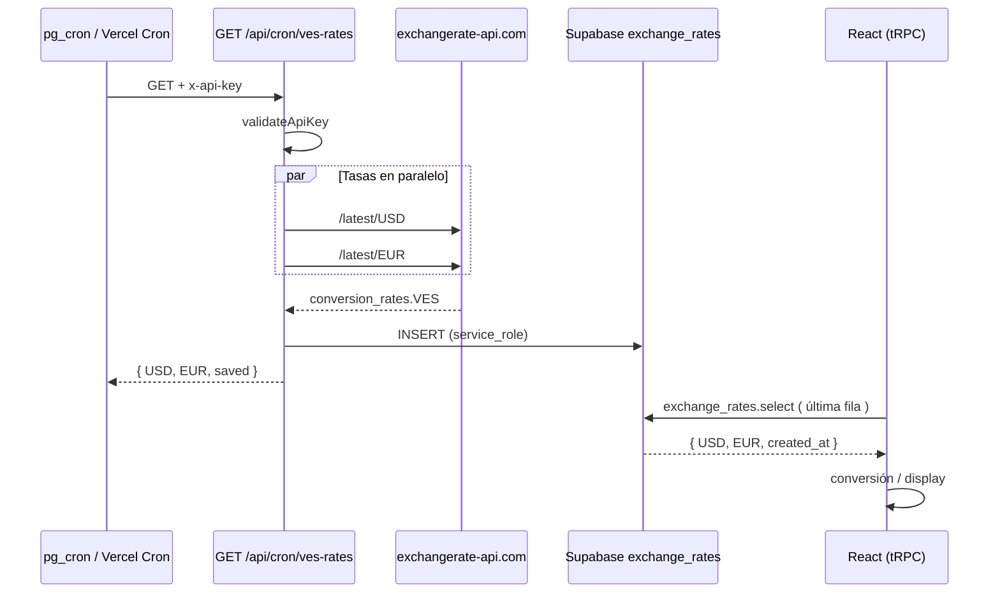

# Guía: Tasas de Cambio VES — `exchange_rates`

Guía portable para implementar la actualización automática de tasas USD/EUR → VES y su consumo en la app. Cubre SQL, cron, API route, script de API key, validaciones, router tRPC, types y patrones de uso en UI.

Pensada para copiar en otro proyecto o pasarla como contexto a un agente de IA en Cursor.

> **Single-tenant:** Las tasas de cambio en este proyecto son **globales** (no hay `club_id`). No requiere adaptación multitenancy.

---

## Referencia en este repositorio

| Archivo                                                                                     | Descripción                                          |
| ------------------------------------------------------------------------------------------- | ---------------------------------------------------- |
| `src/sql/tables/exchange_rates.sql`                                                         | DDL de la tabla + RLS                                |
| `src/sql/cron/ves-rates.cron.sql`                                                           | Job pg_cron que llama al endpoint                    |
| `src/app/api/cron/ves-rates/route.ts`                                                       | Endpoint que consulta API externa e inserta en BD    |
| `scripts/generate-exchange-rates-api-key.js`                                                | Genera `CRON_API_KEY`                                |
| `src/trpc/routes/exchange_rates.router.ts`                                                  | Query: última tasa registrada                        |
| `src/validations/exchange_rates.validations.ts`                                             | Schema Zod del select                                |
| `src/types/exchange_rates.types.ts`                                                         | Interface TypeScript                                 |
| `src/utils/supabase/supabase.service.ts`                                                    | Cliente Supabase con `service_role` (insert en cron) |
| `src/components/pages/admin/accounting/AccountingExchangeRates/AccountingExchangeRates.tsx` | UI de visualización                                  |
| `src/contexts/EnrollmentRequestContext.tsx`                                                 | Conversión de montos según método de pago            |
| `src/components/pages/admin/enrollments/EnrollmentPlansForm/EnrollmentPlansForm.tsx`        | Preview USD/EUR → VES                                |

---

## 1. Arquitectura general

```
┌─────────────────────┐     GET /api/cron/ves-rates      ┌──────────────────────────┐
│  Supabase pg_cron   │ ──── Header: x-api-key ─────────► │  Next.js API Route       │
│  (6:00 AM UTC)      │                                     │  route.ts                │
└─────────────────────┘                                     └────────────┬─────────────┘
                                                                           │
                              ┌────────────────────────────────────────────┤
                              │                                            │
                              ▼                                            ▼
                   ┌──────────────────────┐                    ┌─────────────────────┐
                   │ exchangerate-api.com │                    │ Supabase (insert)   │
                   │ GET /latest/USD      │                    │ exchange_rates      │
                   │ GET /latest/EUR      │                    │ (service_role)      │
                   └──────────────────────┘                    └─────────────────────┘

┌─────────────────────┐     trpc.exchange_rates.select      ┌──────────────────────────┐
│  Frontend (React)   │ ◄────────────────────────────────── │  exchange_rates router   │
│  useQuery({})       │     última fila por created_at       │  order desc limit 1      │
└─────────────────────┘                                     └──────────────────────────┘
```

### Flujo resumido

1. **Cron** (Supabase o externo) dispara `GET /api/cron/ves-rates` con header `x-api-key`.
2. **API route** valida la key, consulta tasas VES desde exchangerate-api.com (USD y EUR en paralelo).
3. **Insert** de una nueva fila en `exchange_rates` vía cliente `service_role` (bypass RLS).
4. **Frontend** lee siempre la fila más reciente con `trpc.exchange_rates.select.useQuery({})`.

### Modelo append-only

Cada ejecución del cron **inserta** una fila nueva. No hay `update`. El historial queda en la tabla; la app solo consume la más reciente.

---

## 2. Base de datos — `exchange_rates.sql`

```sql
CREATE TABLE public.exchange_rates (
    id UUID DEFAULT gen_random_uuid() PRIMARY KEY,
    currency VARCHAR(3) NOT NULL CHECK (currency IN ('USD', 'EUR', 'VES')),
    "USD" DECIMAL(15, 4) NOT NULL,
    "EUR" DECIMAL(15, 4) NOT NULL,
    created_at TIMESTAMP WITH TIME ZONE NOT NULL DEFAULT NOW()
);

CREATE INDEX idx_exchange_rates_created_at ON public.exchange_rates(created_at DESC);
CREATE INDEX idx_exchange_rates_currency ON public.exchange_rates(currency);

ALTER TABLE public.exchange_rates ENABLE ROW LEVEL SECURITY;

-- Lectura pública (cualquier usuario/cliente puede ver la tasa actual)
CREATE POLICY "Anyone can view exchange rates" ON public.exchange_rates
    AS permissive FOR SELECT TO public USING (true);

-- Solo service_role puede insertar (desde el cron/API route)
CREATE POLICY "Service role can insert exchange rates" ON public.exchange_rates
    AS permissive FOR INSERT TO service_role WITH CHECK (true);
```

### Semántica de columnas

| Columna      | Significado                       | Ejemplo                              |
| ------------ | --------------------------------- | ------------------------------------ |
| `currency`   | Moneda de referencia del registro | Siempre `"VES"` en el cron actual    |
| `"USD"`      | **1 USD = X VES**                 | `36.5000`                            |
| `"EUR"`      | **1 EUR = X VES**                 | `39.2000`                            |
| `created_at` | Momento de la actualización       | Usado para saber cuándo se actualizó |

> Las columnas `"USD"` y `"EUR"` van entre comillas en SQL porque son nombres reservados/conflictivos.

### Fórmulas de conversión en la app

```ts
// USD → VES
const amountInVes = amountUsd * exchangeRate.USD;

// EUR → VES
const amountInVes = amountEur * exchangeRate.EUR;

// VES → USD
const amountInUsd = amountVes / exchangeRate.USD;

// VES → EUR
const amountInEur = amountVes / exchangeRate.EUR;
```

---

## 3. Variables de entorno

| Variable                    | Dónde se usa                    | Descripción                                                                                                                                            |
| --------------------------- | ------------------------------- | ------------------------------------------------------------------------------------------------------------------------------------------------------ |
| `CRON_API_KEY`              | API route `/api/cron/ves-rates` | Protege el endpoint del cron. Header `x-api-key`.                                                                                                      |
| `EXCHANGE_RATES_API_KEY`    | API route (recomendado)         | Key de [exchangerate-api.com](https://www.exchangerate-api.com). **En el repo actual está hardcodeada en el route; en proyecto nuevo, muévela a env.** |
| `NEXT_PUBLIC_SUPABASE_URL`  | Cliente Supabase                | URL del proyecto                                                                                                                                       |
| `SUPABASE_SERVICE_ROLE_KEY` | `createServiceClient()`         | Insert bypass RLS. **Solo servidor, nunca en cliente.**                                                                                                |

Ejemplo `.env.local`:

```env
CRON_API_KEY=tu_clave_generada_con_el_script
EXCHANGE_RATES_API_KEY=tu_clave_de_exchangerate_api_com
NEXT_PUBLIC_SUPABASE_URL=https://xxx.supabase.co
SUPABASE_SERVICE_ROLE_KEY=eyJ...
```

En **Vercel** (o tu host), añade las mismas variables en el dashboard de environment variables.

---

## 4. Script — `generate-exchange-rates-api-key.js`

Genera una clave aleatoria de 64 caracteres hex (32 bytes) para proteger el cron.

```js
#!/usr/bin/env node

const crypto = require("crypto");

const generateApiKey = () => crypto.randomBytes(32).toString("hex");

const apiKey = generateApiKey();

console.log(`CRON_API_KEY=${apiKey}`);
// ... instrucciones para .env.local y Supabase Cron headers
```

### Uso

```bash
npm run generate-exchange-rates-api-key
# o
node scripts/generate-exchange-rates-api-key.js
```

Añadir en `package.json`:

```json
{
  "scripts": {
    "generate-exchange-rates-api-key": "node scripts/generate-exchange-rates-api-key.js"
  }
}
```

La misma clave debe estar en:

1. `.env.local` / Vercel → `CRON_API_KEY`
2. SQL del cron Supabase → header `x-api-key`

---

## 5. API Route — `GET /api/cron/ves-rates`

Archivo: `src/app/api/cron/ves-rates/route.ts`

### 5.1 Autenticación

```ts
const API_KEY_HEADER = "x-api-key";

const validateApiKey = (request: Request): boolean => {
  const apiKey = request.headers.get(API_KEY_HEADER);
  const expectedApiKey = process.env.CRON_API_KEY;
  if (!expectedApiKey) return false;
  return apiKey === expectedApiKey;
};
```

Respuesta si falla: `401 Unauthorized`.

### 5.2 Consulta a exchangerate-api.com

```ts
const EXCHANGERATE_API_BASE = `https://v6.exchangerate-api.com/v6/${process.env.EXCHANGE_RATES_API_KEY}`;

type ExchangeRateApiResponse = {
  result?: string;
  conversion_rates?: Record<string, number>;
  "error-type"?: string;
};

const getVESRate = async (currency: "USD" | "EUR"): Promise<number> => {
  const url = `${EXCHANGERATE_API_BASE}/latest/${currency}`;
  const res = await axios.get<ExchangeRateApiResponse>(url);
  const data = res.data;

  if (data.result !== "success" || !data.conversion_rates?.VES) {
    throw new Error(
      `exchangerate-api (${currency}): VES not in conversion_rates`,
    );
  }

  return Number(data.conversion_rates.VES);
};
```

Se consultan **USD y EUR en paralelo**:

```ts
const [usdRate, eurRate] = await Promise.all([
  getVESRate("USD"),
  getVESRate("EUR"),
]);
```

### 5.3 Insert en Supabase

```ts
import { createServiceClient } from "@/utils/supabase/supabase.service";

const supabase = createServiceClient();
const { error } = await supabase.from("exchange_rates").insert({
  currency: "VES",
  USD: usdRate,
  EUR: eurRate,
  created_at: new Date().toISOString(),
});
```

`createServiceClient()` usa `SUPABASE_SERVICE_ROLE_KEY` para insertar pese a RLS.

### 5.4 Respuesta JSON

```ts
return Response.json({
  USD: usdRate,
  EUR: eurRate,
  timestamp: created_at,
  saved: !error, // true si el insert fue OK
});
```

Errores externos (API caída): `500` con `{ error: "External API error", message }`.

### 5.5 Implementación portable completa

```ts
// src/app/api/cron/ves-rates/route.ts
import { createServiceClient } from "@/utils/supabase/supabase.service";
import axios from "axios";

const API_KEY_HEADER = "x-api-key";
const EXCHANGERATE_API_BASE = `https://v6.exchangerate-api.com/v6/${process.env.EXCHANGE_RATES_API_KEY}`;

type Currency = "USD" | "EUR";

const validateApiKey = (request: Request): boolean => {
  const apiKey = request.headers.get(API_KEY_HEADER);
  return apiKey === process.env.CRON_API_KEY;
};

const getVESRate = async (currency: Currency): Promise<number> => {
  const res = await axios.get(`${EXCHANGERATE_API_BASE}/latest/${currency}`);
  const data = res.data;
  if (data.result !== "success" || !data.conversion_rates?.VES) {
    throw new Error(`exchangerate-api (${currency}): invalid response`);
  }
  return Number(data.conversion_rates.VES);
};

export async function GET(request: Request) {
  if (!validateApiKey(request)) {
    return Response.json({ error: "Unauthorized" }, { status: 401 });
  }

  let USD: number, EUR: number;
  try {
    [USD, EUR] = await Promise.all([getVESRate("USD"), getVESRate("EUR")]);
  } catch (err) {
    return Response.json(
      { error: "External API error", message: String(err) },
      { status: 500 },
    );
  }

  const created_at = new Date().toISOString();
  let saved = false;

  try {
    const supabase = createServiceClient();
    const { error } = await supabase.from("exchange_rates").insert({
      currency: "VES",
      USD,
      EUR,
      created_at,
    });
    saved = !error;
  } catch (err) {
    console.error("[ves-rates]", err);
  }

  return Response.json({ USD, EUR, timestamp: created_at, saved });
}
```

---

## 6. Cliente Supabase service role

```ts
// src/utils/supabase/supabase.service.ts
import "server-only";
import { createClient } from "@supabase/supabase-js";

export const createServiceClient = () => {
  if (typeof window !== "undefined") {
    throw new Error("Service client cannot be used in the browser");
  }

  return createClient(
    process.env.NEXT_PUBLIC_SUPABASE_URL!,
    process.env.SUPABASE_SERVICE_ROLE_KEY!,
    { auth: { autoRefreshToken: false, persistSession: false } },
  );
};
```

---

## 7. Cron — `ves-rates.cron.sql`

Job de Supabase que llama al endpoint desplegado (Vercel u otro).

**Requisitos:** extensiones `pg_cron` y `pg_net` (Supabase Pro).

```sql
-- Eliminar job previo si existe
DO $$
BEGIN
    PERFORM cron.unschedule('ves-rates');
EXCEPTION WHEN OTHERS THEN
    NULL;
END $$;

-- Programar: 6:00 AM UTC = 2:00 AM Venezuela (UTC-4)
SELECT cron.schedule(
    'ves-rates',
    '0 6 * * *',
    $$SELECT net.http_get(
        url := 'https://TU-DOMINIO.vercel.app/api/cron/ves-rates',
        headers := jsonb_build_object('x-api-key', 'TU_CRON_API_KEY'),
        timeout_milliseconds := 1000
    )$$
);
```

### Antes de ejecutar

1. Reemplazar URL por tu dominio de producción.
2. Reemplazar `TU_CRON_API_KEY` por el valor de `CRON_API_KEY` en Vercel.
3. Ejecutar el SQL en el SQL Editor de Supabase.

### Alternativa: Vercel Cron

Si no usas Supabase Pro, configura cron en `vercel.json`:

```json
{
  "crons": [
    {
      "path": "/api/cron/ves-rates",
      "schedule": "0 6 * * *"
    }
  ]
}
```

> Con Vercel Cron debes añadir el header `x-api-key` vía middleware o usar `CRON_SECRET` de Vercel en lugar de tu propia key. Ajusta `validateApiKey` según el mecanismo elegido.

---

## 8. Validaciones — `exchange_rates.validations.ts`

Schema alineado con la tabla real (sin `updated_at` ni `deleted_at`):

```ts
import { z } from "zod";

const exchangeRateValidation = () =>
  z.object({
    id: z.uuid(),
    currency: z.enum(["USD", "EUR", "VES"]),
    USD: z.number(),
    EUR: z.number(),
    created_at: z.coerce.date(),
  });

const selectValidation = () => z.object({});

export const vExchangeRate = {
  db: exchangeRateValidation,
  select: selectValidation,
};
```

El `select` no recibe filtros: siempre devuelve la tasa más reciente.

---

## 9. Types — `exchange_rates.types.ts`

```ts
interface ExchangeRate {
  id: string;
  currency: "USD" | "EUR" | "VES";
  USD: number;
  EUR: number;
  created_at: string;
}
```

Si usas Supabase codegen, extiende `Tables<"exchange_rates">`:

```ts
interface ExchangeRate extends Tables<"exchange_rates"> {
  currency: "USD" | "EUR" | "VES";
}
```

---

## 10. Router tRPC — `exchange_rates.router.ts`

Registrar en el router raíz:

```ts
// src/trpc/trpc.router.ts
import { exchangeRateRouter } from "@/trpc/routes/exchange_rates.router";

export const appRouter = router({
  exchange_rates: exchangeRateRouter,
  // ...
});
```

Implementación:

```ts
import { router, publicProcedure } from "@/trpc";
import { vExchangeRate } from "@/validations/exchange_rates.validations";

export const exchangeRateRouter = router({
  select: publicProcedure
    .input(vExchangeRate.select())
    .query(async ({ ctx }) => {
      const { data, error } = await ctx.supabase
        .from("exchange_rates")
        .select("*")
        .order("created_at", { ascending: false })
        .limit(1)
        .single();

      if (error) throw new Error(error.message);
      return data;
    }),
});
```

**Query del cliente:**

```tsx
const { data: exchangeRate, isLoading } = trpc.exchange_rates.select.useQuery(
  {},
);
```

Retorna `undefined`/error si no hay filas. Maneja el estado vacío en UI.

---

## 11. Consumo en UI

### 11.1 Visualización — `AccountingExchangeRates`

```tsx
const { data: rate, isLoading } = trpc.exchange_rates.select.useQuery({});

const usd = rate ? Number(rate.USD) : null;
const eur = rate ? Number(rate.EUR) : null;

// Muestra cards "Dólar BCV" y "Euro BCV" + fecha de actualización
```

### 11.2 Conversión en inscripciones — `EnrollmentRequestContext`

Convierte el monto base según la moneda del método de pago seleccionado:

```tsx
const { data: exchangeRate } = trpc.exchange_rates.select.useQuery({});

// VES → USD
if (baseCurrency === "VES" && methodCurrency === "USD") {
  const converted = exchangeRate.USD
    ? baseAmount / exchangeRate.USD
    : baseAmount;
}

// USD → VES
if (baseCurrency === "USD" && methodCurrency === "VES") {
  const converted = exchangeRate.USD
    ? baseAmount * exchangeRate.USD
    : baseAmount;
}
```

### 11.3 Preview en formulario de planes — `EnrollmentPlansForm`

Muestra equivalente en bolívares al editar cuota:

```tsx
const { data: exchangeRate } = trpc.exchange_rates.select.useQuery({});

const amountInVes = useMemo(() => {
  if (currency === "VES") return amount;
  if (currency === "USD") return amount * Number(exchangeRate.USD);
  if (currency === "EUR") return amount * Number(exchangeRate.EUR);
  return null;
}, [currency, enrollmentFee, exchangeRate]);
```

---

## 12. Diagrama de secuencia



---

## 13. Checklist de implementación

### Base de datos

- [ ] Ejecutar `exchange_rates.sql`
- [ ] Verificar RLS: SELECT público, INSERT solo `service_role`
- [ ] Habilitar extensiones `pg_cron` y `pg_net` (si usas cron Supabase)

### Backend

- [ ] Crear `src/app/api/cron/ves-rates/route.ts`
- [ ] Crear `createServiceClient()` con `service_role`
- [ ] Registrar `exchangeRateRouter` en tRPC
- [ ] Variables de entorno en local y producción

### Seguridad

- [ ] `npm run generate-exchange-rates-api-key` → guardar en env
- [ ] Mover API key de exchangerate-api.com a `EXCHANGE_RATES_API_KEY` (no hardcodear)
- [ ] Nunca exponer `SUPABASE_SERVICE_ROLE_KEY` en cliente

### Cron

- [ ] Desplegar app con el endpoint accesible
- [ ] Ejecutar `ves-rates.cron.sql` con URL y key correctas
- [ ] Probar manualmente: `curl -H "x-api-key: TU_KEY" https://tu-app/api/cron/ves-rates`

### Frontend

- [ ] `trpc.exchange_rates.select.useQuery({})` donde necesites tasas
- [ ] Manejar `!rate && !isLoading` (sin datos aún)
- [ ] Usar `Number(rate.USD)` / `Number(rate.EUR)` (DECIMAL puede llegar como string)

---

## 14. Prueba manual del endpoint

```bash
curl -s -H "x-api-key: TU_CRON_API_KEY" \
  https://tu-dominio.vercel.app/api/cron/ves-rates | jq
```

Respuesta esperada:

```json
{
  "USD": 36.5,
  "EUR": 39.2,
  "timestamp": "2026-06-02T06:00:00.000Z",
  "saved": true
}
```

Verificar en Supabase:

```sql
SELECT * FROM exchange_rates ORDER BY created_at DESC LIMIT 5;
```

---

## 15. Errores comunes

| Problema                  | Causa                                           | Solución                                                                  |
| ------------------------- | ----------------------------------------------- | ------------------------------------------------------------------------- |
| `401 Unauthorized`        | Key incorrecta o ausente                        | Igualar `CRON_API_KEY` en Vercel y en el cron SQL                         |
| `saved: false`            | RLS o service role                              | Verificar `SUPABASE_SERVICE_ROLE_KEY` y policy INSERT para `service_role` |
| `500 External API error`  | Key exchangerate-api inválida o límite excedido | Revisar `EXCHANGE_RATES_API_KEY` y plan en exchangerate-api.com           |
| UI muestra "No hay tasas" | Cron nunca corrió o falló                       | Ejecutar curl manual y revisar logs                                       |
| `PGRST116` en select      | Tabla vacía                                     | Normal antes del primer cron; manejar en UI                               |
| Timeout en pg_cron        | `timeout_milliseconds := 1000` muy bajo         | Subir a 5000–10000 ms                                                     |
| Tasas desactualizadas     | Cron no programado                              | Verificar `cron.job` en Supabase: `SELECT * FROM cron.job;`               |

---

## 16. Notas del repositorio origen

1. **API key hardcodeada:** En `route.ts` la URL de exchangerate-api incluye la key en el path. Para proyecto nuevo, usa `process.env.EXCHANGE_RATES_API_KEY`.
2. **Validación desactualizada:** `exchange_rates.validations.ts` menciona `updated_at` y `deleted_at`, pero la tabla **no** tiene esas columnas. Usa el schema de la sección 8.
3. **Sin multitenancy:** No hay `club_id`; una sola serie de tasas para toda la app.
4. **Fuente de datos:** exchangerate-api.com (referencia orientativa BCV). Evalúa si necesitas otra fuente oficial según tu dominio.

---

## 17. Orden recomendado para Cursor

Si vas a pedirle a Cursor que implemente esto en otro proyecto, pega esta guía y pide en este orden:

1. SQL `exchange_rates` + RLS
2. `createServiceClient`
3. API route `/api/cron/ves-rates`
4. Script + env vars
5. Validations + types + tRPC router
6. Cron SQL (o Vercel cron)
7. Componente UI de visualización
8. Integrar conversión donde la app lo necesite
