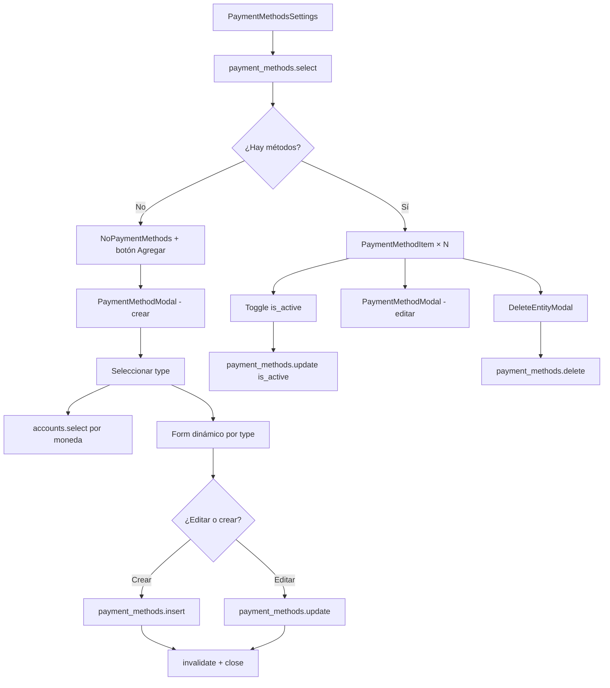

# Guía: Configuración de Métodos de Pago — `PaymentMethodsSettings`

Guía portable para implementar la gestión de métodos de pago en un proyecto externo. Cubre base de datos, validaciones, router tRPC, tipos, constantes y toda la capa UI (`PaymentMethodsSettings`, `PaymentMethodModal`, `PaymentMethodItem` y formularios por tipo).

Pensada para copiar en otro proyecto o pasarla como contexto a un agente de IA en Cursor.

> **Adaptación single-tenant:** En este repositorio los métodos de pago están scoped por `club_id` (multitenancy). En un proyecto **sin multitenancy**, elimina `club_id` de la tabla, validaciones, routers y props de componentes. Esta guía incluye versiones simplificadas en cada sección.

---

## Referencia en este repositorio

| Archivo | Descripción |
|---------|-------------|
| `src/components/pages/admin/settings/PaymentMethodsSettings/PaymentMethodsSettings.tsx` | Página/card principal: lista + botón agregar |
| `src/components/pages/admin/settings/PaymentMethodsSettings/PaymentMethodsSettings.types.ts` | Props del componente |
| `src/components/pages/admin/settings/payment-methods/PaymentMethodModal/PaymentMethodModal.tsx` | Modal crear/editar (selector de tipo + campos comunes + form dinámico) |
| `src/components/pages/admin/settings/PaymentMethodItem/PaymentMethodItem.tsx` | Fila de la lista: toggle activo, editar, eliminar |
| `src/components/pages/admin/settings/payment-methods/forms/*/` | Formularios por tipo (`PagoMovilForm`, `ZinliForm`, etc.) |
| `src/constants/payment-methods.ts` | Tipos permitidos, metadata (nombre, icono, moneda) |
| `src/types/payment_methods.types.ts` | Interface TypeScript |
| `src/validations/payment_methods.validations.ts` | Schemas Zod (select, insert, update, delete) |
| `src/trpc/routes/payment_methods.router.ts` | CRUD vía Supabase |
| `src/trpc/routes/accounts.router.ts` | Cuentas asociadas (filtradas por moneda) |
| `src/sql/tables/clubs/payment_methods.sql` | DDL + RLS |
| `src/app/admin/accounting/settings/page.tsx` | Página que consume `PaymentMethodsSettings` |

---

## 1. Arquitectura general

```
SettingsPage
└── PaymentMethodsSettings
    ├── trpc.payment_methods.select  →  lista de métodos
    ├── PaymentMethodModal (crear)
    │   ├── Estado común: type, name, is_active, account_id
    │   ├── trpc.accounts.select (filtrado por moneda del tipo)
    │   └── Form por tipo → insert / update
    └── PaymentMethodItem[] (por cada método)
        ├── Toggle is_active  →  trpc.payment_methods.update
        ├── PaymentMethodModal (editar)
        └── DeleteEntityModal  →  trpc.payment_methods.delete
```

### Modelo de datos clave

Cada fila en `payment_methods` tiene:

| Campo | Rol |
|-------|-----|
| `type` | Discriminador: qué formulario y qué campos usar |
| `name` | Etiqueta opcional del admin ("Cuenta principal", "Zinli personal") |
| `payment_details` | JSONB con campos específicos del tipo (teléfono, email, etc.) |
| `account_id` | Cuenta contable donde se registran movimientos de ese método |
| `is_active` | Si aparece como opción de pago para usuarios |

```
payment_methods
├── type: "pago_movil" | "zinli" | "zelle" | "binance" | "transferencia_bancaria"
├── name: "Mi Pago Móvil BDV"
├── payment_details: { phone, cedula, bank_name }   ← schema depende del type
├── account_id: UUID → accounts (misma moneda que el tipo)
└── is_active: true
```

---

## 2. Adaptación single-tenant (sin clubs)

En el proyecto origen, `club_id` separa métodos de pago por club y métodos de la plataforma (`club_id IS NULL`).

**En tu proyecto externo, omite todo lo relacionado con clubs:**

| Capa | Origen (multitenancy) | Single-tenant |
|------|----------------------|---------------|
| Tabla `payment_methods` | `club_id UUID REFERENCES clubs` | **Eliminar columna** `club_id` |
| Tabla `accounts` | `club_id UUID REFERENCES clubs` | **Eliminar columna** `club_id` |
| RLS | Políticas por club + super admin | Políticas simples: admin autenticado |
| `PaymentMethodsSettings` | `club?: Club \| null` | **Sin props** (o solo permisos) |
| `payment_methods.select` input | `{ club_id, is_active? }` | `{ is_active? }` |
| `payment_methods.insert` | incluye `club_id` | **Sin** `club_id` |
| `accounts.select` input | `{ club_id, currency?, is_active? }` | `{ currency?, is_active? }` |
| Formularios insert | `club_id` en mutate | **Sin** `club_id` |
| Página settings | `useClub()` + `club={club}` | Render directo del componente |

---

## 3. Base de datos

### 3.1 Tabla `payment_methods` — versión single-tenant

```sql
CREATE TABLE public.payment_methods (
    id UUID DEFAULT uuid_generate_v4() PRIMARY KEY,
    name VARCHAR(255) NOT NULL DEFAULT '',
    type VARCHAR(50) NOT NULL DEFAULT 'pago_movil'
        CHECK (type IN ('pago_movil', 'zinli', 'zelle', 'binance', 'transferencia_bancaria')),
    payment_details JSONB NOT NULL DEFAULT '{}'::jsonb,
    is_active BOOLEAN NOT NULL DEFAULT true,
    account_id UUID REFERENCES public.accounts(id) ON DELETE SET NULL,
    created_by UUID NOT NULL REFERENCES public.profiles(id),
    created_at TIMESTAMPTZ NOT NULL DEFAULT NOW(),
    updated_at TIMESTAMPTZ NOT NULL DEFAULT NOW(),
    deleted_at TIMESTAMPTZ
);

CREATE INDEX idx_payment_methods_is_active ON public.payment_methods(is_active);
CREATE INDEX idx_payment_methods_type ON public.payment_methods(type);
CREATE INDEX idx_payment_methods_account_id ON public.payment_methods(account_id);
CREATE INDEX idx_payment_methods_payment_details ON public.payment_methods USING GIN (payment_details);

ALTER TABLE public.payment_methods ENABLE ROW LEVEL SECURITY;

-- Ejemplo RLS simple (ajusta según tu auth)
CREATE POLICY "Anyone can view active payment methods" ON public.payment_methods
    FOR SELECT TO public
    USING (deleted_at IS NULL);

CREATE POLICY "Admins can manage payment methods" ON public.payment_methods
    FOR ALL TO authenticated
    USING (true)
    WITH CHECK (auth.uid() = created_by);
```

### 3.2 Tabla `accounts` (dependencia)

Cada método de pago **debe** vincularse a una cuenta contable. La moneda de la cuenta debe coincidir con la del tipo de método (definida en constantes).

```sql
CREATE TABLE public.accounts (
    id UUID DEFAULT uuid_generate_v4() PRIMARY KEY,
    name VARCHAR(255) NOT NULL DEFAULT '',
    currency VARCHAR(3) NOT NULL DEFAULT 'USD'
        CHECK (currency IN ('USD', 'EUR', 'VES')),
    description TEXT NOT NULL DEFAULT '',
    is_default BOOLEAN NOT NULL DEFAULT false,
    is_active BOOLEAN NOT NULL DEFAULT true,
    created_by UUID NOT NULL REFERENCES public.profiles(id),
    created_at TIMESTAMPTZ NOT NULL DEFAULT NOW(),
    updated_at TIMESTAMPTZ NOT NULL DEFAULT NOW(),
    deleted_at TIMESTAMPTZ
);
```

> Si no tienes módulo de contabilidad, puedes hacer `account_id` nullable y omitir el selector en el modal. En este proyecto es **obligatorio** antes de guardar.

---

## 4. Constantes — `payment-methods.ts`

Fuente única de verdad para tipos permitidos y metadata de UI:

```ts
export const PAYMENT_METHOD_TYPES = [
  "pago_movil",
  "zinli",
  "zelle",
  "binance",
  "transferencia_bancaria",
] as const;

export type PaymentMethodType = (typeof PAYMENT_METHOD_TYPES)[number];

export interface PaymentMethodBaseInfo {
  id: PaymentMethodType;
  name: string;
  icon: string;
  currency: "USD" | "EUR" | "VES";
  description: string;
}

export const PAYMENT_METHODS_BASE_INFO: PaymentMethodBaseInfo[] = [
  { id: "pago_movil", name: "Pago Móvil", icon: "...", currency: "VES", description: "..." },
  { id: "zinli", name: "Zinli", icon: "...", currency: "USD", description: "..." },
  { id: "zelle", name: "Zelle", icon: "...", currency: "USD", description: "..." },
  { id: "binance", name: "Binance", icon: "...", currency: "USD", description: "..." },
  { id: "transferencia_bancaria", name: "Transferencia Bancaria", icon: "...", currency: "VES", description: "..." },
];

export const PAYMENT_METHODS_BY_TYPE = PAYMENT_METHODS_BASE_INFO.reduce(
  (acc, info) => { acc[info.id] = info; return acc; },
  {} as Record<PaymentMethodType, PaymentMethodBaseInfo>
);
```

**Regla:** Los valores de `PAYMENT_METHOD_TYPES` deben coincidir con el `CHECK` de la columna `type` en PostgreSQL.

---

## 5. Types — `payment_methods.types.ts`

```ts
interface PaymentMethod {
  id: string;
  name: string;
  type: "pago_movil" | "zinli" | "zelle" | "binance" | "transferencia_bancaria";
  payment_details: Record<string, string>;
  account_id: string | null;
  is_active: boolean;
  created_by: string;
  created_at: string;
  updated_at: string;
  deleted_at: string | null;
}
```

Props de componentes (single-tenant):

```ts
// PaymentMethodsSettings — sin props de club
export interface PaymentMethodsSettingsProps {
  className?: string;
}

// PaymentMethodModal
export interface PaymentMethodModalProps {
  children?: React.ReactNode;       // Trigger (botón crear o editar)
  paymentMethod?: PaymentMethod;    // undefined = crear, definido = editar
}

// PaymentMethodItem
export type PaymentMethodItemProps = {
  paymentMethod: PaymentMethod;
};
```

---

## 6. Validaciones — `payment_methods.validations.ts`

Patrón del proyecto: un schema base + derivados por operación (`vPaymentMethod.select()`, `.insert()`, etc.).

### 6.1 Schema base (single-tenant)

```ts
import { z } from "zod";
import { PAYMENT_METHOD_TYPES } from "@/constants/payment-methods";

const paymentMethodTypeEnum = z.enum(PAYMENT_METHOD_TYPES);

const paymentMethodValidation = () =>
  z.object({
    id: z.uuid(),
    name: z.string().max(255),
    type: paymentMethodTypeEnum,
    payment_details: z.record(z.string(), z.string()),
    account_id: z.uuid(),
    is_active: z.boolean(),
    created_by: z.uuid(),
    created_at: z.date().optional(),
    updated_at: z.date().optional(),
    deleted_at: z.date().nullable().optional(),
  });
```

### 6.2 Schemas por operación

```ts
// SELECT — input de la query
const selectValidation = () =>
  z.object({
    is_active: z.boolean().optional(),
  });

// INSERT — lo que envía el formulario al crear
const insertValidation = () =>
  paymentMethodValidation().omit({
    id: true,
    created_at: true,
    updated_at: true,
    deleted_at: true,
    created_by: true,  // lo asigna el router con ctx.user.id
  });

// UPDATE — partial + id obligatorio
const updateValidation = () =>
  paymentMethodValidation()
    .omit({ created_at: true, updated_at: true, deleted_at: true, created_by: true })
    .partial()
    .extend({ id: z.uuid() });

// DELETE
const deleteValidation = () =>
  paymentMethodValidation().pick({ id: true });

export const vPaymentMethod = {
  db: paymentMethodValidation,
  select: selectValidation,
  insert: insertValidation,
  update: updateValidation,
  delete: deleteValidation,
};
```

### 6.3 Validaciones por tipo (formularios UI)

Estas viven en cada `*Form.helpers.ts` y validan **solo** `payment_details`. El router recibe el objeto ya validado como `Record<string, string>`.

| Tipo | Campos en `payment_details` | Schema Zod |
|------|----------------------------|------------|
| `pago_movil` | `phone`, `cedula`, `bank_name` | Todos requeridos |
| `zinli` | `name`, `email` | email válido |
| `zelle` | `name`, `email` | email válido |
| `binance` | `email`, `wallet_address` | Ambos requeridos |
| `transferencia_bancaria` | `name`, `bank_name`, `account_number`, `account_type` | `account_type` opcional |

Ejemplo `PagoMovilForm.helpers.ts`:

```ts
export const schema = z.object({
  phone: z.string().min(1, "El teléfono es requerido"),
  cedula: z.string().min(1, "La cédula es requerida"),
  bank_name: z.string().min(1, "El banco es requerido"),
});

export const defaultValues = { phone: "", cedula: "", bank_name: "" };

export function getDefaultValuesFromPaymentMethod(paymentMethod: {
  payment_details?: Record<string, string>;
}) {
  const details = paymentMethod.payment_details ?? {};
  return {
    phone: details.phone ?? "",
    cedula: details.cedula ?? "",
    bank_name: details.bank_name ?? "",
  };
}
```

> **Convención:** En modo edición, `getDefaultValuesFromPaymentMethod` hidrata el form desde `payment_details`. El campo `name` del método (etiqueta admin) vive en el modal, no dentro de `payment_details` (excepto en Zinli/Zelle/BankTransfer donde `name` en details = titular).

---

## 7. Router tRPC — `payment_methods.router.ts`

Registrar en el router raíz:

```ts
// trpc.router.ts
import { paymentMethodRouter } from "@/trpc/routes/payment_methods.router";

export const appRouter = router({
  // ...
  payment_methods: paymentMethodRouter,
});
```

### 7.1 Versión single-tenant

```ts
import { router, publicProcedure, protectedProcedure } from "@/trpc";
import { vPaymentMethod } from "@/validations/payment_methods.validations";

export const paymentMethodRouter = router({
  select: publicProcedure
    .input(vPaymentMethod.select())
    .query(async ({ input, ctx }) => {
      const { is_active } = input;

      let query = ctx.supabase
        .from("payment_methods")
        .select("*")
        .is("deleted_at", null)
        .order("created_at", { ascending: false });

      if (is_active !== undefined) {
        query = query.eq("is_active", is_active);
      }

      const { data, error } = await query;
      if (error) throw new Error(error.message);
      return data;
    }),

  insert: protectedProcedure
    .input(vPaymentMethod.insert())
    .mutation(async ({ input, ctx }) => {
      if (!ctx.user) throw new Error("User not authenticated");

      const { data, error } = await ctx.supabase
        .from("payment_methods")
        .insert({ ...input, created_by: ctx.user.id })
        .select()
        .single();

      if (error) throw new Error(error.message);
      return data;
    }),

  update: protectedProcedure
    .input(vPaymentMethod.update())
    .mutation(async ({ input, ctx }) => {
      const { id, ...rest } = input;

      const { data, error } = await ctx.supabase
        .from("payment_methods")
        .update({ ...rest, updated_at: new Date().toISOString() })
        .eq("id", id)
        .select("*")
        .single();

      if (error) throw error;
      return data;
    }),

  delete: protectedProcedure
    .input(vPaymentMethod.delete())
    .mutation(async ({ input, ctx }) => {
      const { error } = await ctx.supabase
        .from("payment_methods")
        .delete()
        .eq("id", input.id);

      if (error) throw new Error(error.message);
    }),
});
```

### 7.2 Router `accounts` (dependencia del modal)

El modal filtra cuentas por moneda según el tipo seleccionado:

```ts
// En PaymentMethodModal:
const selectedMethodCurrency = selectedType
  ? PAYMENT_METHODS_BY_TYPE[selectedType]?.currency
  : undefined;

const { data: accounts = [] } = trpc.accounts.select.useQuery(
  { is_active: true, currency: selectedMethodCurrency },
  { enabled: !!selectedMethodCurrency }
);
```

Versión single-tenant del select:

```ts
select: publicProcedure
  .input(z.object({
    is_active: z.boolean().optional(),
    currency: z.enum(["USD", "EUR", "VES"]).optional(),
  }))
  .query(async ({ input, ctx }) => {
    let query = ctx.supabase
      .from("accounts")
      .select("*")
      .is("deleted_at", null)
      .order("created_at", { ascending: false });

    if (input.is_active !== undefined) query = query.eq("is_active", input.is_active);
    if (input.currency) query = query.eq("currency", input.currency);

    const { data, error } = await query;
    if (error) throw new Error(error.message);
    return data;
  }),
```

---

## 8. UI — `PaymentMethodsSettings`

Componente contenedor: card con header, lista, estado vacío e info.

```tsx
"use client";

const PaymentMethodsSettings = () => {
  const { data: paymentMethods = [] } = trpc.payment_methods.select.useQuery(
    {},
    { enabled: true }
  );

  const noMethods = paymentMethods.length === 0;

  return (
    <Card>
      <CardHeader>
        <CardTitle>Métodos de Pago</CardTitle>
        <PaymentMethodModal>
          <Button><Plus /> Agregar Método</Button>
        </PaymentMethodModal>
      </CardHeader>

      <CardContent>
        {!noMethods && paymentMethods.map((method) => (
          <PaymentMethodItem key={method.id} paymentMethod={method} />
        ))}
        {noMethods && <NoPaymentMethods />}
        <Separator />
        {/* Texto informativo */}
      </CardContent>
    </Card>
  );
};
```

**Query:** `trpc.payment_methods.select.useQuery({})` — sin filtros trae todos los métodos no eliminados.

**Crear:** `PaymentMethodModal` con `children` como trigger (`DialogTrigger asChild`).

---

## 9. UI — `PaymentMethodModal`

Modal más complejo que el patrón simple de `AssignRoleModal`: combina **estado local del shell** + **formulario dinámico por tipo**.

### 9.1 Estado del modal (fuera del react-hook-form)

```tsx
const formName = "payment-method";
const [open, setOpen] = useState(false);
const [selectedType, setSelectedType] = useState<PaymentMethodType | null>(defaultType);
const [is_active, setIsActive] = useState(paymentMethod?.is_active ?? true);
const [name, setName] = useState(paymentMethod?.name ?? "");
const [account_id, setAccountId] = useState(paymentMethod?.account_id ?? "");
```

Estos campos son **comunes a todos los tipos** y se pasan como props al formulario hijo. Solo `payment_details` varía por tipo.

### 9.2 Dos modos de trigger

| Modo | `children` | Trigger |
|------|-----------|---------|
| Crear | `<Button>Agregar</Button>` | `DialogTrigger asChild` |
| Editar | `undefined` | `DropdownMenuItem` con `e.preventDefault()` + `setOpen(true)` |

### 9.3 Selector de tipo + switch activo + cuenta

```tsx
<Select value={selectedType} onValueChange={(v) => {
  setSelectedType(v as PaymentMethodType);
  setAccountId(""); // Reset al cambiar tipo (moneda distinta)
}}>
  {PAYMENT_METHODS_BASE_INFO.map((m) => (
    <SelectItem key={m.id} value={m.id}>{m.name}</SelectItem>
  ))}
</Select>

<Switch checked={is_active} onCheckedChange={setIsActive} />

<Input value={name} onChange={...} placeholder="Etiqueta opcional..." />

<Select value={account_id} onValueChange={setAccountId}>
  {accounts.map((acc) => (
    <SelectItem key={acc.id} value={acc.id}>
      {acc.name} ({acc.currency})
    </SelectItem>
  ))}
</Select>
```

### 9.4 Formulario dinámico por tipo

```tsx
const renderForm = () => {
  if (!selectedType) return null;
  const formProps = { formName, handleClose, is_active, name, paymentMethod, account_id };
  switch (selectedType) {
    case "pago_movil": return <PagoMovilForm {...formProps} />;
    case "zinli": return <ZinliForm {...formProps} />;
    case "zelle": return <ZelleForm {...formProps} />;
    case "binance": return <BinanceForm {...formProps} />;
    case "transferencia_bancaria": return <BankTransferForm {...formProps} />;
    default: return null;
  }
};
```

### 9.5 Footer con submit externo

Mismo patrón que `AssignRoleModal`:

```tsx
<Button type="submit" form={`form-${formName}`}>
  {paymentMethod ? "Guardar cambios" : "Agregar método de pago"}
</Button>
```

---

## 10. UI — Formularios por tipo

Todos siguen la **misma estructura**. Ejemplo genérico (`PagoMovilForm`):

```tsx
export function PagoMovilForm(props: Props) {
  const { formName, handleClose, is_active, name, paymentMethod, account_id } = props;
  const utils = trpc.useUtils();

  const insertMutation = trpc.payment_methods.insert.useMutation({
    onSuccess: async () => {
      toast({ title: "Método de pago creado", variant: "success" });
      await utils.payment_methods.select.invalidate();
      handleClose();
    },
  });

  const updateMutation = trpc.payment_methods.update.useMutation({ /* igual */ });

  const form = useForm({
    resolver: zodResolver(schema),
    defaultValues: paymentMethod
      ? getDefaultValuesFromPaymentMethod(paymentMethod)
      : defaultValues,
  });

  const onSubmit = async (data: PagoMovilForm) => {
    if (!account_id) {
      toast({ title: "Error", description: "Selecciona una cuenta asociada", variant: "error" });
      return;
    }

    const payment_details = data; // El objeto validado ES payment_details

    if (paymentMethod) {
      await updateMutation.mutateAsync({
        id: paymentMethod.id,
        name,
        type: "pago_movil",
        payment_details,
        is_active,
        account_id,
      });
    } else {
      await insertMutation.mutateAsync({
        name,
        type: "pago_movil",
        payment_details,
        is_active,
        account_id,
      });
    }
  };

  return (
    <Form {...form}>
      <form id={`form-${formName}`} onSubmit={form.handleSubmit(onSubmit)} noValidate>
        {/* FormInput por cada campo de payment_details */}
      </form>
    </Form>
  );
}
```

### Flujo insert vs update

```
                    ┌─────────────────┐
                    │  onSubmit(data) │
                    └────────┬────────┘
                             │
              ┌──────────────┴──────────────┐
              │                             │
     paymentMethod existe?          paymentMethod undefined
              │                             │
              ▼                             ▼
    update({ id, name, type,        insert({ name, type,
      payment_details, is_active,      payment_details, is_active,
      account_id })                    account_id })
              │                             │
              └──────────────┬──────────────┘
                             ▼
              invalidate payment_methods.select
              handleClose() → cierra modal
```

---

## 11. UI — `PaymentMethodItem`

Fila de la lista con tres acciones:

### 11.1 Toggle activo/inactivo

Click directo en el badge de estado (sin abrir modal):

```tsx
const { mutateAsync: updatePaymentMethod } = trpc.payment_methods.update.useMutation({
  onSuccess: (data) => {
    toast({ title: `Método ${data.is_active ? "activado" : "desactivado"}` });
    utils.payment_methods.select.invalidate();
  },
});

const handleToggleEnabled = async (enabled: boolean) => {
  await updatePaymentMethod({ id: paymentMethod.id, is_active: enabled });
};
```

### 11.2 Editar

```tsx
<PaymentMethodModal paymentMethod={paymentMethod}>
  <Button variant="ghost"><Edit /></Button>
</PaymentMethodModal>
```

### 11.3 Eliminar

Usa un modal genérico de confirmación (`DeleteEntityModal`):

```tsx
<DeleteEntityModal
  entity="Método de pago"
  name={paymentMethod.type}
  id={paymentMethod.id}
  mutation={trpc.payment_methods.delete}
  onDeleteSuccess={utils.payment_methods.invalidate}
>
  <Button variant="ghost"><Trash2 /></Button>
</DeleteEntityModal>
```

### 11.4 Display

Muestra icono desde `PAYMENT_METHODS_BASE_INFO`, nombre (`paymentMethod.name` o fallback al nombre del tipo), y badge de estado.

---

## 12. Consumo en flujos de pago (lectura)

Cuando un usuario elige un método para pagar, se consulta la lista filtrada:

```tsx
trpc.payment_methods.select.useQuery({ is_active: true })
```

Para mostrar `payment_details` al usuario, itera las claves del JSONB:

```tsx
// PaymentMethodDetails.tsx — render genérico
Object.entries(paymentMethod.payment_details)
  .filter(([, v]) => v)
  .map(([key, value]) => (
    <Item key={key} label={getPaymentMethodFieldLabel(key)} value={value} />
  ));
```

Labels en español (`getPaymentMethodFieldLabel.ts`):

```ts
const LABELS: Record<string, string> = {
  phone: "Teléfono",
  cedula: "Cédula",
  bank_name: "Banco",
  email: "Email",
  account_number: "Número de cuenta",
  wallet_address: "Dirección de billetera",
  name: "Nombre",
  account_type: "Tipo de cuenta",
};
```

---

## 13. Diagrama de flujo completo



---

## 14. Checklist para proyecto externo (single-tenant)

### Backend / datos

- [ ] Tabla `payment_methods` sin `club_id`
- [ ] Tabla `accounts` sin `club_id` (si usas cuenta asociada)
- [ ] `CHECK` en `type` alineado con `PAYMENT_METHOD_TYPES`
- [ ] RLS o middleware de auth según tu stack
- [ ] Router: `select`, `insert`, `update`, `delete`

### Validaciones

- [ ] `vPaymentMethod` con schemas por operación
- [ ] Schema Zod por cada tipo en `*Form.helpers.ts`
- [ ] `getDefaultValuesFromPaymentMethod` por tipo

### Constantes y types

- [ ] `PAYMENT_METHODS_BASE_INFO` con moneda por tipo
- [ ] Interface `PaymentMethod`
- [ ] `getPaymentMethodFieldLabel` para UI de lectura

### UI

- [ ] `PaymentMethodsSettings` — lista + query
- [ ] `PaymentMethodModal` — estado común + switch de forms
- [ ] 5 formularios por tipo (o los que necesites)
- [ ] `PaymentMethodItem` — toggle, edit, delete
- [ ] Patrón `formName` + submit en footer del modal

### Dependencias npm

- [ ] `@tanstack/react-query` + tRPC (o equivalente)
- [ ] `react-hook-form` + `@hookform/resolvers/zod` + `zod`
- [ ] Radix Dialog + shadcn/ui (Card, Button, Select, Switch, etc.)

---

## 15. Plantilla mínima portable

### Página de settings

```tsx
export default function SettingsPage() {
  return (
    <div className="space-y-8">
      <FeatureHeader title="Configuración de Contabilidad" />
      <div className="grid lg:grid-cols-2 gap-4">
        <AccountsSettings />
        <PaymentMethodsSettings />
      </div>
    </div>
  );
}
```

### Agregar un nuevo tipo de método de pago

1. Añadir valor al `CHECK` de PostgreSQL y a `PAYMENT_METHOD_TYPES`
2. Entrada en `PAYMENT_METHODS_BASE_INFO` (con `currency`)
3. Crear carpeta `forms/NuevoTipoForm/` con `.tsx`, `.types.ts`, `.helpers.ts`
4. Añadir `case` en el `switch` de `PaymentMethodModal.renderForm()`
5. Añadir labels en `getPaymentMethodFieldLabel` si aplica

---

## 16. Errores comunes

| Problema | Causa | Solución |
|----------|-------|----------|
| No hay cuentas en el select | No existen accounts con la moneda del tipo | Crear cuentas USD/VES según el método |
| Submit no guarda | Falta `account_id` | Validar en `onSubmit` antes de mutar |
| Form vacío al editar | `getDefaultValuesFromPaymentMethod` no mapea keys | Revisar keys de `payment_details` vs schema |
| Tipo cambia y cuenta inválida | Moneda distinta | Reset `account_id` al cambiar `selectedType` |
| Lista no se actualiza | Falta invalidate | `utils.payment_methods.select.invalidate()` en onSuccess |
| Confusión `name` | Hay `name` del método y `name` en details (titular) | `name` del modal = etiqueta admin; `name` en details = titular de cuenta |

---

## 17. Diferencias con el patrón `AssignRoleModal`

| Aspecto | AssignRoleModal | PaymentMethodModal |
|---------|-----------------|-------------------|
| Formularios | Uno fijo | Uno por `type` (switch) |
| Estado fuera del form | Solo `open` | `type`, `name`, `is_active`, `account_id` |
| Trigger | Solo dropdown | Dropdown (editar) o DialogTrigger (crear) |
| Validación | Un schema | Schema común (API) + schema por tipo (UI) |
| Datos variables | Campos fijos | `payment_details` JSONB según tipo |
| Dependencia extra | Ninguna | `accounts.select` filtrado por moneda |

Ambos comparten: `formName`, submit en `DialogFooter` con `form={...}`, invalidate de queries y `handleClose()` tras éxito.
