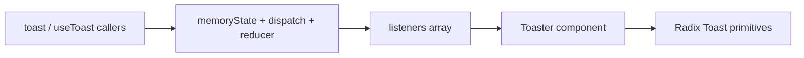

# Adaptar `useToast` a Vue Composition API + Reka UI

Guía para portar la lógica de toasts de este proyecto (React + Radix) a un proyecto Vue con **Reka UI** y estilos **SCSS BEM**, preservando el mismo comportamiento.

**Fuentes en este repo:**

- [`src/hooks/useToast.ts`](../src/hooks/useToast.ts) — store imperativo + hook
- [`src/components/ui/toaster.tsx`](../src/components/ui/toaster.tsx) — render de la cola
- [`src/components/ui/toast.tsx`](../src/components/ui/toast.tsx) — primitives Radix + variantes Tailwind

---

## 1. Cómo funciona el sistema actual



1. `toast()` / `dispatch()` actualizan un **estado global en memoria** (`memoryState`), no React Context ni Zustand/Pinia.
2. Cada `useToast()` se suscribe a `listeners` y re-renderiza cuando cambia el estado.
3. `Toaster` lee `toasts` y monta un `<Toast>` (Radix Root) por ítem.
4. Al cerrar (`open: false`), se encola un `REMOVE_TOAST` diferido (`TOAST_REMOVE_DELAY`) para permitir animación de salida.

### Constantes y reglas a preservar

| Constante / regla | Valor |
|---|---|
| `TOAST_LIMIT` | `1` |
| `TOAST_REMOVE_DELAY` | `1_000_000` ms |
| Variantes | `default` \| `destructive` \| `success` \| `error` |
| `errorToast` | título `"Oops, something went wrong!"`, `variant: "error"`, `duration: 8000` |
| Cierre | `onOpenChange(false)` → `DISMISS_TOAST` |

### API pública a replicar

```ts
toast({ title?, description?, variant?, duration?, action? })
// → { id, dismiss, update }

useToast()
// → { toast, errorToast, dismiss, toasts }
```

---

## 2. Mapeo React / Radix → Vue / Reka

| Este repo | Proyecto Vue |
|---|---|
| `@radix-ui/react-toast` | `reka-ui` |
| `ToastPrimitives.Provider` | `ToastProvider` |
| `ToastPrimitives.Root` | `ToastRoot` |
| `ToastPrimitives.Title` | `ToastTitle` |
| `ToastPrimitives.Description` | `ToastDescription` |
| `ToastPrimitives.Close` | `ToastClose` |
| `ToastPrimitives.Action` | `ToastAction` |
| `ToastPrimitives.Viewport` | `ToastViewport` |
| `--radix-toast-swipe-*` | `--reka-toast-swipe-*` |
| `useState` + `useEffect` | `shallowRef` + `onMounted` / `onUnmounted` |
| Tailwind + CVA | SCSS BEM (`Toast`, `Toast--success`, …) |

Docs Reka Toast: [https://reka-ui.com/docs/components/toast](https://reka-ui.com/docs/components/toast)

---

## 3. Dependencias (en el otro proyecto)

Cuando instales Reka UI:

```bash
npm install reka-ui
```

También necesitas soporte SCSS (`sass`) si aún no lo tienes.

**No** uses Pinia/provide-inject para el store: el patrón actual permite llamar `toast()` fuera de `setup` (p. ej. en callbacks de API).

---

## 4. Árbol de archivos sugerido

```text
src/
  composables/
    useToast.ts
  components/
    Toast/
      Toaster.vue
      Toast.scss
App.vue   # montar <Toaster /> una sola vez
```

---

## 5. Código de referencia: `composables/useToast.ts`

Copia este archivo tal cual. Es la misma lógica del hook React, sin React ni `@trpc/client`.

`errorToast` acepta cualquier cosa con `.message` (`Error` o errores de tRPC/fetch).

```ts
import { onMounted, onUnmounted, shallowRef, type ShallowRef } from "vue";

const TOAST_LIMIT = 1;
const TOAST_REMOVE_DELAY = 1_000_000;

export type ToastVariant = "default" | "destructive" | "success" | "error";

export type ToasterToast = {
  id: string;
  title?: string;
  description?: string;
  /** Texto del botón de acción (opcional). */
  actionLabel?: string;
  /** Callback al pulsar la acción (opcional). */
  onAction?: () => void;
  variant?: ToastVariant;
  duration?: number;
  open?: boolean;
  onOpenChange?: (open: boolean) => void;
};

const actionTypes = {
  ADD_TOAST: "ADD_TOAST",
  UPDATE_TOAST: "UPDATE_TOAST",
  DISMISS_TOAST: "DISMISS_TOAST",
  REMOVE_TOAST: "REMOVE_TOAST",
} as const;

type ActionType = typeof actionTypes;

type Action =
  | { type: ActionType["ADD_TOAST"]; toast: ToasterToast }
  | { type: ActionType["UPDATE_TOAST"]; toast: Partial<ToasterToast> & { id: string } }
  | { type: ActionType["DISMISS_TOAST"]; toastId?: string }
  | { type: ActionType["REMOVE_TOAST"]; toastId?: string };

interface State {
  toasts: ToasterToast[];
}

let count = 0;

function genId() {
  count = (count + 1) % Number.MAX_SAFE_INTEGER;
  return count.toString();
}

const toastTimeouts = new Map<string, ReturnType<typeof setTimeout>>();

const addToRemoveQueue = (toastId: string) => {
  if (toastTimeouts.has(toastId)) return;

  const timeout = setTimeout(() => {
    toastTimeouts.delete(toastId);
    dispatch({ type: "REMOVE_TOAST", toastId });
  }, TOAST_REMOVE_DELAY);

  toastTimeouts.set(toastId, timeout);
};

export const reducer = (state: State, action: Action): State => {
  switch (action.type) {
    case "ADD_TOAST":
      return {
        ...state,
        toasts: [action.toast, ...state.toasts].slice(0, TOAST_LIMIT),
      };

    case "UPDATE_TOAST":
      return {
        ...state,
        toasts: state.toasts.map((t) =>
          t.id === action.toast.id ? { ...t, ...action.toast } : t
        ),
      };

    case "DISMISS_TOAST": {
      const { toastId } = action;

      if (toastId) {
        addToRemoveQueue(toastId);
      } else {
        state.toasts.forEach((t) => addToRemoveQueue(t.id));
      }

      return {
        ...state,
        toasts: state.toasts.map((t) =>
          t.id === toastId || toastId === undefined ? { ...t, open: false } : t
        ),
      };
    }

    case "REMOVE_TOAST":
      if (action.toastId === undefined) {
        return { ...state, toasts: [] };
      }
      return {
        ...state,
        toasts: state.toasts.filter((t) => t.id !== action.toastId),
      };
  }
};

const listeners: Array<(state: State) => void> = [];

let memoryState: State = { toasts: [] };

function dispatch(action: Action) {
  memoryState = reducer(memoryState, action);
  listeners.forEach((listener) => listener(memoryState));
}

type ToastInput = Omit<ToasterToast, "id">;

function toast(props: ToastInput) {
  const id = genId();

  const update = (next: ToasterToast) =>
    dispatch({ type: "UPDATE_TOAST", toast: { ...next, id } });

  const dismiss = () => dispatch({ type: "DISMISS_TOAST", toastId: id });

  dispatch({
    type: "ADD_TOAST",
    toast: {
      ...props,
      id,
      open: true,
      onOpenChange: (open: boolean) => {
        if (!open) dismiss();
      },
    },
  });

  return { id, dismiss, update };
}

function errorToast(error: Error | { message: string }) {
  return toast({
    title: "Oops, something went wrong!",
    description: error.message,
    variant: "error",
    duration: 8_000,
  });
}

function useToast() {
  const state: ShallowRef<State> = shallowRef(memoryState);

  const setState = (next: State) => {
    state.value = next;
  };

  onMounted(() => {
    listeners.push(setState);
  });

  onUnmounted(() => {
    const index = listeners.indexOf(setState);
    if (index > -1) listeners.splice(index, 1);
  });

  return {
    toast,
    errorToast,
    dismiss: (toastId?: string) => dispatch({ type: "DISMISS_TOAST", toastId }),
    /** Lista reactiva de toasts (usar `toasts.value` en script; auto-unwrap en template). */
    toasts: state,
  };
}

export { useToast, toast, errorToast, dispatch };
```

### Nota sobre `title` / `description`

En React eran `React.ReactNode`. En Vue, por simplicidad y paridad de uso típico, son `string`. Si necesitas contenido rico, añade slots en `Toaster.vue` o guarda un `component`/`vnode` en el toast (fuera del alcance mínimo de paridad).

### Nota sobre `action`

En React era un `ReactElement`. Aquí se modela como `actionLabel` + `onAction` para no acoplar VNodes al store. En el template se renderiza con `ToastAction` de Reka.

---

## 6. Código de referencia: `components/Toast/Toaster.vue`

```vue
<script setup lang="ts">
import {
  ToastAction,
  ToastClose,
  ToastDescription,
  ToastProvider,
  ToastRoot,
  ToastTitle,
  ToastViewport,
} from "reka-ui";
import { computed } from "vue";
import { useToast, type ToastVariant } from "@/composables/useToast";

const { toasts } = useToast();

const items = computed(() => toasts.value.toasts);

function variantClass(variant: ToastVariant = "default") {
  return `Toast--${variant}`;
}

function handleOpenChange(
  open: boolean,
  onOpenChange?: (open: boolean) => void
) {
  onOpenChange?.(open);
}
</script>

<template>
  <ToastProvider>
    <ToastRoot
      v-for="item in items"
      :key="item.id"
      class="Toast"
      :class="variantClass(item.variant)"
      :open="item.open"
      :duration="item.duration"
      @update:open="(open) => handleOpenChange(open, item.onOpenChange)"
    >
      <div class="Toast__content">
        <ToastTitle v-if="item.title" class="Toast__title">
          {{ item.title }}
        </ToastTitle>
        <ToastDescription v-if="item.description" class="Toast__description">
          {{ item.description }}
        </ToastDescription>
      </div>

      <ToastAction
        v-if="item.actionLabel"
        class="Toast__action"
        :alt-text="item.actionLabel"
        @click="item.onAction?.()"
      >
        {{ item.actionLabel }}
      </ToastAction>

      <ToastClose class="Toast__close" aria-label="Cerrar">
        <span class="Toast__closeIcon" aria-hidden="true">×</span>
      </ToastClose>
    </ToastRoot>

    <ToastViewport class="Toast__viewport" />
  </ToastProvider>
</template>

<style lang="scss" src="./Toast.scss"></style>
```

### Integración en `App.vue`

```vue
<script setup lang="ts">
import Toaster from "@/components/Toast/Toaster.vue";
</script>

<template>
  <RouterView />
  <Toaster />
</template>
```

---

## 7. Estilos SCSS BEM: `components/Toast/Toast.scss`

Equivalente a las clases Tailwind/CVA de [`toast.tsx`](../src/components/ui/toast.tsx) y el viewport del mismo archivo. Block: **`Toast`**.

```scss
// Toast.scss — BEM mirror of src/components/ui/toast.tsx

.Toast {
  pointer-events: auto;
  position: relative;
  display: flex;
  width: 100%;
  align-items: center;
  justify-content: space-between;
  gap: 1rem;
  overflow: hidden;
  border-radius: var(--radius, 0.375rem);
  border: 1px solid var(--border, #e5e5e5);
  background-color: var(--background, #fff);
  color: var(--foreground, #171717);
  padding: 1.5rem 2rem 1.5rem 1.5rem;
  box-shadow:
    0 10px 15px -3px rgb(0 0 0 / 0.1),
    0 4px 6px -4px rgb(0 0 0 / 0.1);
  transition:
    transform 150ms ease,
    opacity 150ms ease,
    color 150ms ease,
    background-color 150ms ease,
    border-color 150ms ease;

  // Swipe (Reka)
  &[data-swipe="move"] {
    transform: translateX(var(--reka-toast-swipe-move-x, 0));
    transition: none;
  }

  &[data-swipe="cancel"] {
    transform: translateX(0);
  }

  &[data-swipe="end"] {
    transform: translateX(var(--reka-toast-swipe-end-x, 100%));
  }

  // Open / close
  &[data-state="open"] {
    animation: Toast-slide-in-from-top 150ms ease-out;
  }

  &[data-state="closed"] {
    animation: Toast-slide-out-to-right 100ms ease-in forwards;
    opacity: 0.8;
  }

  @media (min-width: 640px) {
    &[data-state="open"] {
      animation-name: Toast-slide-in-from-bottom;
    }
  }

  // ——— Modifiers (variantes) ———
  &--default {
    border-color: var(--border, #e5e5e5);
    background-color: var(--background, #fff);
    color: var(--foreground, #171717);
  }

  &--destructive {
    border-color: var(--destructive, #dc2626);
    background-color: var(--destructive, #dc2626);
    color: var(--destructive-foreground, #fafafa);

    .Toast__close {
      color: rgb(252 165 165);

      &:hover {
        color: #fff;
      }
    }
  }

  &--success {
    border-color: #10b981;
    background-color: var(--background, #fff);
    color: #064e3b;
  }

  &--error {
    border-color: #ef4444;
    background-color: var(--background, #fff);
    color: #7f1d1d;
  }

  // ——— Elements ———
  &__viewport {
    position: fixed;
    top: 0;
    z-index: 100;
    display: flex;
    max-height: 100vh;
    width: 100%;
    flex-direction: column-reverse;
    padding: 1rem;
    outline: none;

    @media (min-width: 640px) {
      top: auto;
      right: 0;
      bottom: 0;
      flex-direction: column;
    }

    @media (min-width: 768px) {
      max-width: 420px;
    }
  }

  &__content {
    display: grid;
    gap: 0.25rem;
    min-width: 0;
  }

  &__title {
    font-size: 0.875rem;
    line-height: 1.25rem;
    font-weight: 600;
  }

  &__description {
    font-size: 0.875rem;
    line-height: 1.25rem;
    opacity: 0.9;
  }

  &__action {
    display: inline-flex;
    height: 2rem;
    flex-shrink: 0;
    align-items: center;
    justify-content: center;
    border-radius: var(--radius, 0.375rem);
    border: 1px solid var(--border, #e5e5e5);
    padding: 0 0.75rem;
    font-size: 0.875rem;
    font-weight: 500;
    background: transparent;
    cursor: pointer;
    transition:
      background-color 150ms ease,
      color 150ms ease,
      border-color 150ms ease;

    &:hover {
      background-color: var(--secondary, #f5f5f5);
    }

    &:focus {
      outline: none;
      box-shadow: 0 0 0 2px var(--ring, #2563eb);
    }

    &:disabled {
      pointer-events: none;
      opacity: 0.5;
    }
  }

  &__close {
    position: absolute;
    top: 0.5rem;
    right: 0.5rem;
    border-radius: var(--radius, 0.375rem);
    padding: 0.25rem;
    border: none;
    background: transparent;
    color: color-mix(in oklab, var(--foreground, #171717) 50%, transparent);
    opacity: 0;
    cursor: pointer;
    transition: opacity 150ms ease, color 150ms ease;

    &:hover {
      color: var(--foreground, #171717);
    }

    &:focus {
      opacity: 1;
      outline: none;
      box-shadow: 0 0 0 2px var(--ring, #2563eb);
    }
  }

  &:hover &__close {
    opacity: 1;
  }

  &__closeIcon {
    display: inline-block;
    font-size: 1rem;
    line-height: 1;
    width: 1rem;
    text-align: center;
  }
}

@keyframes Toast-slide-in-from-top {
  from {
    transform: translateY(-100%);
    opacity: 0;
  }
  to {
    transform: translateY(0);
    opacity: 1;
  }
}

@keyframes Toast-slide-in-from-bottom {
  from {
    transform: translateY(100%);
    opacity: 0;
  }
  to {
    transform: translateY(0);
    opacity: 1;
  }
}

@keyframes Toast-slide-out-to-right {
  from {
    transform: translateX(0);
    opacity: 1;
  }
  to {
    transform: translateX(100%);
    opacity: 0;
  }
}
```

Variables CSS recomendadas (defínelas en tu tema global): `--background`, `--foreground`, `--border`, `--destructive`, `--destructive-foreground`, `--secondary`, `--ring`, `--radius`.

---

## 8. Ejemplos de uso (misma DX que este repo)

```ts
import { useToast, toast } from "@/composables/useToast";

// Dentro de setup / Composition API
const { toast, errorToast } = useToast();

toast({
  title: "Guardado",
  description: "Los cambios se aplicaron correctamente.",
  variant: "success",
});

try {
  await saveSomething();
} catch (err) {
  errorToast(err as Error);
}

// Imperativo (fuera de setup), igual que export { toast }
toast({ title: "Hola", variant: "default" });
```

Con acción:

```ts
toast({
  title: "Producto eliminado",
  actionLabel: "Deshacer",
  onAction: () => restoreProduct(),
  variant: "default",
});
```

---

## 9. Checklist de paridad

Antes de dar por cerrado el port, verifica:

- [ ] `TOAST_LIMIT === 1` (solo un toast visible a la vez)
- [ ] `DISMISS` pone `open: false` y luego `REMOVE` tras `TOAST_REMOVE_DELAY`
- [ ] `toast()` retorna `{ id, dismiss, update }`
- [ ] `useToast()` expone `{ toast, errorToast, dismiss, toasts }`
- [ ] Variantes: `default`, `destructive`, `success`, `error` con clases BEM `Toast--*`
- [ ] `errorToast` usa título fijo, `variant: "error"`, `duration: 8000`
- [ ] Cerrar (botón / swipe / timeout de Reka) dispara `onOpenChange(false)` → dismiss
- [ ] `<Toaster />` montado una sola vez en el layout raíz
- [ ] Estilos solo SCSS BEM (sin Tailwind en estos componentes)
- [ ] Swipe usa variables `--reka-toast-swipe-*`

---

## 10. Diferencias conscientes vs React

| Tema | React (este repo) | Vue (este doc) |
|---|---|---|
| `action` | `ReactElement` | `actionLabel` + `onAction` |
| `title` / `description` | `ReactNode` | `string` |
| `errorToast` tipado | `TRPCClientErrorBase \| Error` | `Error \| { message: string }` |
| Icono close | `lucide-react` `X` | carácter `×` (sustituible por tu icon set) |
| Suscripción | `useEffect(..., [state])` | `onMounted` / `onUnmounted` (más limpio; evita re-subscribe) |

Si en el otro proyecto usas tRPC Vue, puedes tipar `errorToast` con el error de tu cliente sin cambiar el cuerpo de la función.
